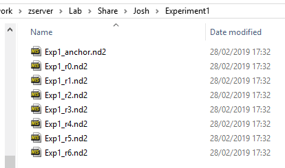
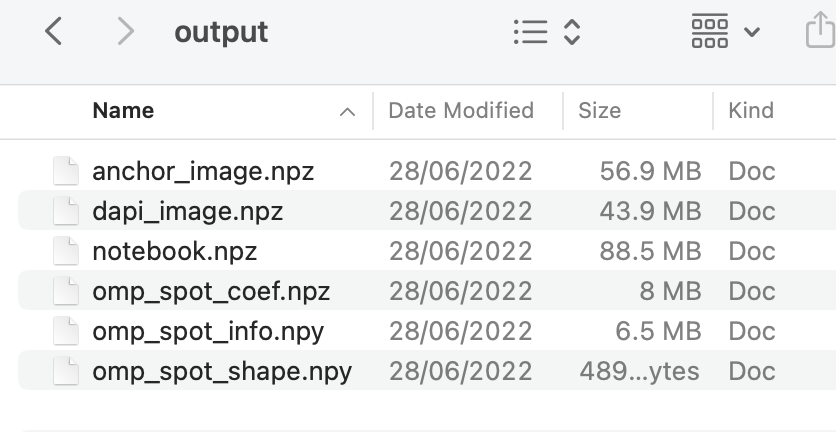
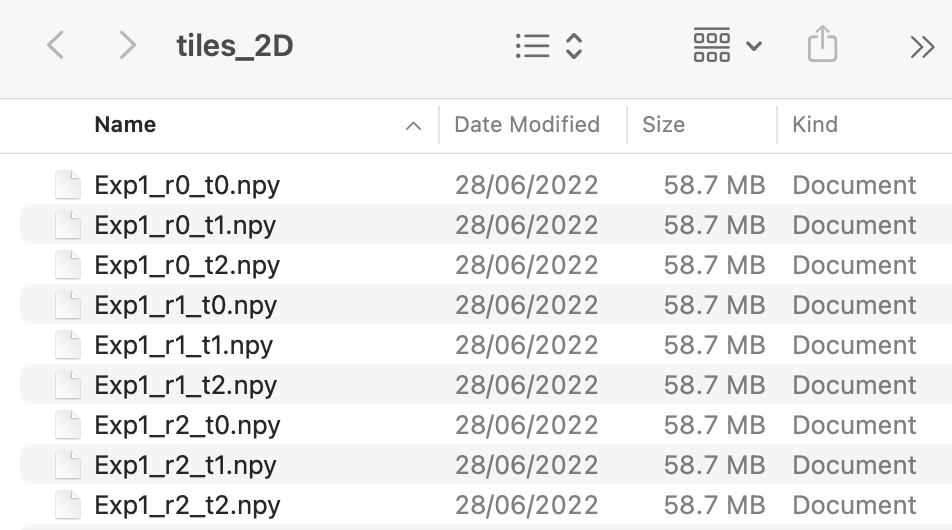

# Setting up the Config File

A config (.ini) file needs to be created for each experiment to run the pipeline. 
All parameters not specified in this file will inherit the [default values](config.md).
The parameters with Default = `MUST BE SPECIFIED` are the bare minimum parameters which need to be set in the experiment
config file.
If any section or parameter within a section is added to the config file 
which is not included in the [default file](config.md), an error will be raised when it is loaded in.
Some example config files for typical experiments are listed below.

## Example Config Files

=== "3D"

    ``` ini
    [file_names]
    input_dir = /Users/.../experiment1/raw
    output_dir = /Users/.../experiment1/output
    tile_dir = /Users/.../experiment1/tiles
    round = Exp1_r0, Exp1_r1, Exp1_r2, Exp1_r3, Exp1_r4, Exp1_r5, Exp1_r6
    anchor = Exp1_anchor
    code_book = /Users/.../experiment1/codebook.txt

    [basic_info]
    is_3d = True
    anchor_channel = 4
    dapi_channel = 0
    ```

=== "2D"

    ``` ini
    [file_names]
    input_dir = /Users/.../experiment1/raw
    output_dir = /Users/.../experiment1/output
    tile_dir = /Users/.../experiment1/tiles
    round = Exp1_r0, Exp1_r1, Exp1_r2, Exp1_r3, Exp1_r4, Exp1_r5, Exp1_r6
    anchor = Exp1_anchor
    code_book = /Users/.../experiment1/codebook.txt

    [basic_info]
    is_3d = False
    anchor_channel = 4
    dapi_channel = 0
    ```

=== ".npy Raw Data"

    ``` ini
    [file_names]
    input_dir = /Users/.../experiment1/raw
    output_dir = /Users/.../experiment1/output
    tile_dir = /Users/.../experiment1/tiles
    round = Exp1_r0, Exp1_r1, Exp1_r2, Exp1_r3, Exp1_r4, Exp1_r5, Exp1_r6
    anchor = Exp1_anchor
    code_book = /Users/.../experiment1/codebook.txt
    raw_extension = .npy
    raw_metadata = metadata

    [basic_info]
    is_3d = True
    anchor_channel = 4
    dapi_channel = 0
    ```

=== "No Anchor"

    ``` ini
    [file_names]
    input_dir = /Users/.../experiment1/raw
    output_dir = /Users/.../experiment1/output
    tile_dir = /Users/.../experiment1/tiles
    round = Exp1_r0, Exp1_r1, Exp1_r2, Exp1_r3, Exp1_r4, Exp1_r5, Exp1_r6
    code_book = /Users/.../experiment1/codebook.txt

    [basic_info]
    is_3d = True
    ref_round = 2
    ref_channel = 4
    ```

=== "QuadCam"

    ``` ini
    [file_names]
    input_dir = /Users/.../experiment1/raw
    output_dir = /Users/.../experiment1/output
    tile_dir = /Users/.../experiment1/tiles
    round = Exp1_r0, Exp1_r1, Exp1_r2, Exp1_r3, Exp1_r4, Exp1_r5, Exp1_r6, Exp1_r7, Exp1_r8
    anchor = Exp1_anchor
    code_book = /Users/.../experiment1/codebook.txt

    [basic_info]
    is_3d = True
    anchor_channel = 4
    dapi_channel = 0
    dye_names = DY405, CF405L, AF488, DY520XL, AF532, AF594, ATTO425, AF647, AF750
    channel_camera = 405, 555, 470, 470, 555, 640, 555, 640, 640
    channel_laser = 405, 405, 445, 470, 520, 520, 555, 640, 730
    ```

=== "Separate Round"

    ``` ini
    [file_names]
    notebook_name = sep_round_notebook
    input_dir = /Users/.../experiment1/raw
    output_dir = /Users/.../experiment1/output
    tile_dir = /Users/.../experiment1/tiles
    anchor = Exp1_sep_round
    code_book = /Users/.../experiment1/codebook.txt

    [basic_info]
    is_3d = True
    anchor_channel = 4
    ```


??? note "Note on *Separate Round* Config File"

    The *Separate Round* config file above is used for registering an additional round to an experiment already run to 
    completion (using a config file like the *3D* one indicated above). The pipeline for the *Separate Round* case 
    cannot be run further that the stitching section.

    The [`run_sep_reg`](code/sep_round_reg.md#docs.scripts.sep_round_reg.run_sep_round_reg) function 
    (script is [here](scripts/sep_round_reg.py)) 
    runs the pipeline 
    for the 
    *Separate Round* case and then registers the `anchor_round`/`anchor_channel` to the `anchor_round`/`anchor_channel`
    of the full experiment.

These parameters are explained below and [here](config.md). 

## [file_names](config.md#file_names)
If the names of the files change during the pipeline or if they are being accessed from another computer,
the [*file_names*](config.md#file_names) section of the configuration file can also be 
changed as explained [here](notebook.md#file_names).

### input_dir

The input directory is the path to the folder which contains the raw data. 
Examples for the two possible cases of `raw_extension` are given below (i.e. these are respectively what the input 
directory looks like for the config files *3D* and *.npy Raw Data* listed above).
=== ".nd2"
    {width="400"}

=== ".npy"
    {width="400"}

???note "Differences with `raw_extension = .npy`"

    It is assumed that when `raw_extension = .npy`, there were initial .nd2 files which contained excess information 
    (e.g. extra channels). These were then converted to .npy files to get rid of this.

    For the .npy case, input_dir must also contain a metadata .json file. 
    This contains the metadata extracted from the initial .nd2 files using the function 
    [save_metadata](code/utils/nd2.md#iss.utils.nd2.save_metadata).
    An example metadata file is given [here](files/metadata_example.json) for an experiment with 
    3 tiles and 7 channels.

    Also, each name listed in the `round` parameter indicates a folder not a file. 
    It is assumed these folders were produced using 
    [`dask.array.to_npy_stack`](https://docs.dask.org/en/stable/generated/dask.array.to_npy_stack.html)
    so the contents of each folder should contain a file named *info* and a .npy file for each tile, with the name 
    being the index of the tile in the initial .nd2 file. An example showing the folder for the first round of a 
    three tile experiment is given below:

    {width="400"}
    


### output_dir
The output directory is the path to the folder that you would like the [notebook.npz](notebook.md) 
file containing the experiment  results to be saved. 
The image below shows what the output directory typically looks like at the end of the experiment.

{width="400" align=left }

The names of the files produced can be changed by changing the parameters `big_anchor_image`, `big_dapi_image`, 
`notebook_name`, `omp_spot_coef`, `omp_spot_info` and `omp_spot_shape` in the [config file](config.md#file_names). 

<br clear="left"/>

### tile_dir
The tile directory is the path to the folder that you would like the filtered images for each tile, round and 
colour channel to be saved to. 

If `is_3d == True`, a .npy file will be produced for each round, tile and channel with
the name for round r, tile *T*, channel *C* being `file_names[round][r]`_t*T*c*C*.npy with axis in the order z-y-x
(the name for the anchor round, tile *T*, channel *C* will be `file_names[anchor]`_t*T*c*C*.npy).
If `is_3d == False`, a .npy file will be produced for each round and tile called `file_names[round][r]`_t*T*.npy 
with axis in the order c-y-x. 

An example of what the tile directory looks like at the end of the experiment is shown below for a 
3D and 2D experiment with 3 tiles and 7 channels:
=== "3D"
    {width="400"}

=== "2D"
    {width="400"}


### code_book
This is the path to the file containing the code for each gene. 
The file should be a text file containing two columns, the first being the gene name. 
The second is the code specifying which dye that gene should appear in each round. 
Thus it is of length `n_rounds`, containing numbers in the range from `0` to `n_dyes-1` inclusive. 

???+ example

    An example is given [here](files/codebook.txt) so that if

    `basic_info[dye_names] = DY405, CF405L, AF488, DY520XL, AF532, AF594, ATTO425`

    the gene *Sst* with the code *6200265* will
    be expected to appear with the following dyes in each round:

    - Round 0: `ATTO425`
    - Round 1: `AF488`
    - Round 2: `DY405`
    - Round 3: `DY405`
    - Round 4: `AF488`
    - Round 5: `ATTO425`
    - Round 6: `AF594`


## [basic_info](config.md#basic_info)
### anchor_channel
The `anchor_channel` is the channel in the `anchor_round` which contains spots corresponding to all genes. 
These spots are used for registration to the imaging rounds and to determine the expected `bled_code` for each gene.

### ref_round
If there is no `anchor_round`, `ref_round` must be specified instead and it should be a round which contains a lot 
of spots in each channel. Spots in `ref_round` / `ref_channel` will then be used as reference spots for registration
and to determine the expected `bled_code` for each gene. 

If the `anchor_round` is used and `ref_round` is specified, `ref_round` will be set to `anchor_round` (last round) 
[in the notebook](code/pipeline/basic_info.md#iss.pipeline.basic_info.set_basic_info).

???+warning "Problem with not using anchor"
    With no anchor, the registration is likely to be worse because an imaging round is used as a reference.
    Thus, not all genes will appear in `ref_round` / `ref_channel`, but only those which appear with a dye
    in the `ref_round` which have high intensity in the `ref_channel`.
    Also, we would expect the final spots saved in nb.ref_spots to only correspond to genes appearing in 
    `ref_round` / `ref_channel` and thus lots of genes will be missing.

    With an anchor though, we expect all genes to show up in `anchor_round` / `anchor_channel`.

### ref_channel
If there is no `anchor_round`, `ref_channel` must be specified instead and it should be the channel in `ref_round` 
which contains the most spots. If the `anchor_round` is used and both `anchor_channel` and `ref_channel` are specified,
`ref_channel` will be set to `anchor_channel` 
[in the notebook](code/pipeline/basic_info.md#iss.pipeline.basic_info.set_basic_info).

### dapi_channel
This is the channel in the `anchor_round` that contains the DAPI images. 
The tiles of this channel will be stitched together and saved in the `file_names[output_dir]` with a name 
`file_names[big_dapi_image]`. 

To tophat filter the raw DAPI images first, either 
[`extract[r_dapi]` or `extract[r_dapi_auto_microns]`](config.md#extract) must be specified.

### Specifying Dyes
It is expected that each gene will appear with a single dye in a given round as indicated by `file_names[code_book]`.
If `dye_names` is not specified, it is assumed as a starting point for the 
[`bleed_matrix` calculation](code/call_spots/bleed_matrix.md#iss.call_spots.bleed_matrix.get_bleed_matrix) 
that the number of dyes is equal to the number of channels and dye 0 will only appear in channel 0,
dye 1 will only appear in channel 1 etc. 

If `dye_names` is specified, both `channel_camera` and `channel_laser` must also be specified. This is so that
a starting point for the `bleed_matrix` calculation can be obtained by 
[reading off](code/call_spots/bleed_matrix.md#iss.call_spots.bleed_matrix.get_dye_channel_intensity_guess) 
the expected intensity of each dye in each channel using the file `file_names[dye_camera_laser]`. 

The default `file_names[dye_camera_laser]` is given 
[here](https://github.com/jduffield65/iss_python/blob/main/iss/setup/dye_camera_laser_raw_intensity.csv) 
but if a dye, camera or laser not indicated in this file are used in an experiment, a new version must be made.

## Common Additional Parameters
There are a few other parameters that may often need to be different to those given in the 
[default config file](config.md).

### [`extract[r_smooth]`](config.md#extract)
The parameter `r_smooth` in the extract section specifies whether to smooth with an averaging kernel after
the raw images have been convolved with a 
[difference of hanning kernel](code/utils/morphology.md#iss.utils.morphology.base.hanning_diff).
This will make the extract section of the pipeline slower but will reduce the influence
of anomalously high or low intensity pixels. It may be particularly appropriate to *3D* data because
the difference of hanning convolution is done independently on each z-plane but the smoothing
can incorporate information between z-planes.

??? note "Time for smoothing"

    The size of `r_smooth` has big influence on time taken for smoothing. 
    For a `2048 x 2048 x 50` image:

    * `r_smooth = 1, 1, 2`: 2.8 seconds
    * `r_smooth = 2, 2, 2`: 8.5 seconds

    The convolution with the 
    [difference of hanning kernel](code/utils/morphology.md#iss.utils.morphology.base.hanning_diff)
    takes 4.1 seconds on the same image so smoothing will make the extract section of the pipeline 
    significantly longer.


By default, this is not specified meaning no smoothing is done. If smoothing is needed, typical values are:

- 2D: `r_smooth = 2, 2`
- 3D: `r_smooth = 1, 1, 2`

The kernel which the image is correlated with is then 
`np.ones(2 * r_smooth - 1) / np.sum(np.ones(2 * r_smooth - 1))` so for `r_smooth = 2, 2` it will be:

``` python
array([[0.11111111, 0.11111111, 0.11111111],
       [0.11111111, 0.11111111, 0.11111111],
       [0.11111111, 0.11111111, 0.11111111]])
```

The effect of smoothing can be seen using `view_filter`.

### [`extract[r_dapi]`](config.md#extract)
By default, no filtering will be applied to the *dapi_channel* image of the *anchor_round* and thus no .npy file
will be saved to the *tile_dir*. This can be changed by specifying `r_dapi` which should be approximately
the radius of a feature in the DAPI image (typical `r_dapi` is 48). In this case, a *2D* tophat filtering
will be performed using a kernel of radius `r_dapi`. 

Alternatively, `r_dapi_auto_microns` can be specified to be the radius of the kernel in units of microns and `r_dapi`
will be computed automatically by converting this into units of yx-pixels (typical `r_dapi_auto_microns` is 8).

??? note "Time for DAPI filtering"

    The size of `r_dapi` has big influence on time taken for tophat filtering. 
    For a `2048 x 2048 x 50` image:

    * `r_dapi = 48`: 142.4 seconds
    * `r_smooth = 12`: 3.9 seconds

    The tophat filtering is only done on one channel for each tile but it is quite slow so it may be best to avoid it,
    especially for experiments with lots of tiles.

The effect of DAPI filtering can be seen using `view_filter`.


### [`stitch[expected_overlap]`](config.md#stitch)
This is the expected fractional overlap between neighbouring tiles. 
By default, it is 0.1 meaning a 10% overlap is expected.

### [thresholds](config.md#thresholds)
The parameters in the [thresholds](config.md#thresholds) section of the config file contains the thresholds 
used to determine which spots pass a quality thresholding process such that we consider their 
gene assignments legitimate.

The default values are based on an experiment run with ground truth data, but they will likely need adjusting 
after investigating the effect of the thresholds using [`iss_plot`](code/plot/viewer.md).


### Using a subset of the raw data
To run the pipeline with a subset of tiles, imaging rounds, channels or z-planes the following parameters 
can be set in the [*basic_info*](config.md#basic_info) section of the configuration file:

* `use_tiles`
* `ignore_tiles`
* `use_rounds`
* `use_channels`
* `use_z`

If midway through the pipeline, it is decided that a particular tile, round or channel is not worth using,
it can be [removed](notebook.md#changing-basic_info-mid-pipeline) 
without re-running all the steps of the pipeline completed so far.
