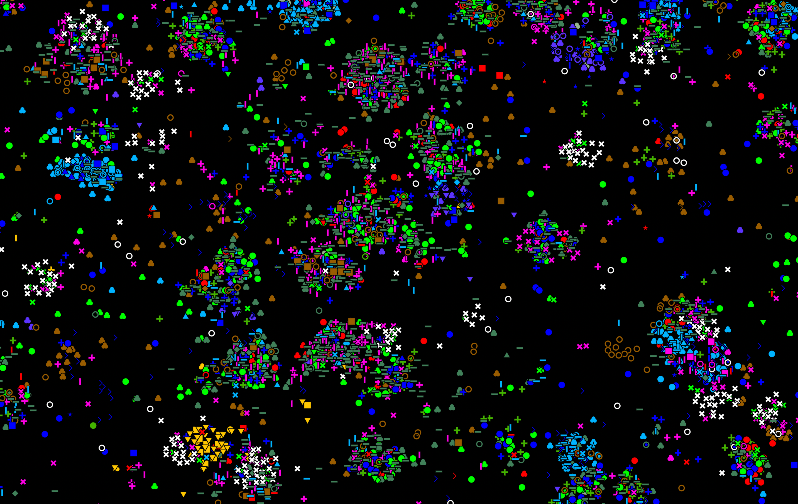

# coppafish
{width="800"}

*coppafish* is a data analysis pipeline for decoding *coppaFISH* (combinatorial padlock-probe-amplified fluorescence 
in situ hybridization) datasets. [*coppaFISH*](https://www.nature.com/articles/s41586-022-04915-7) 
is a method for in situ transcriptomics which produces a series of images arranged in terms of tiles, rounds and 
channels. *coppafish* then determines the distribution of genes via [image processing](pipeline/extract.md), 
[spot detection](pipeline/find_spots.md), [registration](pipeline/register.md) and 
[gene calling](pipeline/call_reference_spots.md). The distribution of genes (like that shown above, each marker
and color is a different gene) can then be used to determine the location and type of cells using 
[*pciSeq*](run_code.md#exporting-to-pciseq).


## Installation
*coppafish* supports python 3.8 and above. It can be installed using pip:

``` bash
pip install coppafish
```

To use the napari [Viewer](view_results.md) and matplotlib [diagnostics](view_results.md#diagnostics), 
the *plotting* version must be installed:

``` bash
pip install coppafish[plotting]
```

To use the [optimised](code/omp/coefs.md#optimised) code, which is recommended for running the 
[*find spots*](pipeline/find_spots.md) and [*OMP*](pipeline/omp.md) sections of the pipeline (otherwise
they are [very slow](files/timings/full_run_no_extract_no_jax.csv)), the *optimised* version must be installed:

``` bash
pip install coppafish[optimised]
```

!!! warning "Installing on Windows"

    The optimised code requires *jax* which is not supported on Windows, thus the *optimised* version 
    of *coppafish* cannot be used on Windows.

The *optimised* and *plotting* features can both be installed by running:

``` bash
pip install coppafish[optimised,plotting]
```
