# Call Reference Spots
The [*call reference spots* step of the pipeline](../code/pipeline/call_reference_spots.md) uses the 
$n_{rounds} \times n_{channels}$  `color` obtained for each reference spot 
(detected on the reference round/reference channel ($r_{ref}$/$c_{ref}$) in the 
[*get reference spots*](get_reference_spots.md) step of the pipeline to compute the `bleed_matrix` accounting
for crosstalk between color channels. We then compute the `gene_efficiency` which allows for varying round
strengths for each gene, before assigning each reference spot to a gene.

These gene assignments are saved in the [`ref_spots`](../notebook_comments.md#ref_spots) *NotebookPage* 
while the bleed_matrix and expected bled_code for each gene are saved in the 
[`call_spots`](../notebook_comments.md#call_spots) *NotebookPage*. The distribution of the genes can be 
seen using the [`iss_plot` viewer](../view_results.md) once these pages have been added.

!!! note "Note: `config` in this section, with no section specified, means `config['call_spots']`"

## Color Normalisation
We assign a spot $s$ to a gene $g$, based on its $n_{rounds} \times n_{channels}$ `color`, $\pmb{\acute{\zeta}_s}$, 
indicating the intensity in each round and channel.

However, we first need to equalize color channels, so that no one color channel dominates the others when 
it comes to gene assignment. The normalised `spot_colors`, $\pmb{\zeta}$, are obtained by dividing the saved 
`spot_colors`, $\pmb{\acute{\zeta}}$, by a $n_{rounds} \times n_{channels}$ 
normalisation factor, `nb.call_spots.color_norm_factor`.

??? question "Why do we need to normalise color channels?"

    The gene assignment of the spot below indicates why we need to normalise color channels.
    With no normalisation, the gene assignment is overly influenced by channel 4 which 
    is one of the most intense channels (see `color_norm_factor` in example box below). Thus it matches 
    to *Reln* which appears in channel 4 in rounds 0, 1, 5 and 6. It also doesn't care at all about 
    channel 2 because it is the weakest channel and *Reln* does not appear in channel 2 in any rounds.

    With normalisation, the most obvious effect is channel 2 gets boosted and now has an influence.
    Given that *Id2* appears in channel 2 in rounds 1, 3, 5 and 6, if channel 2 was never considered,
    it would always make the score to *Id2* low. When we include channel 2 though, we get a high score
    even though we are not matching the round 0, channel 4 intensity which contributed to the *Reln* assignment
    without normalisation.
    
    === "No Normalisation"
        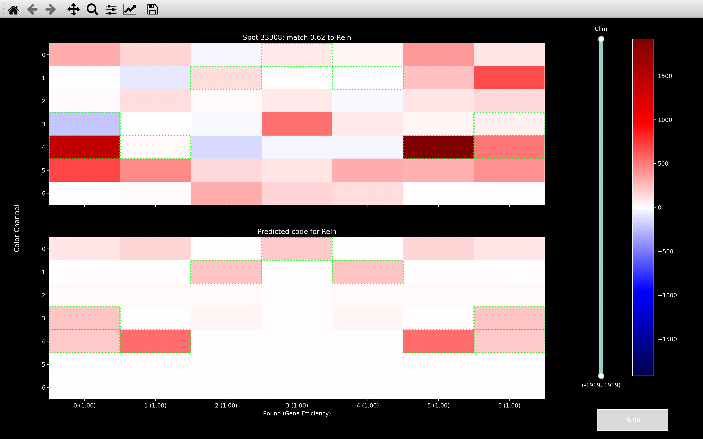{width="800"}

    === "With Normalisation"
        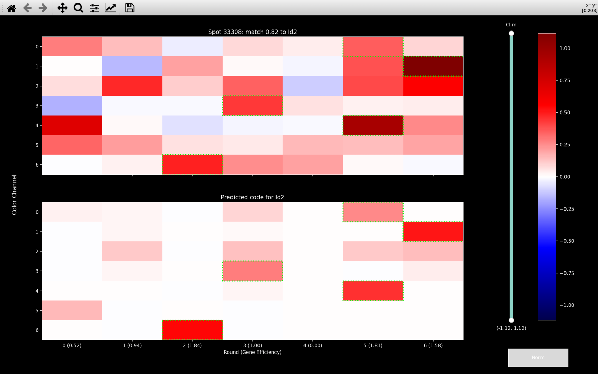{width="800"}

This is [obtained](../code/call_spots/base.md#iss.call_spots.base.color_normalisation) 
using the parameters `config['color_norm_intensities']` and 
`config['color_norm_probs']` such that for each round, $r$, and channel $c$, 
the probability of $\zeta_{rc}$ being larger than 
`config['color_norm_intensities'][i]` is less than `config['color_norm_probs'][i]` for each $i$.

The probabilities come from the [histograms](extract.md#hist_counts) produced in the *extract and filter* step i.e.
if `config['color_norm_intensities'] = 0.5` and `config['color_norm_probs'] = 0.01`, then 
in each round and channel, only 1% of pixels on the mid z-plane across all tiles would have $\zeta_{rc} > 0.5$.

If `config[bleed_matrix_method] = 'single'`, then we combine all rounds for each channel so that 
`nb.call_spots.color_norm_factor[r, c]` is the same for all $r$ of a particular $c$. 

??? example

    With `config['color_norm_intensities'] = 0.5, 1, 5` and `config['color_norm_probs'] = 0.01, 5e-4, 1e-5`
    and the [histograms](extract.md#hist_counts) shown in the *extract and filter* step, the two
    methods of `config[bleed_matrix_method]` produce the following `color_norm_factor`:
    
    === "Single"
        {width="500"}

    === "Separate"
        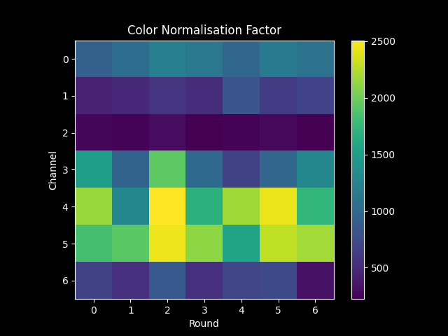{width="500"}

    The [normalised histogram](extract.md#hist_counts) shown was normalised using the *Single* `color_norm_factor`
    and you can see that for each round and channel there is a similar area under the curve
    (probability) beyond $\zeta_{rc}=0.5$, as expected from `config['color_norm_intensities']`.

## Background
After we have the normalised spot colors, $\pmb{\zeta}$, we 
[remove](../code/call_spots/background.md#iss.call_spots.background.fit_background) some background *genes* from them. 
There is one background *gene* for each channel, $\pmb{B}_C$. The background *gene* for channel $C$ is defined by:
$\pmb{B}_{C_{rc}}$ if $c = C$ and 0 otherwise i.e. it is just a strip in channel $C$:

{width="300"}

It is also normalised to have an L2 norm of 1. These are saved as `nb.call_spots.background_codes`.

??? question "Why do we need to fit background *genes*?"

    We fit the background *genes* because it is fairly common for $\pmb{\zeta}_s$ to have high intensity 
    across all rounds of a channel as shown for the example [`view_codes`](../view_results.md#c-view_codes) 
    plot below:
    
    === "No Background Removal"
        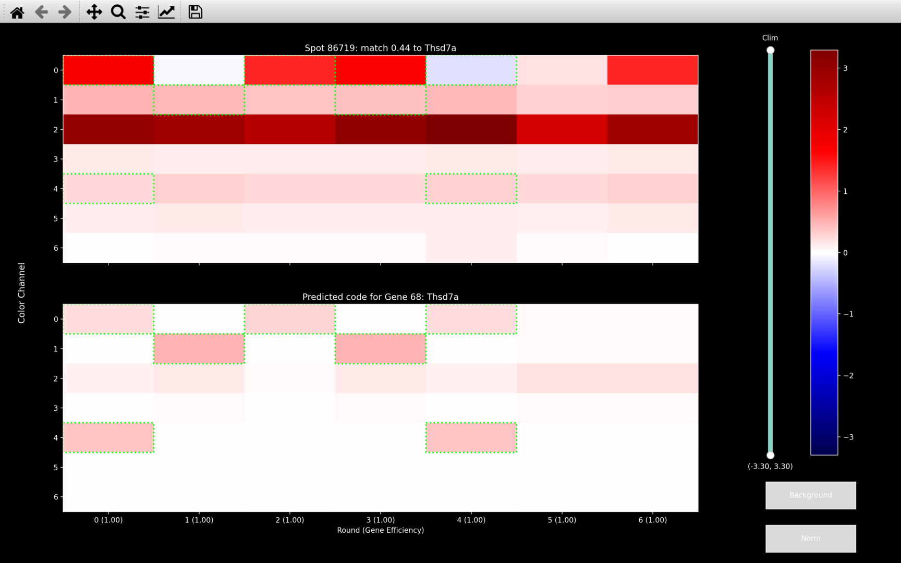{width="500"}

    === "With Background Removal"
        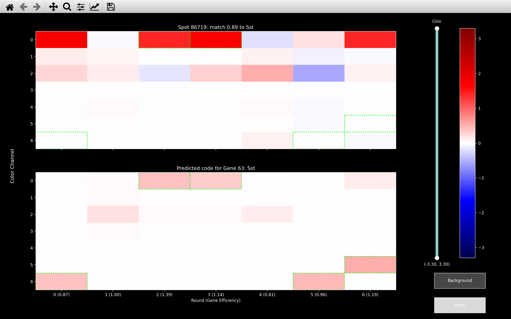{width="500"}

    Now no gene in the codebook looks that much like a background gene but if the background genes have not
    been fit, as with the first image above, spots like this will match to the gene which has the most 
    rounds in the relavent channel/s. Here, *Thsd7a* has intensity in channel 2 in all rounds apart from round 2.
    This problem will be exacerbated in the omp step, because at each iteration of the omp algorithm, 
    it will just try and fit more and more genes to explain the intense channel.

    If we do remove background though, as with the second image, the gene assignment will be based 
    on the other channels where not all rounds were intense. In this case, we get a match to *Sst* due
    to round 2 and 3 in channel 0.

    If we look at [`histogram_score`](#histogram_score) for *Thsd7a*, we see that wihtout background removal
    (purple), the peak in score is significantly larger:

    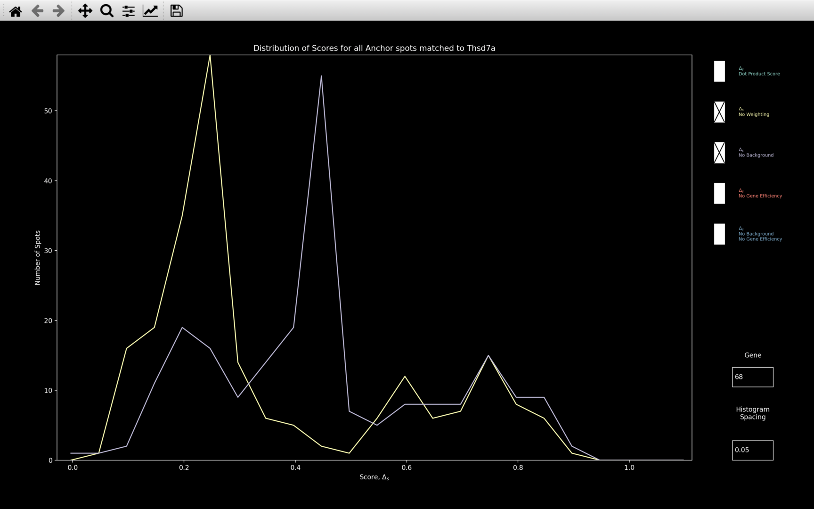{width="500"}

    This indicates that without background removal, we would end up with a lot more spots assigned to
    genes like *Thsd7a* which have high intensity in most rounds of a single channel.
    

The coefficient, $\mu_{sC}$, for the channel $C$ background *gene*, $\pmb{B}_C$, fit to the spot $s$ color, 
$\pmb{\zeta}_s$ is:

$$
\mu_{sC} = \frac{\sum_rw^2_{rC}\zeta_{s_{rC}}B_{C_{rC}}}{\sum_rw^2_{rC}B^2_{C_{rC}}}; 
w_{rC} = \frac{1}{|\zeta_{s_{rC}}| + \lambda_b}
$$

Where, $\lambda_b$ is `config['background_weight_shift']` and the sum is over all rounds used.

??? note "Value of $\lambda_b$"

    If `config['background_weight_shift']` is left blank, it is set to the median of the [`intensity`](#intensity) 
    computed from the absolute colors, [$\tilde{\chi}$](omp.md#initial-intensity-threshold), 
    of all pixels in the middle z-plane (`nb.call_spots.norm_shift_tile`) 
    of the central tile (`nb.call_spots.norm_shift_z`).

    This is because it gives an estimate of what $|\zeta_{s_{rC}}|$ would be for an average non-spot pixel.
    If we set $\lambda_b$ to be equal to this, it is saying that if a spot had a round and channel with very
    low intensity, then that round and channel would have as much influence on the final coefficient
    as an average pixel. 

    If $\lambda_b = 0$, then $w_{rc}$ would go to $\infty$ for low intensity rounds and channels,
    so the value of $\lambda_b$ chosen also provides an upper bound onthe contribution of low intensity 
    rounds and channels to the final coefficient.

If the weighting, $w$, was a constant across rounds and channels ($\lambda_b = \infty$), this would just be 
the least squares solution. After we have found the coefficients, we remove the background contribution
from the spot colors to give $\pmb{\zeta}_{{s0}}$ which we use from now on.

$$
\zeta_{{s0}_{rC}} = \zeta_{{s}_{rC}} - \mu_{sC}B_{C_{rC}}
$$


??? question "Why do we need a weighting?"
    
    We find $\mu_{sC}$ via weighted least squares, because it limits the influence of outliers. 
    The example below shows that with $\lambda_b = \infty$ (normal least squares), really tries to remove
    the outlier in round 4, channel 0. The result of this is that all the other rounds of channel 0 become 
    very negative.
    
    === "$\pmb{\zeta}_s$"
        {width="600"}
    === "$\pmb{\zeta}_{s0} (\lambda_b = 0.08)$"
        {width="600"}
    === "$\pmb{\zeta}_{s0} (\lambda_b = \infty)$"
        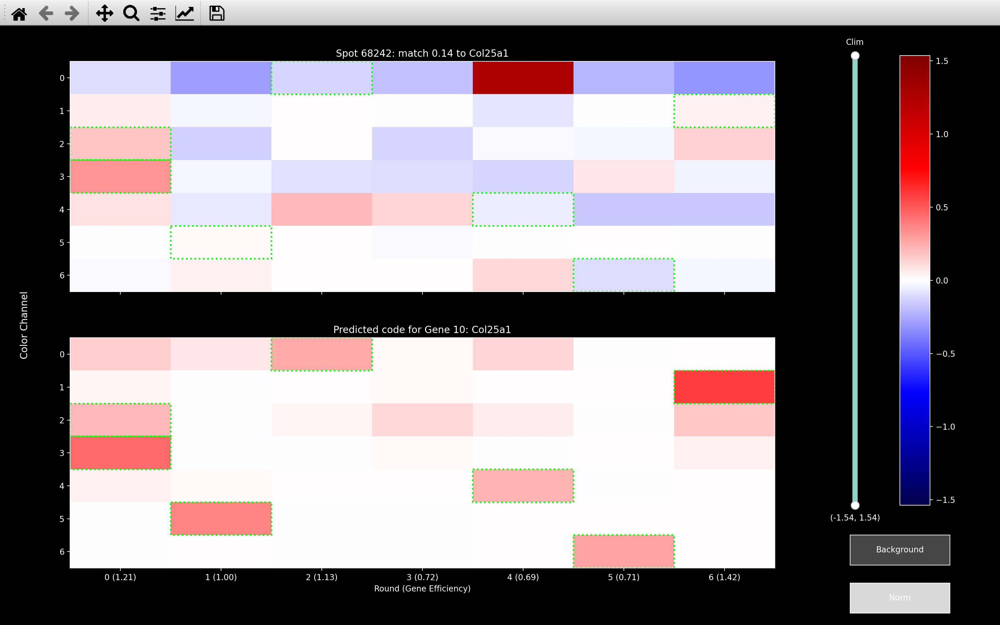{width="600"}
    
    This spot should be *Slc6a1* as shown from the $\lambda_b = 0.08$ image but *Slc6a1* is expected to be 
    in 4 of the 6 rounds that were set to negative by the background fitting with $\lambda_b = \infty$.
    Thus, this spot can no longer be assigned to the correct gene after $\lambda_b = \infty$ background fitting.
    
    So basically, the job of the background fitting is to remove intensity in a particular channel if 
    that channel is intense across all rounds. This is because there are no actual genes which can explain this.
    We do not want it to tone down outlier rounds and channels because outliers are usually due to actual genes.


### [`view_background`](../code/plot/call_spots.md#view_background)
The background coefficient calculation can be visualised by using the 
[`view_background`](../code/plot/call_spots.md#view_background) function:

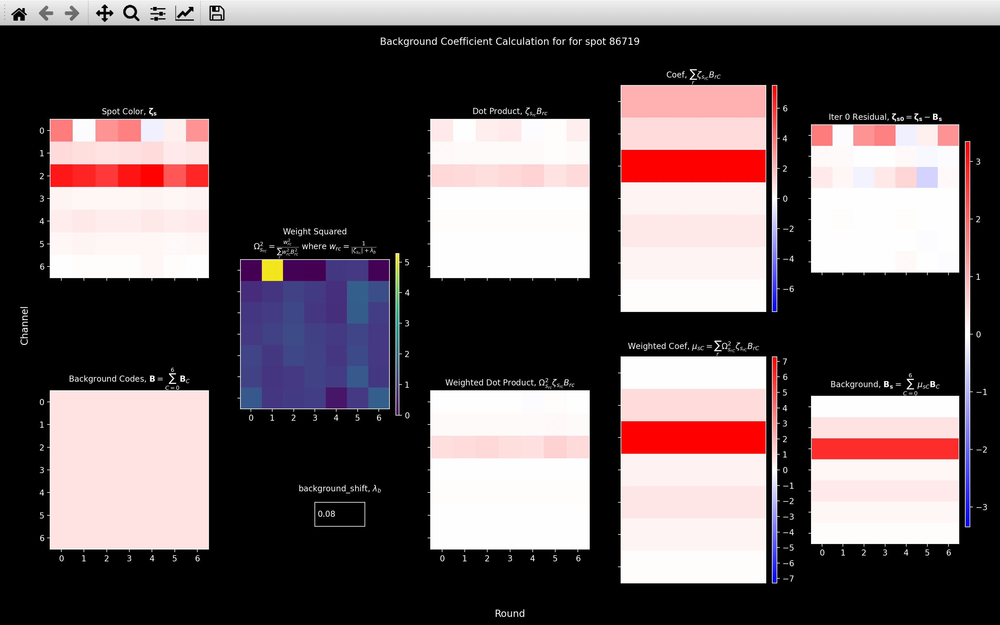{width="800"}

For each plot, each row corresponds to a different background *gene* coefficient calculation i.e. a different 
channel. There is no overlap between the background codes hence we can view all the calculations at the same time.

In the bottom row, round $r$, channel $c$ in the *Weighted Dot Product* plot refers to the value
of $\frac{w^2_{rc}\zeta_{s_{rc}}B_{C_{rc}}}{\sum_rw^2_{rC}B^2_{C_{rC}}}$. 
In the top row, the *Dot Product* plot is the same as the *Weighted Dot Product* plot except $\lambda_b = \infty$.

The bottom row *Weighted Coef* plot thus shows the coefficient computed for the current value of $\lambda_b$ 
(0.08 here, but can be specified with in the textbox). The top row *Coef* plot shows the coefficient that would
be computed with $\lambda_b = \infty$.

The main difference between the two in this case is that the channel 0 coefficient is much larger for the
$\lambda_b = \infty$ case. This is because the *Weight Squared*, $\Omega^2_{s_{rc}}$ term acts to increase the
contribution of the weak round 1, channel 0 and decrease the contribution of the strong rounds: 0, 2, 3 and 6.

## Bleed Matrix
Crosstalk can occur between color channels. Some crosstalk may occur due to optical bleedthrough; 
additional crosstalk can occur due to chemical cross-reactivity of probes. The precise degree of crosstalk does not
seem to vary much between sequencing rounds.
It is therefore possible to largely compensate for this crosstalk by learning the precise amount of crosstalk 
between each pair of color channels.

To [estimate the crosstalk](../code/call_spots/bleed_matrix.md#iss.call_spots.bleed_matrix.get_bleed_matrix), 
we use the spot colors, $\pmb{\zeta}_{s0}$, of all well isolated spots. We 
reshape these, so we have a set of $n_{isolated} \times n_{rounds}$ vectors, each of dimension 
$n_{channels}$, $\pmb{v}_i$ ($v_{0_c} = \zeta_{{s=0,0}_{r=0,c}}$).
Only [well-isolated](find_spots.md#isolated-spots) spots are used to ensure that crosstalk estimation is 
not affected by spatial overlap of spots corresponding to different genes.

Crosstalk is then estimated by running a 
[scaled k-means](../code/call_spots/bleed_matrix.md#iss.call_spots.bleed_matrix.scaled_k_means) 
algorithm on these vectors, which finds a set of $n_{dye}$ vectors, $\pmb{c}_d$, such that the error function:

$$
\sum_i\min_{\lambda_i, d(i)}|\pmb{v}_i - \lambda_i\pmb{c}_{d(i)}|^2
$$

is minimized. In other words, it finds the $n_{dyes}$ intensity vectors, $\pmb{c}_d$, each of dimension
$n_{channels}$, such that the spot color of each well isolated spot on every round is close to a scaled version of 
one of them. The $n_{dyes} \times n_{channels}$
array of dye vectors is termed the `bleed matrix` and is saved as `nb.call_spots.bleed_matrix` (a `bleed_matrix` 
is saved for each round, but if `config['bleed_matrix_method'] = 'single'`, it will be the same for each round).
The [`view_bleed_matrix`](../view_results.md#b-view_bleed_matrix) function can be used to show it:


=== "Single Bleed Matrix"
    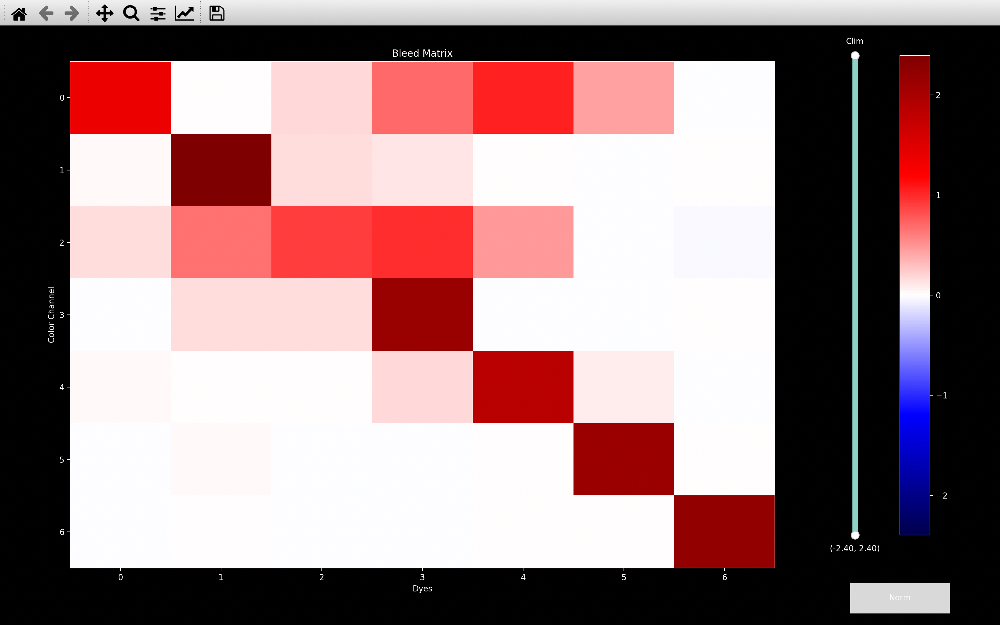{width="800"}
=== "Separate Bleed Matrix For Each Round"
    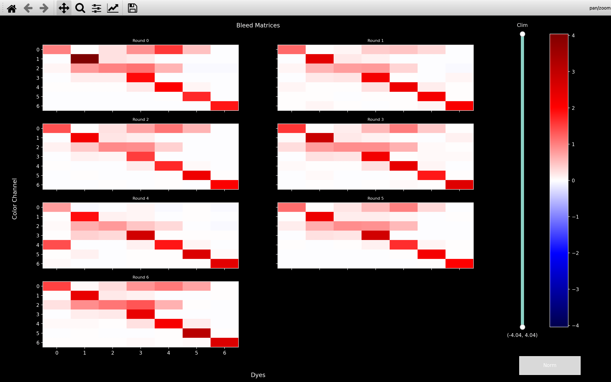{width="800"}


As shown in the second plot, if `config['bleed_matrix_method'] = 'separate'`, we compute a different 
`bleed_matrix` for each round - i.e. we loosen the assumption that crosstalk does not vary between sequencing rounds.

### Initial Bleed Matrix
To estimate the dye intensity vectors, $\pmb{c}_d$, the 
[`scaled_k_means`](../code/call_spots/bleed_matrix.md#iss.call_spots.bleed_matrix.scaled_k_means) algorithm
needs to know the number of dyes and a starting guess for what each dye vector looks like.

This is specified in the [`basic_info`](../config.md#basic_info) section of the configuration file as explained 
[here](../config_setup.md#specifying-dyes).

### Scaled K Means
The pseudocode for the [`scaled_k_means`](../code/call_spots/bleed_matrix.md#iss.call_spots.bleed_matrix.scaled_k_means)
algorithm to obtain the dye intensity vectors, $\pmb{c}_d$, is given below:

```
v: Single round intensity vectors of well isolated spots 
   [n_vectors x n_channels]
c: Initial Guess of Bleed Matrix
   [n_dyes x n_channels]
dye_ind_old: [n_vectors] array of zeros.

v_norm = v normalised so each vector has an L2 norm of 1.
Normalise c so that each dye vector has an L2 norm of 1.

i = 0
while i < n_iter:
    score = dot product between each vector in v_norm and each
        dye in c. [n_vectors x n_dyes]
    top_score = highest score across dyes for each vector
        in v_norm. [n_vectors].
    dye_ind = dye corresponding to top_score for each vector
        in v_norm. [n_vectors].
        
    if dye_ind == dye_ind_old:
        Stop iteration because we have reached convergence
        i.e. i = n_iter
    dye_ind_old = dye_ind
    
    for d in range(n_dyes):
        v_use = all vectors in v with dye_ind = d and 
            top_score > score_thresh.
            Use un-normalised as to avoid overweighting weak points.
            [n_use x n_channels]
        if n_use < min_size:
            c[d] = 0
        else:
            Update c[d] to be top svd component of v_use i.e.
                v_matrix = v_use.transpose() @ v_use / n_use
                    [n_channels x n_channels]
                c[d] = np.linalg.svd(v_matrix)[0][:, 0]
                    [n_channels]
        
    i = i + 1    
return c
```
There are a few parameters in the config file which are used:

* `bleed_matrix_n_iter`: This is `n_iter` in the above code.
* `bleed_matrix_min_cluster_size`: This is `min_size` in the above code.
* `bleed_matrix_score_thresh`: This is `score_thresh` in the above code.
* `bleed_matrix_anneal`: If this is `True`, the `scaled_k_means` algorithm will be run twice.
    The second time will use $\pmb{c}_d$ returned from the first run as the starting point,
    and it will have a different `score_thresh` for each dye. `score_thresh` for dye $d$ 
    will be equal to the median of `top_score[dye_ind == d]` in the last iteration of the first run.
    The idea is that for the second run, we only use vectors which have a large score,
    to get a more accurate estimate.

### [`view_scaled_k_means`](../code/plot/call_spots.md#scaled-k-means)
The [`scaled_k_means`](../code/call_spots/bleed_matrix.md#iss.call_spots.bleed_matrix.scaled_k_means) algorithm 
can be visualised using the [`view_scaled_k_means`](../code/plot/call_spots.md#scaled-k-means) function:

{width="800"}

In each column, the top row, boxplot $d$, is for `top_score[dye_ind == d]` (only showing scores above
`score_thresh`, which is 0 for the first two plots) with the dye vectors, $\pmb{c}_d$, indicated in the second
row. The number of vectors assigned to each dye is indicated by the number within each boxplot.

The first column is for the first iteration i.e. with the initial guess of the bleed matrix.
The second column is after the first `scaled_k_means` algorithm has finished.
The third column is after the second `scaled_k_means` algorithm has finished (only shown if `bleed_matrix_anneal=True`).
The bottom whisked of the boxplots in the third column indicate the `score_thresh` used for each dye.

This is useful for debugging the `bleed_matrix` computation, as you want the boxplots to show high scores and for those
scores to increase from left to right as the algorithm is run.

## Gene Bled Codes
Once the `bleed_matrix` has been computed, the expected code for each gene can be 
[obtained](../code/call_spots/base.md#iss.call_spots.base.get_bled_codes).

Each gene appears with a single dye in each imaging round as indicated by the [codebook](../config_setup.md#code_book)
and saved as `nb.call_spots.gene_codes`.
`bled_code[g, r, c]` for gene $g$ in round $r$, channel $c$ is then given by `bleed_matrix[r, c, gene_codes[g, r]]`.
If `gene_codes[g, r]` is outside `nb.basic_info.use_dyes`, then `bled_code[g, r]` will be set to 0.

Each `bled_code` is also normalised to have an L2 norm of 1. They are saved as `nb.call_spots.bled_codes`.

??? example

    Using the *Single Bleed Matrix* shown as an example [earlier](#bleed-matrix), the bled_code
    for *Kcnk2* with `gene_code = 6304152` is:

    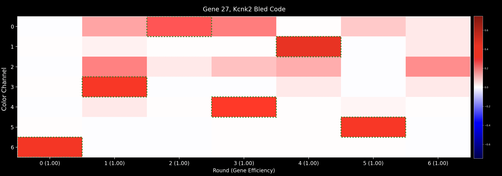{width="800"}

## Dot Product Score
To assign spot $s$, with spot color (post background), $\pmb{\zeta}_{{si}}$, to a gene, we compute a dot product
score, $\Delta_{sig}$ to each gene, $g$, with `bled_code` $\pmb{b}_g$. This is 
[defined](../code/call_spots/dot_product.md#iss.call_spots.dot_product.dot_product_score) to be:

$$
\Delta_{sig} = \sum_{r=0}^{n_r-1}\sum_{c=0}^{n_c-1}\omega^2_{{si}_{rc}}\tilde{\zeta}_{{si}_{rc}}b_{g_{rc}}
$$

Where:

$$
\tilde{\zeta}_{{si}_{rc}} = \frac{\zeta_{{si}_{rc}}}
{\sqrt{\sum_{\mathscr{r}=0}^{n_r-1}\sum_{\mathscr{c}=0}^{n_c-1}\zeta^2_{{si}_{\mathscr{rc}}}} + \lambda_d}
$$

$$
\sigma^2_{{si}_{rc}} = \beta^2 + \alpha\sum_g\mu^2_{sig}b^2_{g_{rc}}
$$

$$
\omega^2_{{si}_{rc}} = n_rn_c\frac{\sigma^{-2}_{{si}_{rc}}}
{\sum_{\mathscr{r}=0}^{n_r-1}\sum_{\mathscr{c}=0}^{n_c-1}\sigma^{-2}_{{si}_{\mathscr{rc}}}}
$$

* $n_{r}$ is the number of rounds.
* $n_{c}$ is the number of channels.
* $\lambda_d$ is `config['dp_norm_shift'] * sqrt(n_rounds)` (typical `config['dp_norm_shift']` is 0.1).
* $\alpha$ is `config['alpha']` (*default is 120*).
* $\beta$ is `config['beta']` (*default is 1*).
* The sum over genes, $\sum_g$, is over all real and background genes i.e. $\sum_{g=0}^{n_g+n_c-1}$.
$\mu_{sig=n_g+C} = \mu_{sC} \forall i$ and $\pmb{b}_{g=n_g+C} = \pmb{B}_C$ where $\mu_{sC}$ and $\pmb{B}_C$
were introduced in the [background](#background) section.
* $i$ refers to the number of actual genes fit prior to this iteration of *OMP*. Here, because we are
only fitting one gene, $i=0$, meaning only background has been fit ($\sum_{g=0}^{n_g-1}\mu^2_{sig}b^2_{g_{rc}}=0$).

So if $\lambda_d = 0$ and $\pmb{\omega}^2_{si}$ was 1 for each round and channel (achieved through $\alpha=0$), then 
this would just be the normal dot product between two vectors with L2 norm of one. 
The min value is 0 and max value is 1. 

The purpose of the weighting, $\pmb{\omega}^2_{{si}}$, is to decrease the contribution of rounds/channels 
which already have a gene in. It is really more relevant to the 
[*OMP* algorithm](omp.md#weighting-in-dot-product-score). 
It can be turned off in this part of the pipeline by setting
`config['alpha'] = 0`. The $n_rn_c$ term at the start of the $\omega^2_{{si}_{rc}}$ equation is a normalisation
term such that the max possible value of $\Delta_{sig}$ is approximately 1 (it can be more though).

??? note "Value of $\lambda_d$"

    If in the $\Delta_{sig}$ equation, we used $\pmb{\zeta}_{{si}}$ instead of $\pmb{\tilde{\zeta}}_{{si}}$,
    then the max value would no longer have an upper limit and a high score could be achieved by having 
    large values of $\pmb{\zeta}_{{si}}$ in some rounds and channels as well as by having $\pmb{\zeta}_{{si}}$
    being similar to $\pmb{b}_g$. 

    We use the [intensity](#intensity) value to indicate the strength of the spot, so for $\Delta_{sig}$, we 
    really just want a variable which indicates how alike the spot color is to the gene, indepenent of
    strength. Hence, we use $\pmb{\tilde{\zeta}}_{{si}}$.

    If $\lambda_d = 0$, it would mean that even background pixels with very small intensity could get a high score.
    So, we use a non-zero value of $\lambda_d$ to prevent very weak spots getting a large $\Delta_{sig}$.

    If `config['dp_norm_shift']` is not specified, it is set to the median of the L2 norm in a single round
    computed from the colors of all pixels in the middle z-plane 
    (`nb.call_spots.norm_shift_tile`) of the central tile (`nb.call_spots.norm_shift_z`).
    
    The idea behind this is that, the L2 norm of an average background pixel would be 
    `config['dp_norm_shift'] * sqrt(n_rounds)`. So if $\lambda_d$ was set to this, it is giving 
    a penalty to any spot which is less intense than the average background pixel. This is 
    desirable since any pixels of such a low intensity are unlikely to be spots.

The spot $s$, is assigned to the gene $g$, for which $\Delta_{sig}$ is the largest.

### [`view_score`](../code/plot/call_spots.md#view_score)
How the various parameters in the dot product score calculation affect the final value can be investigated,
for a single spot, through the function [`view_score`](../code/plot/call_spots.md#view_score):


=== "`view_score`"
    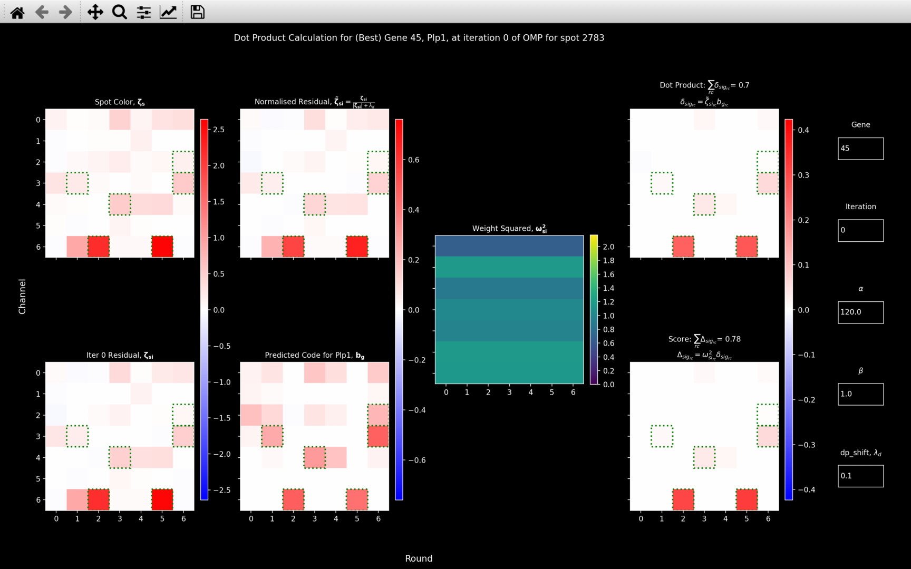{width="800"}
=== "`view_weight`"
    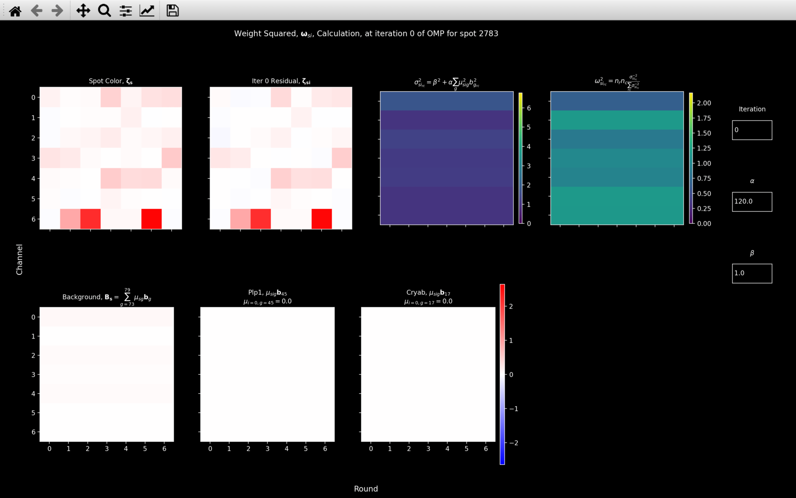{width="800"}

* The top left plot shows the spot color prior to any removal of genes or background.
* The bottom left plot shows the spot color after all genes fit prior to the current iteration have been removed
(just background for iteration 0).
* The top right plot shows the dot product score obtained without weighting ($\alpha=0$).
* The bottom right plot shows the actual score obtained with the current weighting parameters.
* To get to the gene with the highest dot product score for the current iteration, you can enter an impossible value
in the *Gene* textbox. As well as typing the index of the gene, you can also type in the gene name to 
look at the calculation for a specific gene.
* Clicking on the *Weight Squared* plot shows the [`view_weight`](../code/plot/call_spots.md#view_weight) 
plot indicating how it is calculated (second image above). 
[This is more useful for iterations other than 0](omp.md#view_weight).

Looking at the `view_weight` image and the far right plots of the `view_score` image, 
we see that the effect of the weighting is to down-weight color channel 0 because this is where the background
coefficient is the largest. The channels with a smaller background coefficient (1, 5 and 6) then have 
a weighting greater than 1. Thus, the weighted score is greater than the non-weighted one because
channel 6, where this spot is particularly strong has a greater contribution.
I.e. because the intensity in channel 6 cannot be explained by background genes, but it can be explained by Plp1, 
we boost the score. For most spots, the background coefficients are very small and so the weighting has little effect.

Using the [`histogram_score`](#histogram_score) function, we see that the effect of weighting (blue) is to 
add a tail of scores greater than 1 for spots where an increased contribution is given to the rounds/channels
where they are most intense. The mode score does not change though:

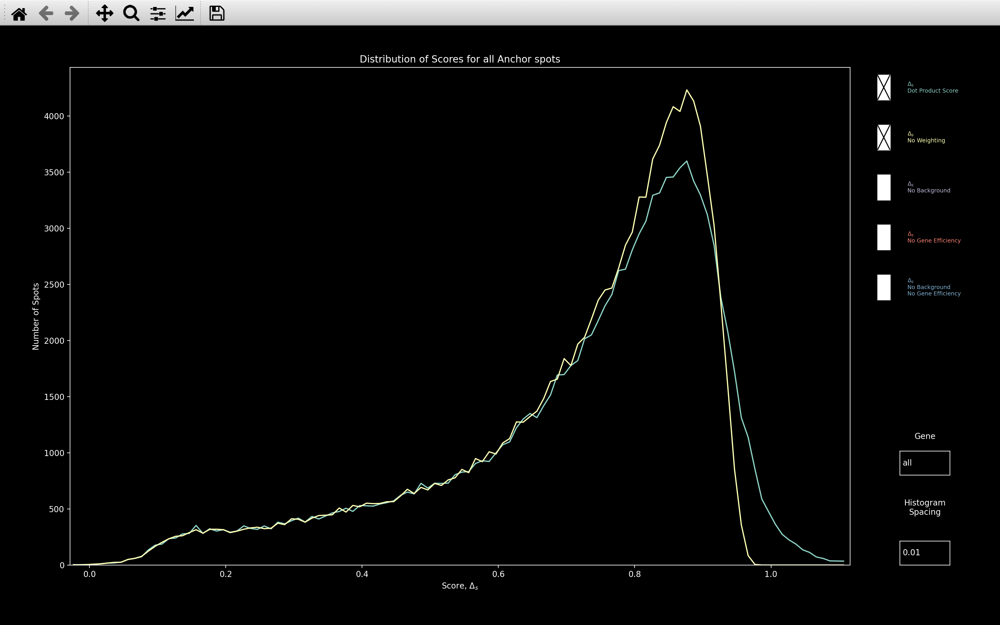{width="800"}

## Gene Efficiency
Once we have a [score](#dot-product-score) and gene assigned to each spot, we can update the bled_codes
for each gene, $\pmb{b}_g$ based on all the spot colors assigned to them, $\pmb{\zeta}_{{s0}}$. 
We do this by determining `nb.call_spots.gene_efficiency`. `gene_efficiency[g, r]` gives the expected intensity
of gene $g$ in round $r$, as determined by the spots assigned to it, compared to that expected by the `bleed_matrix`.

The pseudocode below explains how it is [computed](../code/call_spots/base.md#iss.call_spots.base.get_gene_efficiency).

```
spot_colors: Intensity of each spot in each channel
    [n_spots x n_rounds x n_channels]
spot_gene_no: Gene each spot was assigned to.
    [n_spots]
bm: Bleed Matrix, indicates expected intensity of each
    dye in each round and channel.
    [n_rounds x n_channels x n_dyes]
gene_codes: Indicates dye each gene should appear with in each round.
    [n_genes x n_rounds]

for g in range(n_genes):
    Only use spots assigned to current gene.
        use = spot_gene_no == g
    
    for r in use_rounds:
        Get bleed matrix prediction for strength of gene g in round r.
            bm_pred = bm[r, :, gene_codes[g, r]]
            [n_channels]
        Get spot colors for this round.
            spot_colors_r = spot_colors[use, r]
            [n_use x n_channels]
        For each spot, s, find the least squares coefficient, coef, such that
            spot_colors_r[s] = coef * bm_pred
    Store coef for each spot and round as spot_round_strength
        [n_use x n_rounds]
    
    for r in use_rounds:
        av_round_strength[r] = median(spot_round_strength[:, r])
    Find av_round which is the round such that av_round_strength[av_round]
        is the closest to median(av_round_strength).
    
    Update spot_round_strength to only use spots with positive strength in
        av_round.
        keep = spot_round_strength[:, av_round] > 0
        spot_round_strength = spot_round_strength[keep]
        [n_use2 x n_rounds]
        
    For each spot, determine the strength of each round relative to av_round.
    for s in range(n_use2):
        for r in use_rounds:
            relative_round_strength[s, r] = spot_round_strength[s, r] /
                                            spot_round_strength[s, av_round]
    
    Update relative_round_strength based on maximum value.
        max_round_strength is max of relative_round_strength for 
            each spot across rounds [n_use2].
        keep = max_round_strength < max_thresh
        relative_round_strength = relative_round_strength[keep]
        [n_use3 x n_rounds]
        
    Update relative_round_strength based on low values.
        Count number of rounds for each spot below min_thresh.
        for s in range(n_use3):
            n_min[s] = sum(relative_round_strength[s] < min_thresh)
        keep = n_min <= n_min_thresh
        relative_round_strength = relative_round_strength[keep]
        [n_use4 x n_rounds]
        
    for r in use_rounds:
        if n_use4 > min_spots:
            gene_efficiency[g, r] = median(relative_round_strength[:, r])
        else:
            Not enought spots to compute gene efficiency so just set to 1 in 
                every round.
                gene_efficiency[g, r] = 1    

Clip negative gene efficiency at 0.
    gene_efficiency[gene_efficiency < 0] = 0  
return gene_efficiency         
```
There are a few parameters in the [configuration file](../config.md#call_spots) which are used:

* `gene_efficiency_max`: This is `max_thresh` in the above code.
* `gene_efficiency_min`: This is `min_thresh` in the above code.
* `gene_efficiency_min_factor`: `n_min_thresh` in the above code is set to 
`ceil(gene_efficiency_min_factor * n_rounds)`.
* `gene_efficiency_min_spots`: This is `min_spots` in the above code.

In the gene_efficiency calculation, we computed the strength of each spot relative to `av_round`
because, as with the `bleed_matrix` calculation, we expect each spot color to be a scaled version of
one of the `bled_codes`. So we are trying to find out, once a spot color has been normalised such that its strength
in `av_round` is 1, what is the corresponding strength in the other rounds. We do this normalisation
relative to the average round so that half the `gene_efficiency` values will be more than 1 and half less than 1
for each gene. For gene $g$, one value of `gene_efficiency[g]` will be 1, corresponding to `av_round`
but this round will be different for each gene.

??? question "Why do we need `gene_efficiency`?"
        
    We need `gene_efficiency` because there is a high variance in the strength each gene appears with in each round.
    For example, in the the `bled_code` plot below, we see that the effect of incorporating gene_efficiency
    is to reduce the strength of rounds 0, 5 and 6 while boosting rounds 2 and 3.

    ??? note 
        In the example below, it seems that rounds corresponding to the same dye (0 and 5; 1 and 4; 2 and 3) 
        have similar strengths, so it may be that different dyes (instead of rounds) 
        have different strengths for different genes.
        

    === "`bled_code`"
        {width="600"}
    === "histogram"
        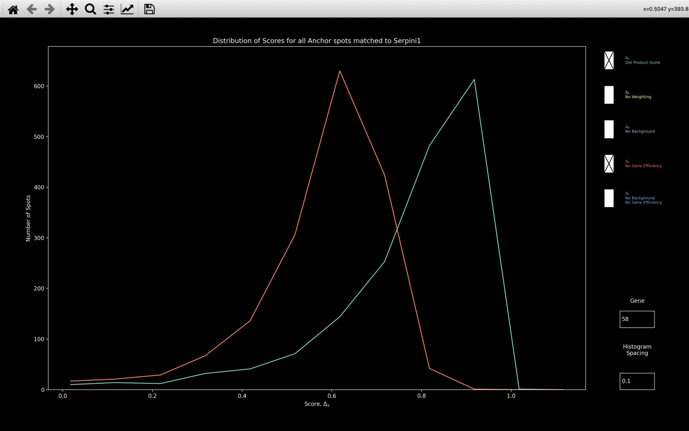{width="600"}

    The [histogram](#histogram_score) plot above then shows that when gene efficiency is included (blue line), 
    the score distribution is shifted considerably. 
    This indicates that gene efficiency is required to truly capture what
    spot colors corresponding to `Serpini1` look like.
    
    The [`histogram_score`](#histogram_score) plot combining all genes, also shows a shift in the peak 
    of the distribution towards higher scores when gene efficiency is included:

    {width="600"}

### Spots used
Because we use the `gene_efficiency` to update the `bled_codes`, we only want to use spots, which we
are fairly certain have been assigned to the correct gene. Thus, only spots which satisfy all the following
are used in the `gene_efficiency` calculation:

* Like with the [`scaled_k_means`](#bleed-matrix) calculation, only spots identified as [isolated](find_spots.md#isolated-spots) 
in the *find spots* step of the pipeline are used.
* The dot product score to the best gene, $g_0$, $\Delta_{s0g_0}$ must exceed `config['gene_efficiency_score_thresh']`.
* The difference between the dot product score to the best gene, $g_0$, and the second best gene, $g_1$:
$\Delta_{s0g_0}-\Delta_{s0g_1}$ must exceed `config['gene_efficiency_score_diff_thresh']`.
* The [intensity](#intensity), $\chi_s$, must exceed `config['gene_efficiency_intensity_thresh']`.

??? note "Value of `config['gene_efficiency_intensity_thresh']`"

    If `config['gene_efficiency_intensity_thresh']` is not specified, 
    it is set to the percentile indicated by `config['gene_efficiency_intensity_thresh_percentile']` 
    of the [`intensity`](#intensity) 
    computed from the colors of all pixels in the middle z-plane 
    (`nb.call_spots.norm_shift_tile`) of the central tile (`nb.call_spots.norm_shift_z`).
    
    It is then clipped to be between `config[gene_efficiency_intensity_thresh_min]` and 
    `config[gene_efficiency_intensity_thresh_max]`.

    The idea is that this is quite a low threshold (default percentile is 37), 
    just ensuring that the intensity is not amongst the weakest background pixels. If the intensity
    threshold was too high, we would end up losing spots which look a lot like genes just
    because they are weak. But if it was too low, we would identify some background pixels as genes.

### Updating `bled_codes`
Once the `gene_efficiency` has been computed, the `bled_codes` can be updated:

```
bled_codes: Those computed from the bleed_matrix
    [n_genes x n_rounds x n_channels].
gene_efficiency: [n_genes x n_rounds]

for g in range (n_genes):
    for r in use_rounds:
        for c in use_channels:
            bled_codes[g, r, c] = bled_codes[g, r, c] * gene_efficiency[g, r]
    Normalise bled_codes[g] so it has an L2 norm of 1.
```

We then re-compute the [dot product score](#dot-product-score) and gene assignment 
for each spot with the new `bled_codes`. We continue this process of computing the gene_efficiency, 
updating the [dot product score](#dot-product-score) until the same spots
have been used to compute the gene efficiency in two subsequent iterations or until
`config[gene_efficiency_n_iter]` iterations have been run.

The bled_codes computed from the final iteration will be saved as `nb.call_spots.bled_codes_ge`. This will
be the same as `nb.call_spots.bled_codes` if `config[gene_efficiency_n_iter] = 0`.
These are the ones used to compute dot product score to the best gene, $g_0$, $\Delta_{s0g_0}$.
These are saved as `nb.ref_spots.gene_no` and `nb.ref_spots.score` respectively.
The difference between the dot product score to the best gene, $g_0$, and the second best gene, $g_1$:
$\Delta_{s0g_0}-\Delta_{s0g_1}$ is saved as `nb.ref_spots.score_diff`.


## Intensity
As well as a variable indicating how closely a spot matches a gene (`nb.ref_spots.score`), we also save 
a variable indicating the overall fluorescence of a spot, independent of which gene it belongs to. This intensity,
$\chi$, is saved as `nb.ref_spots.intensity` and for a spot $s$, it is 
[defined](../code/call_spots/qual_check.md#iss.call_spots.qual_check.get_spot_intensity) by:

$$
\chi_s = \underset{r}{\mathrm{median}}(\max_c\zeta_{s_{rc}})
$$

I.e. for each round, we take the max color across channels to give a set of $n_{rounds}$ values.
We then take the median of these. 

The logic behind this is that if the spot is actually a gene, then
there should be at least one channel in every round which is intense, because the relevant dye shows up in it.
If the spot was not actually a gene though, you would expect all channels in any given round 
to be similarly weakly intense and thus the max over channels would give a low value.


### [`view_intensity`](../code/plot/call_spots.md#view_intensity)
The intensity calculation can be visualised with the [`view_intensity`](../code/plot/call_spots.md#view_intensity)
function:

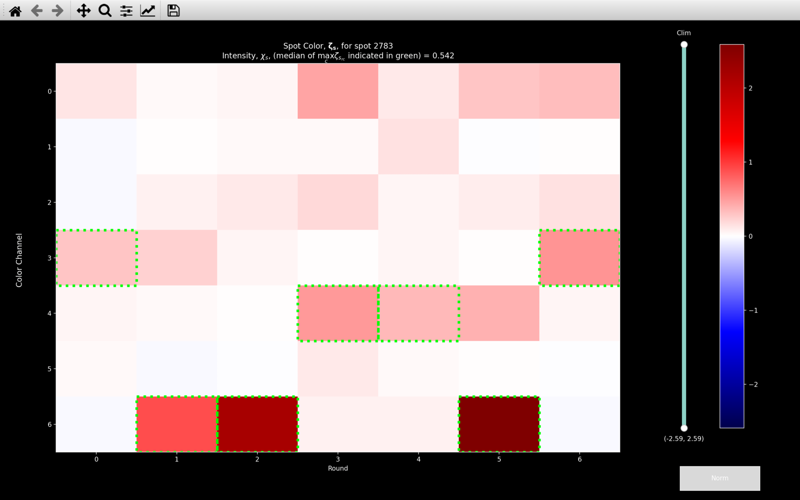{width="600"}

$\chi_s = 0.542$ for this example spot, which is the median of all the values shown with a green border.

## Diagnostics
As well as [`view_background`](#view_background), [`view_scaled_k_means`](#view_scaled_k_means), 
[`view_score`](#view_score) and [`view_intensity`](#view_intensity), 
there are a few other functions using matplotlib which may help to debug this section of the pipeline.

### [`histogram_score`](../code/plot/omp.md#histogram_score)
This shows the histogram of the [dot product score](#dot-product-score), $\Delta_s$, 
assigned to every reference spot:

=== "Dot Product Score"
    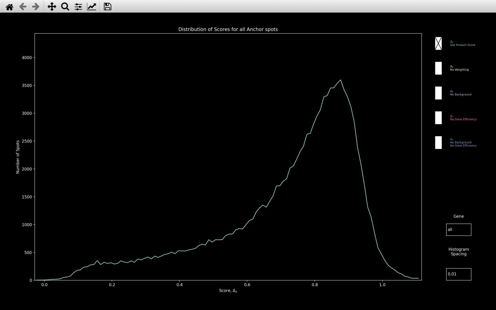{width="800"}
=== "All Plots"
    {width="800"}

This is useful for checking how well that the gene assignment worked. The higher the score where the distribution 
peaks, the better. Certainly, if the peak is around 0.8, as with this example, then it probably worked well.

The *Dot Product Score* image above is showing the histogram of `nb.ref_spots.score`, but there are 4 other plots 
which can be selected, as shown in the *All Plots* image above:

* *No Weighting*: This is the score that would be computed if $\alpha=0$ in the 
[dot product score calculation](#dot-product-score). The max possible score in this case is 1.
* *No Background*: This is the score that would be computed if the [background](#background) *genes* were not removed
before determining the score. This also has no weighting because in the dot product calculation, 
$\omega^2_{si_{rc}} = 1$ if no background has been fitted. Hence, the max score is 1 as with *No Weighting*.
* *No Gene Efficiency*: This is the score that would be computed if the `nb.call_spots.bled_codes`
were used instead of `nb.call_spots.bled_codes_ge`. $\omega^2_{si_{rc}} \neq 1$ here so the max score is over 1.
* *No Background / No Gene Efficiency*: This is the score that would be computed if the [background](#background) 
*genes* were not removed before determining the score and if `nb.call_spots.bled_codes`
were used instead of `nb.call_spots.bled_codes_ge`. The max score is 1 in this case.

The *Gene* textbox can also be used to view the histogram of a single gene. Either the index of the gene
or the gene name can be entered. To go back to viewing all genes, type in *all* into the textbox.

The Histogram Spacing textbox can be used to change the bin size of the histogram.

### [`gene_counts`](../code/plot/call_spots.md#gene_counts)
This plot indicates the number of spots assigned to each gene which also have `nb.call_spots.score > score_thresh`
and `nb.call_spots.intensity > intensity_thresh`. The default `score_thresh` and `intensity_thresh` 
are `config['thresholds']['score_ref']` and `config['thresholds']['intensity']` respectively. They can be changed
with the textboxes though. This 
[thresholding](../code/call_spots/qual_check.md#iss.call_spots.qual_check.quality_threshold) 
is the same that is done in the [results viewer](../view_results.md#score-range) 
and when [exporting to pciSeq](../code/utils/pciseq.md). 

=== "Gene Counts"
    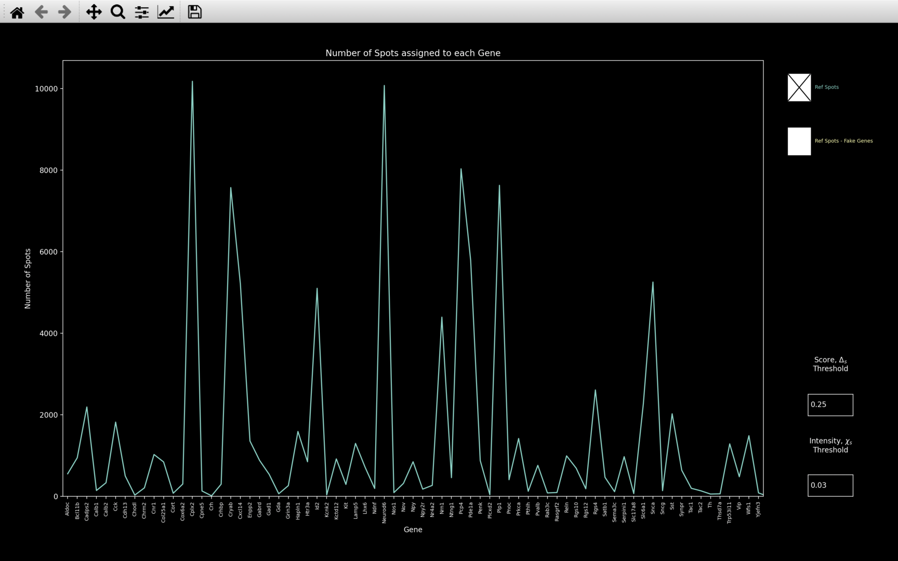{width="800"}
=== "Gene Counts with Fake Genes"
    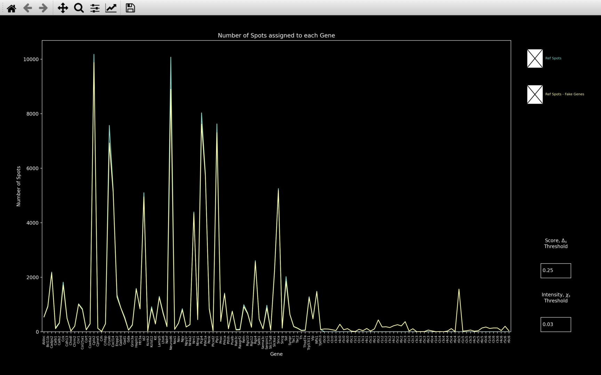{width="800"}

There is also a second *Ref Spots - Fake Genes* plot which can be shown in yellow. This shows the results 
of the gene assignment if we added some fake `bled_codes` as well as the ones corresponding to genes.
The idea is to choose fake `bled_codes` which are well separated from the actual `bled_codes`. If spots then match to
these fake genes then it probably means the initial gene assignment is not reliable.

The fake `bled_codes` can be specified, but by default there is one fake bled_code added for each round, $r$, and
channel $c$, which is 1 in round $r$, channel $c$ and 0 everywhere else. In the second image above, we see that 
there is not much change in the gene counts when we add the fake genes, indicating the initial assignment is probably
reliable.

??? example "Example Dataset with lots of *Fake Genes*"

    The example below indicates a case when the fake genes functionality may be useful.
        
    When we look at the `iss_plot`, we see that there seems to be too many spots assigned to *Penk* and 
    *Vip*.
    
    === "`iss_plot`"
        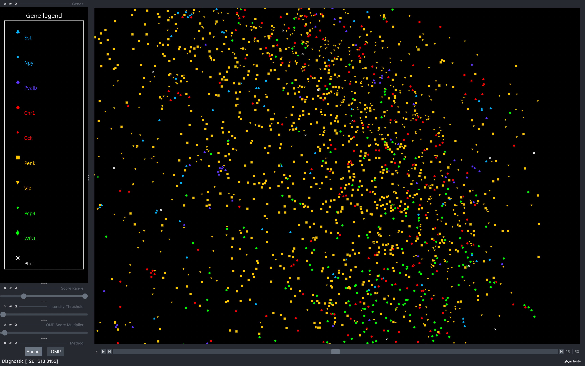{width="800"}
    === "`gene_counts`"
        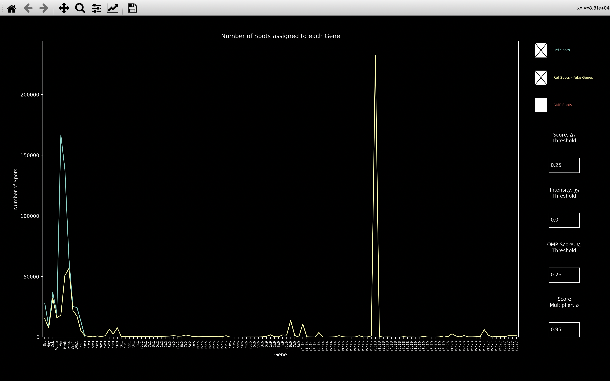{width="800"}
    === "*Penk*"
        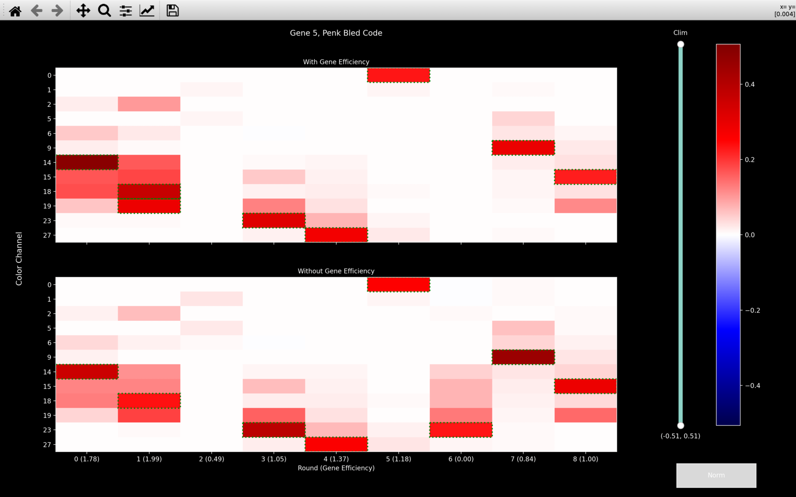{width="800"}
    === "*Vip*"
        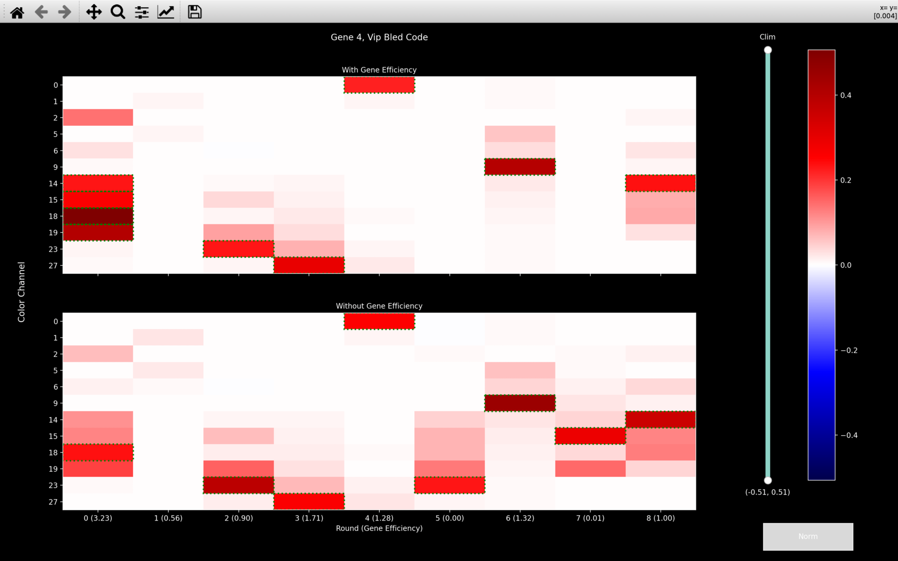{width="800"}

    If we then look at the `gene_counts`, we see that when we include fake genes, the number of spots
    assigned to *Penk* and *Vip* decreases drastically because they have been assigned to the $r0c18$ fake gene.
    
    When we look at the *Penk* and *Vip* bled_codes, we see that they are very intense in round 0, channel 18.
    So most spots seem to only have been assigned to these genes on the basis of this one round and channel.

### [`view_bleed_matrix`](../code/plot/call_spots.md#view_bleed_matrix)
[This function](../view_results.md#b-view_bleed_matrix) is useful for seeing if the dye vectors in the 
bleed_matrix are easily distinguished.

### [`view_bled_codes`](../code/plot/call_spots.md#view_bled_codes)
[This function](../view_results.md#g-view_bled_codes) is useful for seeing how the `gene_efficiency` 
affected the `bled_codes`.

### [`view_codes`](../code/plot/call_spots.md#view_codes)
[This function](../view_results.md#c-view_codes) is useful for seeing how a particular spot matches
the gene it was assigned to.

### [`view_spot`](../code/plot/call_spots.md#view_spot)
[This function](../view_results.md#s-view_spot) is useful for seeing if the neighbourhood of a  particular spot 
has high intensity in all rounds/channels where the gene it was assigned, expects it to.

## Psuedocode
This is the pseudocode outlining the basics of this [step of the pipeline](../code/pipeline/call_reference_spots.md).
There is more detailed pseudocode about how the [`bleed_matrix`](#scaled-k-means) and 
[`gene_efficiency`](#gene-efficiency) are found.

```
Determine color_norm_factor from nb.extract.hist_counts
    [n_rounds x n_channels]

Load in pixel colors of all pixel of middle z-plane of
    central tile. Use these to determine the following
    if not provided in the config file:
    - nb.call_spots.background_weight_shift    
    - nb.call_spots.dp_norm_shift
    - nb.call_spots.gene_efficiency_intensity_thresh
    - nb.call_spots.abs_intensity_percentile

Normalise reference spot colors
    spot_colors = nb.ref_spots.colors / color_norm_factor
    [n_spots x n_rounds x n_channels]

Compute Spot Intensity  (nb.ref_spots.intensity)
Remove Background from spot_colors
Compute Bleed Matrix    (nb.call_spots.bleed_matrix)
Compute Bled Codes      (nb.call_spots.bled_codes)

use_ge_last = array of length n_spots where all values are False.
i = 0
while i < gene_efficiency_n_iter:
    Determine all_scores, the dot product score of each spot to 
        each bled_code.
        [n_spots x n_genes]
    Determine gene_no, the gene for which all_scores is the greatest
        for each spot.
        [n_spots]
    Determine score, the score in all_scores, corresponding to gene_no
        for each spot.
        [n_spots]
    Determine score_diff, the difference between score and the second 
        largest value in all_scores for each spot.
        [n_spots]
    Determine whether each spot was used for gene efficiency calculation.
        use_ge = score > ge_score_thresh            and 
                 score_diff > ge_score_diff_thresh  and 
                 intensity > ge_intensity_thresh    and 
                 nb.ref_spots.isolated.
        [n_spots]
    Compute gene_efficiency with spots indicated by use_ge
    Update bled_codes based on gene_efficiency   
    If use_ge == use_ge_last:
        End iteration i.e. i = gene_efficiency_n_iter
    use_ge_last = use_ge
    i += 1

Save final bled_codes as        nb.call_spots.bled_codes_ge
Save final gene_efficiency as   nb.call_spots.gene_efficiency
Save final gene_no as           nb.ref_spots.gene_no
Save final score as             nb.ref_spots.score
Save final score_diff as        nb.ref_spots.score_diff              
```
