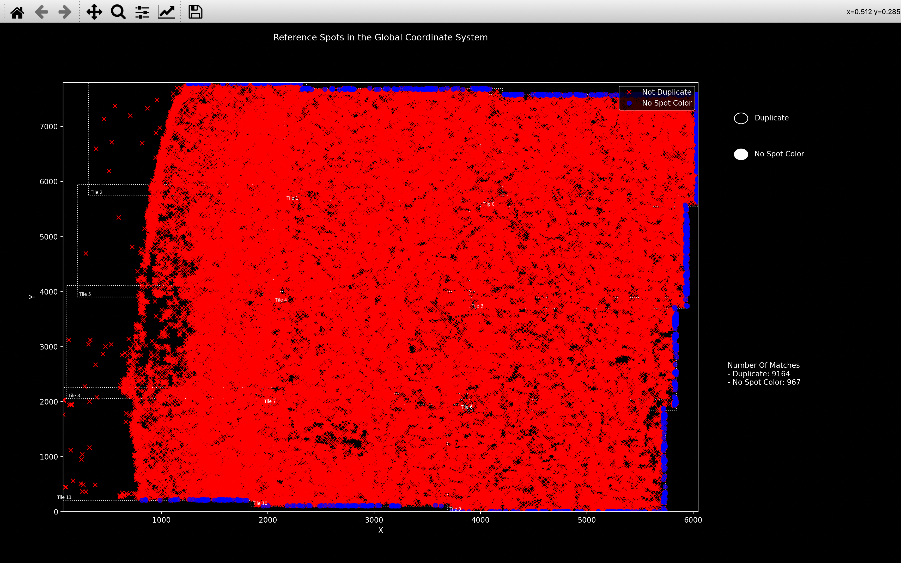

# Get Reference Spots
The [*get reference spots* step of the pipeline](../code/pipeline/get_reference_spots.md) uses the affine transforms
found in the [register](register.md) step of the pipeline to compute the corresponding coordinate of each
reference spot (detected on the reference round/reference channel ($r_{ref}$/$c_{ref}$) in 
[*find spots* step](find_spots.md)) in each imaging round and channel. 
By reading off the intensity values at these coordinates, an $n_{rounds} \times n_{channels}$ 
intensity vector or `spot_color` can be found for each reference spot. 

These intensity vectors are saved as `colors` in the [`ref_spots`](../notebook_comments.md#ref_spots) *NotebookPage* 
which is added to the *Notebook* after this stage is finished and are used for assigning each spot to a gene
in the [*call reference spots* step](call_reference_spots.md). 

???+ note "Variables in [`ref_spots`](../notebook_comments.md#ref_spots) *NotebookPage*"

    All variables in the [`ref_spots`](../notebook_comments.md#ref_spots) *NotebookPage* are arrays 
    where the size of the first axis is $n_{spots}$ i.e. each variable has info for each reference spot.
    
    The variables `local_yxz`, `isolated` and `tile` are just copied from `nb.find_spots.spot_details`.

    The variables `gene_no`, `score`, `score_diff`, `intensity` are not computed until the 
    [*call reference spots* step](call_reference_spots.md) but because each is an array of size $n_{spots}$, 
    they are saved in the [`ref_spots`](../notebook_comments.md#ref_spots) page instead of the 
    [`call_spots`](../notebook_comments.md#call_spots) page.

    Before the [*call reference spots* step](call_reference_spots.md) though, their values will be set to `None`.
    This is so if there is an error in [`call_reference_spots`](../code/pipeline/call_reference_spots.md), 
    [`get_reference_spots`](../code/pipeline/get_reference_spots.md) won't have to be re-run.
    

## Spot Colors
### Duplicates
We don't find the `spot_color` for every reference spot because there will be duplicates - the same spot detected
on more than 1 tile. This is because there is an overlap between the tiles. 

To [remove these duplicates](../code/call_spots/base.md#coppafish.call_spots.base.get_non_duplicate), we only keep spots 
which were detected on a tile (saved in [`nb.find_spots.spot_details`](../notebook_comments.md#find_spots) 
during the [*find spots* step](find_spots.md)) which is also the tile whose centre they are closest to in the 
global coordinate system (`nb.stitch.tile_origin + nb.basic_info.tile_centre`).

The [`view_stitch`](stitch.md#view_stitch) function shows the duplicate spots in blue.

### Applying transform
To determine the aligned coordinate of each reference spot detected on tile $t$ in round $r$, channel $c$, we
must [apply](../code/spot_colors/base.md#coppafish.spot_colors.base.apply_transform) the affine transform found for 
tile $t$, round $r$, channel $c$: `nb.register.transform[t, r, c]` to the $yxz$ coordinates of the spots.

First the $yxz$ coordinates must be centered (subtract `nb.basic_info.tile_centre`) and the z-coordinate
must be converted into units of yx-pixels (multiply by `z_scale = nb.basic_info.pixel_size_z / 
nb.basic_info.pixel_size_xy`).
The $n_{spots} \times 3$ array must then be padded with ones to form an $n_{spots} \times 4$ array, so it can be 
multiplied by the $4 \times 3$ transform. The coordinates are prepared in this way because they must be in the same 
form as was used to compute the transform (see *Preparing point clouds* and *Padding `ref_spot_yxz`* notes 
[here](register.md#icp)). 

Once the $n_{spots} \times 4$ spot coordinate array is multiplied by the $4 \times 3$ transform, a 
$n_{spots} \times 3$ array is obtained, and after the z-scaling and centering are removed, this gives the corresponding
$yxz$ coordinates in round $r$, channel $c$. 

### Reading off intensity
After the $yxz$ coordinates in tile $t$, round $r$, channel $c$, are found, the intensity values at these coordinates
are obtained by supplying the $n_{spots} \times 3$ array as the parameter `yxz` in the function 
[`load_tile`](../code/utils/npy.md#coppafish.utils.npy.load_tile).

After [doing this](../code/spot_colors/base.md#coppafish.spot_colors.base.get_spot_colors) for all tiles, 
rounds and channels, we obtain the `spot_color` where `spot_color[s, r, c]` is the intensity value found for 
spot `s` in round `r`, channel `c`.

### Invalid Values
For some spots, the corresponding coordinates in round $r$, channel $c$, will be outside the bounds of the tile and 
thus the intensity cannot be read off. We therefore only save to the *Notebook* spots which remain in the tile
bounds across all rounds and channels, allowing the full `spot_color` array to be computed.

Once the *Notebook* has the [`ref_spots`](../notebook_comments.md#ref_spots) *NotebookPage*, when 
[`view_stitch`](stitch.md#view_stitch) is run, there will a button called *No Spot Color* which shows in blue 
all spots removed for this reason:

{width="800"}

??? note "`spot_color` outside rounds/channels used"

    `nb.ref_spots.colors` is an `n_spots x nb.basic_info.n_rounds x nb.basic_info.n_channels` array.
    `nb.ref_spots.colors[s, r, c]` will be set to `-nb.basic_info.tile_pixel_value_shift` for all spots, `s`, 
    if either `r` is not in `nb.basic_info.use_rounds` or `c` is not in `nb.basic_info.use_channels`.
    
    This is because it is impossible for an actual pixel to have this intensity, due to clipping 
    done in the [*extract* step](extract.md) when 
    [saving the tiles](../code/utils/npy.md#coppafish.utils.npy.save_tile). 
    So basically, this is an integer version of `nan`.
    
    
## Pseudocode
This is the pseudocode outlining the basics of this [step of the pipeline](../code/pipeline/get_reference_spots.md).

```
r_ref = reference round
c_ref = reference round
spot_yxz[t, r, c] = yxz coordinates for spots detected on tile t,
                    round r, channel c.
transform[t, r, c] = affine transform between tile t, round r_ref, channel c_ref
                     and round r, channel c. 
                     [n_tiles x n_rounds x n_channels x 4 x 3]                   

Remove duplicate spots from spot_yxz[:, r_ref, c_ref].
Center reference point cloud:
    spot_yxz[:, r_ref, c_ref] = spot_yxz[:, r_ref, c_ref] - tile_centre
Convert z coordinate into yx-pixels:
    spot_yxz[:, r_ref, c_ref][:, 2] = spot_yxz[:, r_ref, c_ref][:, 2] * z_scale
Pad reference point cloud with ones:
    spot_yxz[:, r_ref, c_ref][:, 3] = 1 
    
for t in use_tiles:
    spot_colors_t: [n_spots_t x n_rounds x n_channels]              
    for r in use_rounds:
        for c in use_channels:
            Apply transform to get new coordinates in round r, channel c:
                spot_yxz_rc = spot_yxz[t, r_ref, c_ref] @ transform[t, r, c]
            Convert z coordinate back to z-pixels:
                spot_yxz_rc[:, 2] = spot_yxz_rc[:, 2] / z_scale
            Remove centering:
                spot_yxz_rc = spot_yxz_rc + tile_centre
              
            For spots where spot_yxz_rc is outside the tile bounds, 
            cannot read off intensity: 
                spot_colors_t[oob_spots, r, c] = nan
            For all other spots, we read off the intensity at the 
            coordinates we found
                image_trc = load in image for tile t, round r, channel c
                from npy file in tile directory
                spot_colors_t[good_spots, r, c] = image_trc[spot_yxz_rc[good_spots]]

Concatenate all spot_colors_t together so have one large 
[n_spots x n_rounds x n_channels] array
giving colors for all spots across all tiles.

Get rid of any spot for which at least one round and channel has the nan value 
i.e. they were out of bounds on at least one round/channel.
               
Add colors to ref_spots NotebookPage      
Add local_yxz, isolated and tile variables by reshaping information
    in nb.find_spots.spot_details.
Add gene_no, score, score_diff, intensity to ref_spots NotebookPage 
    all with the value None.
```
