# OMP
The [*OMP* step of the pipeline](../code/pipeline/omp.md) runs an Orthogonal Matching Pursuit (*OMP*) algorithm on every 
pixel, adding multiple gene [`bled_codes`](call_reference_spots.md#gene-bled-codes) 
to explain the $n_{rounds} \times n_{channels}$ [intensity vector](get_reference_spots.md#reading-off-intensity) 
at each pixel. This gives us a coefficient, $\mu_{sg}$ for every pixel, $s$, and gene, $g$, and thus we can 
create a coefficient image for every gene.

By doing a local maxima search on these images, we can obtain another estimate of the distribution of genes which 
we can compare to that obtained from the [reference spots](get_reference_spots.md). The number and location of spots
found by the *OMP* method will be different though.

There are some variables obtained for each spot (`local_yxz`, `tile`, 
[`colors`](get_reference_spots.md#reading-off-intensity), `gene_no` and 
[`intensity`](call_reference_spots.md#intensity)) saved in the 
[`omp`](../notebook_comments.md#omp) *NotebookPage* which are equivalent to the same variables saved 
in the [`ref_spots`](../notebook_comments.md#ref_spots) *NotebookPage*. 
There are also some other variables added to the [`omp`](../notebook_comments.md#omp) *NotebookPage* which 
relate to the typical shape of a spot in the gene coefficient images.

The *OMP* section takes quite a long time, so [`config['omp']['use_z']`](../config.md#omp) can be used to only run 
*OMP* on a subset of z-planes.

!!! note "Note: `config` in this section, with no section specified, means [`config['omp']`](../config.md#omp)"

## Why bother with *OMP*?
There are two main reasons to use the *OMP* method for finding the distribution of genes instead of
[*reference spots*](call_reference_spots.md). The first is that *OMP* fits multiple coefficients to every 
pixel and thus allows for overlapping spots:

=== "`view_omp_fit`"
    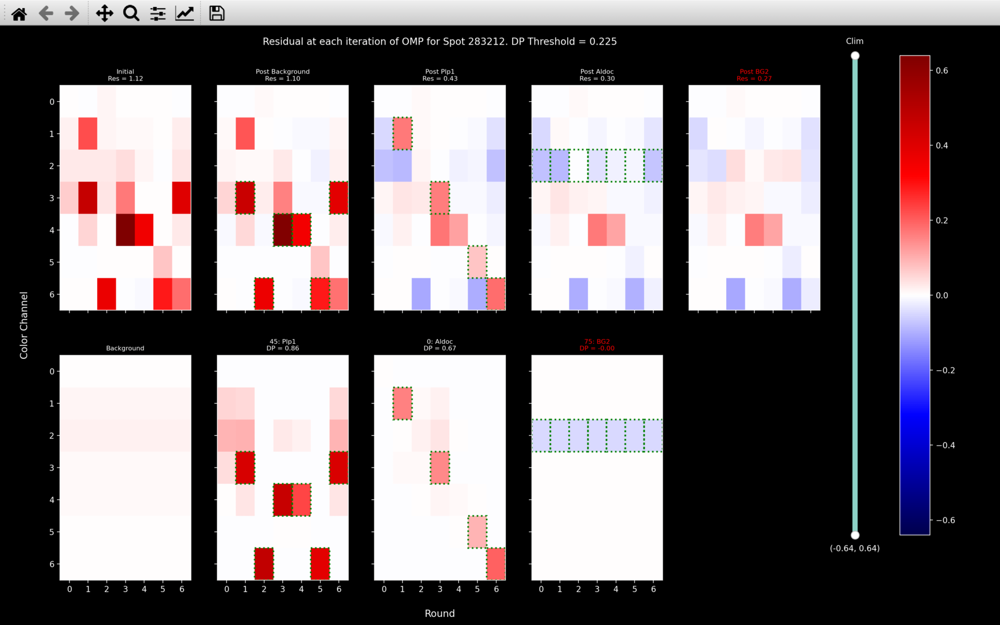{width="600"}
=== "`view_omp`"
    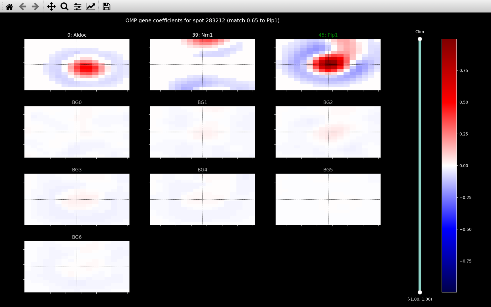{width="600"}

In the [`view_omp_fit`](../view_results.md#shift-o-view_omp_fit) plot, it shows an example of a spot color, 
$\pmb{\zeta}_s$, which requires the `bled_code` of both *Plp1* and *Aldoc* to explain it. The 
[`view_omp`](../view_results.md#o-view_omp) plot then shows that spots for both these genes are detected with 
the *OMP* method. The [*reference spots*](call_reference_spots.md) method though, can only fit one gene 
to each pixel, so here it only detects the *Plp1* spot.

The second reason is that the [*reference spots*](call_reference_spots.md) method can only assign genes to spots
[detected](find_spots.md) on the reference round / reference channel images. It is thus restricted, because there may 
be genes present at pixels other than the finite amount considered. Also, the 
`config['find_spots']['radius_xy']` and `config['find_spots']['radius_z']` parameters in the spot detection 
necessitates a minimum distance between any two genes.

The *OMP* method says that spots are local maxima in the gene coefficient images, and thus it can find spots
at locations other than the location of the *reference spots*. Also, because it does a separate local maxima search
for each gene, the `config['radius_xy']` and `config['radius_z']` parameters in spot detection 
only necessitates a minimum distance between two spots of the same gene.

The consequence of this, is that the spots detected by the *OMP* method tend to be in more dense clusters, as shown 
by the [`iss_plot`](../view_results.md) below. This 
is then more useful for [cell typing](../code/utils/pciseq.md)

=== "*Reference Spots*"
    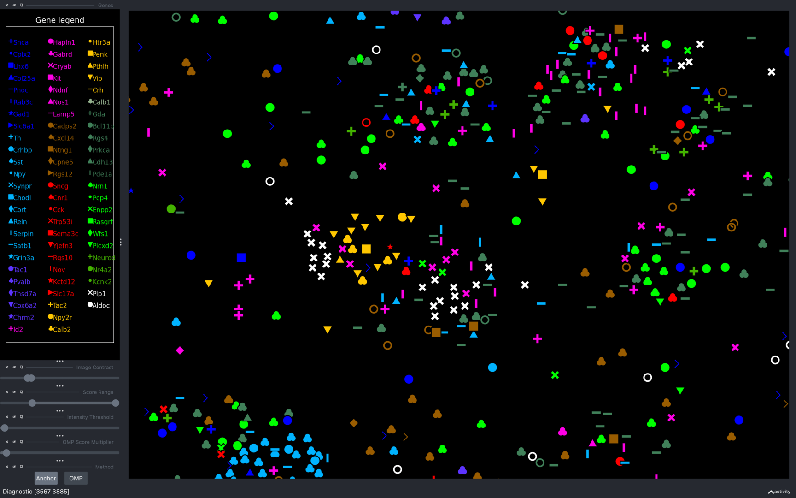{width="600"}
=== "*OMP*"
    {width="600"}


## Initial Intensity Threshold
To produce the gene coefficient images, as shown by the [`view_omp_fit`](../view_results.md#shift-o-view_omp_fit) 
function, we need to run *OMP* on every pixel in the image. However, for a single $2048\times2048\times50$ tile, 
there are $2.1\times10^8$ pixels. Thus, we do an initial thresholding so as not to consider all of them.

We only consider pixel $s$, with pixel color $\pmb{\zeta}_s$, if it has an 
[intensity](call_reference_spots.md#intensity) computed from its absolute pixel color, 
$\tilde{\chi}_s$, greater than `config['initial_intensity_thresh']`. I.e.

$$
\tilde{\chi}_s = \underset{r}{\mathrm{median}}(\max_c|\zeta_{s_{rc}}|)
$$

??? question "Why is absolute pixel color is used?"

    We use $|\pmb{\zeta}_s|$ because we are also interested in whether a pixel has a negative gene coefficient. We
    expect a negative coefficient in an annulus around a spot, as shown in the 
    [`view_omp_fit`](../view_results.md#shift-o-view_omp_fit) plots, as a result of the 
    [difference of hanning kernel](extract.md#effect-of-filtering) used in the initial filtering. If a gene has a
    negative coefficient annulus around the local maxima, then it boosts our confidence that it is legitimate.

If `config['initial_intensity_thresh']` is not specified, it is 
[set to](../code/omp/base.md#iss.omp.base.get_initial_intensity_thresh) the percentile indicated by 
`config['initial_intensity_thresh_percentile']` of $\tilde{\chi}$ computed for all 
pixels in the middle z-plane (`nb.call_spots.norm_shift_tile`) of the central tile (`nb.call_spots.norm_shift_z`).
I.e., it is set to:
``` python
nb.call_spots.abs_intensity_percentile[config['initial_intensity_thresh_percentile']]
```
So this is saying that for a tile and z-plane which we expect to be among the most fluorescent, we are getting 
rid of a quarter of the pixels (with the default value of `config['initial_intensity_thresh'] = 25`) which 
are the least intense. On other z-planes, we will get rid of more.

## *OMP* Algorithm
For every pixel that passes the initial intensity threshold, 
$s$, we run an Orthogonal Matching Pursuit (*OMP*) algorithm to find a coefficient, 
$\mu_{sg}$, for every gene $g$. The pseudocode for how [this is done](../code/omp/coefs.md#iss.omp.coefs.get_all_coefs) 
for each pixel is given below:

```
color: Intensity read from .npy files in tile directory for 
    each round and channel.
    [n_rounds x n_channels]
color_norm_factor: nb.call_spots.color_norm_factor
    [n_rounds x n_channels]
bled_codes: nb.call_spots.bled_codes_ge
    [n_genes x n_rounds x n_channels]
background_codes: nb.call_spots.background_codes
    [n_channels x n_rounds x n_channels]

1. Normalise color
    color = color / color_norm_factor
2. Compute background_coefs.
    Remove background from color - 
        for c in range(n_channels):
            color = color - background_coefs[c] * 
                            background_codes[c]
3. Initialize variables for iterating.
    residual = color  
    added_genes = [] 
    Append background_codes to bled_codes so has shape
        [(n_genes+n_channels) x n_rounds x n_channels]
    Initialize coefs with background_coefs which will not change - 
        coefs = zeros(n_genes+n_channels)
            coefs[n_genes:] = background_coefs

i = 0
while i < n_iter:
    4. Find best_gene to add based on dot product score between residual and 
        bled_codes.
        If score < score_thresh or best_gene is background or best_gene 
        already added:
            Stop - go to step 7.
        Append best_gene to added_genes.
    5. Obtain added_coefs [i+1] 
        for how the bled_codes of all genes in
        added_genes can be combined to best explain color.
        Update coefs -
            for g_ind in range(i+1):
                coefs[added_genes[g_ind]] = added_coefs[g_ind]
    6. Update residual -
        residual = color
        for g in added_genes:
            residual = residual - coefs[g] * bled_codes[g]
    i += 1
7. return coefs            
```
There are a few parameters in the [configuration file](../config.md#omp) which are used:

* `max_genes`: This is `n_iter` in the above code.
* `dp_thresh`: This is `score_thresh` in the above code.

### Pre-Iteration Procedure
Prior to *Step 1*, `color` is $\pmb{\acute{\zeta}}_s$ found through 
[`get_spot_colors`](../code/spot_colors/base.md#iss.spot_colors.base.get_spot_colors) 
by obtaining the [aligned coordinate](get_reference_spots.md#applying-transform) of pixel $s$ in each round and 
channel and then [reading off the corresponding intensity](get_reference_spots.md#reading-off-intensity).

*Step 1* is then just converting `color` from $\pmb{\acute{\zeta}}_s$ to $\pmb{\zeta}_s$ so the color channels 
are equalised, as is done in [`call_reference_spots`](call_reference_spots.md#color-normalisation).

*Step 2* is just finding a coefficient $\mu_{sC}$ for each background *gene*, $\pmb{B}_C$ as is done in
[`call_reference_spots`](call_reference_spots.md#background). The value of $\lambda_b$ in the $w_{rC}$
equation is set to `nb.call_spots.background_weight_shift` so the same value is used for the 
*reference spots* and *OMP* methods.
After this step, `color` is $\pmb{\zeta}_{s0}$ and will always remain so. I.e. once background is fit once, it
is never updated.

*Step 3* is adding the artificial background *genes* to our actual genes. After this step, we have a set of
`bled_codes`, $\pmb{b}$ such that $\pmb{b}_{g=n_{g}+C} = \pmb{B}_C$. We also have a set of coefficients,
$\pmb{\mu}_{s0}$ such that $\mu_{s0g=n_g+C} = \mu_{sC}$. The set of coefficients after $i$ actual genes have been fit
is $\pmb{\mu}_{si}$ ($i=0$ means just background has been fit) but $\mu_{sig=n_g+C} = \mu_{sC} \forall i,C$ 
as the background coefficients are never updated.

### Finding Best Gene
*Step 4* is finding the gene, $g_i$, with the bled_code, $b_{g_i}$ which best represents residual after $i$ actual genes
have been added, $\pmb{\zeta}_{si}$. 

We determine $g_i$ to be the gene for which $|\Delta_{sig}|$ is the largest, where $\Delta_{sig}$ is exactly 
the same dot product score used in [`call_reference_spots`](call_reference_spots.md#dot-product-score). We use 
the absolute score here because negative gene coefficients also provide useful information as 
[explained earlier](#initial-intensity-threshold).

??? note "Dot Product Score Parameters"

    In the configuration file, `alpha` and `beta` specified in both the `call_spots` and `omp` sections
    so different values of these parameters can be used for each method.

    The value of $\lambda_d$ in the $\tilde{\zeta}_{{si}_{rc}}$
    [equation](call_reference_spots.md#dot-product-score) is set 
    to `nb.call_spots.dp_norm_shift * sqrt(n_rounds)` so the same value is used for the 
    *reference spots* and *OMP* methods.
    
After we have found the $g_i$, we stop the algorithm if any of the following are satisfied:

* $|\Delta_{si}| = |\Delta_{sig_i}|$ < `config['dp_thresh']`.
* $g_i \geq n_g$ i.e. $g_i$ is a background *gene*.
* $g_i$ was found to be the best gene on a previous iteration.

This second condition occurred for the third gene added in the view_omp_fit example shown 
[earlier](#why-bother-with-omp). This case is quite rare though, since the background genes have already been fit.
We include it because if there is an artificial gene being identified as the best one, then we are also likely to
erroneously assign actual genes to the pixel which are not actually there. But stopping the algorithm prevents 
this from happening. It may be more appropriate to recompute the background coefficient for the background *gene*
identified, if this happens though.

The third condition is just to stop getting in a loop where we are always fitting the same gene, but it is even rarer 
than the second.

### Finding Gene Coefficients
Once we have decided that a gene is acceptable, in *Step 5* we find the coefficient of that gene as well
as updating the coefficients of all genes previously fit. On iteration $i$, there will be $i+1$ genes
to find the coefficient of. The [coefficients are found](../code/omp/coefs.md#iss.omp.coefs.fit_coefs) 
through normal least squares:

$$
\tilde{\pmb{\mu}}_{si} = (\pmb{G}_i^T\pmb{G}_i)^{-1}\pmb{G}_i^T\pmb{\zeta}_{s0}
$$

Where:

* $\tilde{\pmb{\mu}}_{si}$ is a vector of $i+1$ values such that $\mu_{sig_j} = \tilde{\mu}_{si_j}$ where
$\mu_{sig_j}$ is the coefficient found for gene $g_j$ on iteration $i$ for pixel $s$.
* $\pmb{G}_i$ is a matrix of shape $[n_{rounds}n_{channels} \times (i+1)]$ such that column $j$
is the flattened `bled_code`, $\pmb{b}_{g_j}$, for gene $g_j$, added on iteration $j$.
* $\pmb{\zeta}_{s0}$ is the color for pixel $s$ after background removal flattened, so it has shape 
$[n_{rounds}n_{channels} \times 1]$.

??? "Weighted Least Squares"

    If `config['weight_coef_fit'] = True`, then the coefficients are found through 
    [weighted least squares](../code/omp/coefs.md#iss.omp.coefs.fit_coefs_weight).
    
    In this case, both $\pmb{\zeta}_{s0}$ and every column of $\pmb{G}_i$ are multiplied by
    $\pmb{\omega}_{si}$ where $\pmb{\omega}^2_{si}$ is defined in the 
    [dot product score calculation](call_reference_spots.md#dot-product-score).
    
    The idea behind this is that for normal least squares, the coefficients will be
    overly influenced by outliers. In the *Least Squares* [`view_omp_fit`](../view_results.md#shift-o-view_omp_fit) 
    example below, when fitting *Plp1*, it is so concerned about getting rid of the very intense values in channel 4 
    that it makes lots of channel 2 and 6 values negative.

    === "Least Squares"
        {width="600"}
    === "Weighted Least Squares"
        {width="600"}
    === "Weight - Iteration 1"
        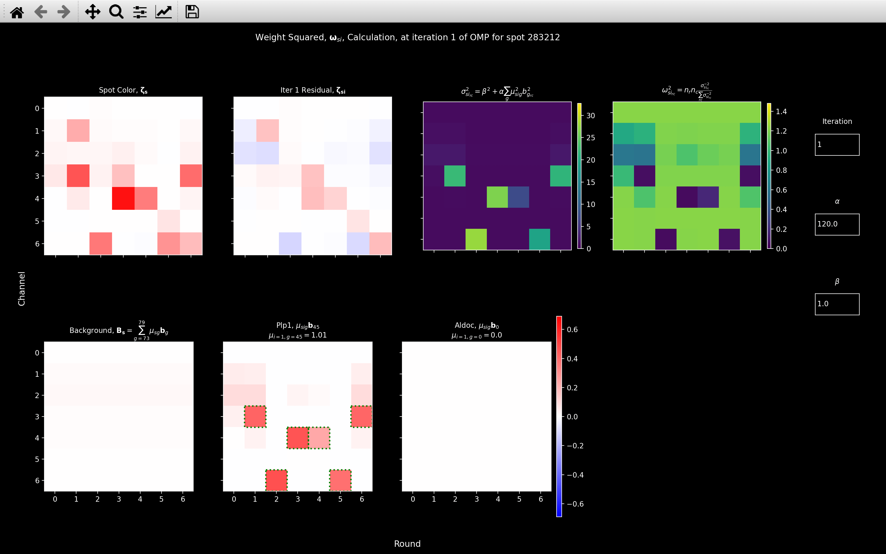{width="600"}
    === "Weight - Iteration 2"
        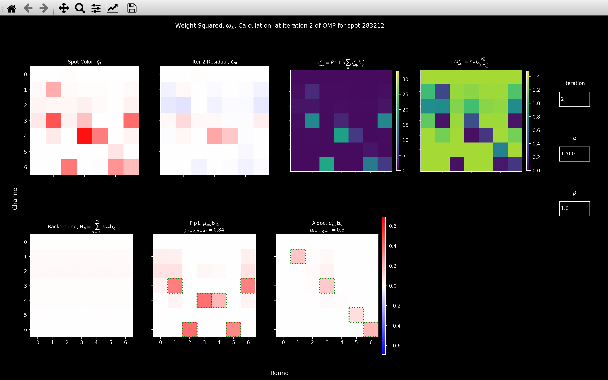{width="600"}
    
    In the *Weighted Least Squares*, we see that after *Aldoc* has been fit, the 
    channel 4 intensity is much larger than in the *Least Squares* case and the channel 6 intensities
    are much less negative.

    If we look at the *Weight - Iteration 1* [`view_weight`](../code/plot/call_spots.md#view_weight) plot,
    we see that this occurs because the contribution of the channel 4 rounds is very small.

    A problem with this though, is that the weight is re-computed at each iteration which can cause the coefficient
    of each gene to change drastically. For example, after *BG2* has been fit,
    we see that channel 6 has become very negative again. Looking at the *Weight - Iteration 2* plot, we see
    that this is because the weight of round 4, channel 4 has increased.

    The coefficient for *Plp1* in the *Weighted Least Squares* case changes from 0.84 to 0.93 after *BG2* has been 
    fit but in the *Least Squares* case, it changes from 1.00 to 1.01.
    
After we have found the coefficients on iteration $i$, we compute the residual for the next iteration in
*Step 6*:

$$
\pmb{\zeta}_{si+1} = \pmb{\zeta}_{s0} - \sum_{g=0}^{n_g-1}\mu_{sig}\pmb{b}_g 
= \pmb{\zeta}_s - \sum_{g=0}^{n_g+n_c-1}\mu_{sig}\pmb{b}_g 
$$

Where $n_c$ is the number of channels and $n_g$ is the number of genes. The second equation includes the combination
from the background *genes*. In the first equation, only $\mu_{sig}$ will only be non-zero for $i+1$ genes (in 
the second equation, it will be for $i+1+n_c$ genes, because we include the $n_c$ background *genes*).

We continue iterating between *Step 4* and *Step 6* until any of the [stopping criteria](#finding-best-gene) are met, 
or we fit `config['max_genes']` to the pixel.

### Weighting in Dot Product Score
The difference between this algorithm and the standard Orthogonal Matching Pursuit algorithm is
the weight factor, $\pmb{\omega}^2_{si}$, used when computing 
[$\Delta_{sig}$](call_reference_spots.md#dot-product-score). Normal *OMP* would have 
$\alpha = 0$ so $\pmb{\omega}^2_{si}=1$. 

By using this weighting, we are trying to say that if a gene has already been fit with high intensity
in round $r$, channel $c$, then the remaining intensity in round $r$, channel $c$, after it has been fit 
is probably because the coefficient of that gene was not fit correctly, rather than because another gene is 
present. As the example below shows, without it, genes are fit to really try and get rid of any anomalously 
intense rounds/channels even if a gene has already been fit there.

=== "`view_omp_fit` - $\alpha=120$"
    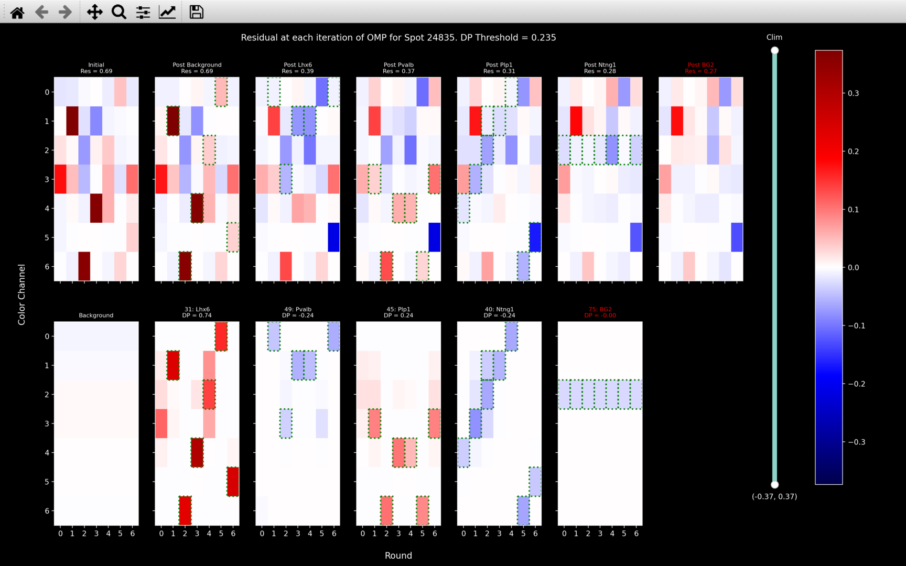{width="800"}
=== "`view_omp_fit` - $\alpha=0$"
    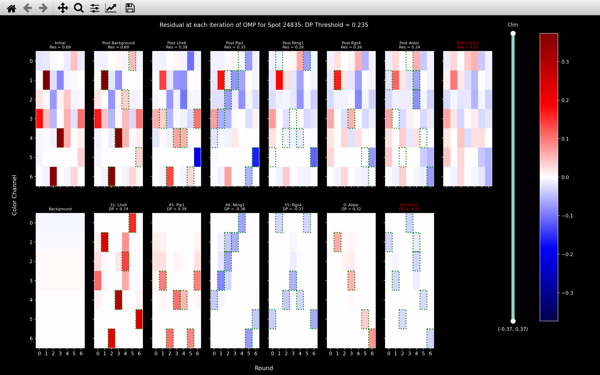{width="800"}
=== "`view_weight` - $\alpha=120$, Iteration 4"
    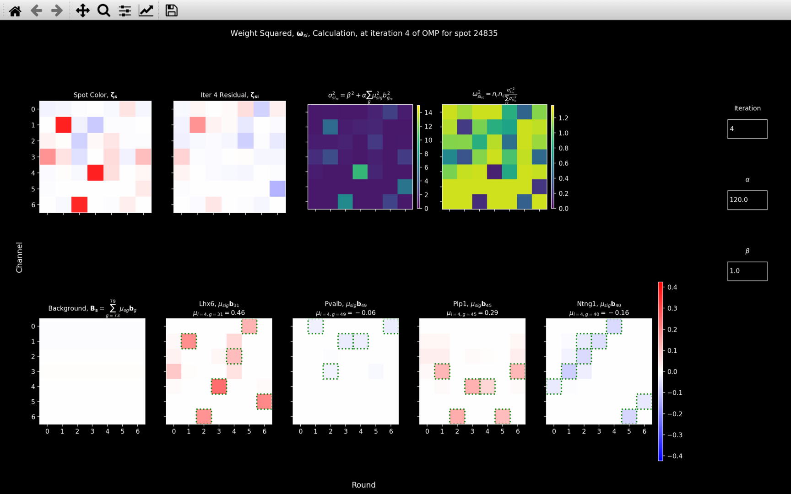{width="800"}
=== "`view_score` - $\alpha=120$, Iteration 4"
    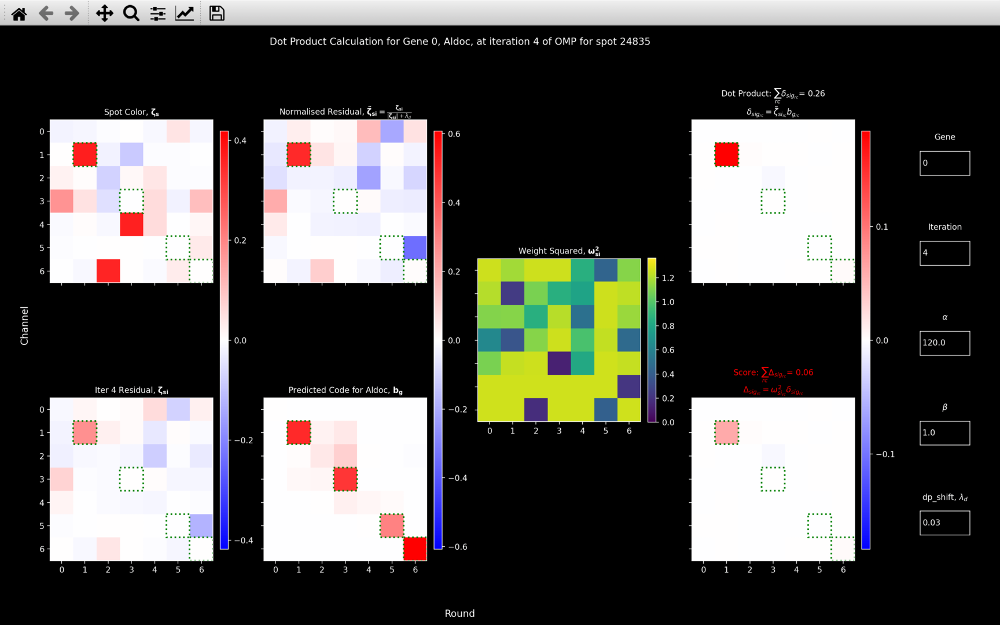{width="800"}

If we compare the [`view_omp_fit`](../view_results.md#shift-o-view_omp_fit) plots, we see that 
in the $\alpha=0$ case, *Rgs4* has been fit to explain the anomalously negative round 6, channel 5
and *Aldoc* has been fit to explain the anomalously positive round 2, channel 1.

The [`view_weight`](#view_weight) shows the calculation of the weight
factor for $i=4$ (all 4 of the actual genes shown have been added). This shows that round 2, channel 1 has a low
weighting because *Lhx6* has already been fit and this gene has high intensity in round 2, channel 1.

If we look the [`view_score`](#view_score) image, we see that in the top right, with $\alpha=0$, we
get a large score for *Aldoc* solely because of the contribution from round 2, channel 1.
If we look at the bottom right though, we see that with $\alpha=120$, the score for *Aldoc* is very small, as we 
would expect it should be, when comparing the 2 plots in the second column of the [`view_score`](#view_score) image.

Basically, we need the weighting because we know that the least squares 
[coefficient fitting](#finding-gene-coefficients) will produce some anomalously intense rounds and channels. 
When selecting the [best gene](#finding-best-gene), we need to be robust to this.

## Finding Spots
{width=200, align=right}
After we have run the *OMP* algorithm on every pixel of a tile, we can 
[produce an image](../code/omp/spots.md#iss.omp.spots.cropped_coef_image) for each gene 
based on the $n_{pixels}\times n_{genes}$ array of coefficients, $\pmb{\mu}$.

A $200\times 200$ pixel section of such an image for three genes is shown on the right.
Clearly, most values in each image because each pixel only has a non-zero coefficient
for a very small number of genes.

<br clear="right"/>

We then take each gene in turn and [find spots](../code/omp/spots.md#iss.omp.spots.get_spots) 
which are the local maxima in the coefficient image. These local maxima are 
[found](../code/find_spots/detect.md#iss.find_spots.detect.detect_spots) in exactly the same way
as in the [*find spots*](find_spots.md#spot-detection) part of the pipeline. But here,
the threshold intensity is 0 and the neighbourhood (kernel for dilation) is defined by the parameters
`config['radius_xy']` and `config['radius_z']`.

### Spot Shape
In the gene coefficient images above, the spots can clearly be seen as red (positive) circles surrounded by a blue 
(negative) annulus. So to decide whether a particular spot is legitimate, we want to compare its shape to 
the average spot shape.

This average spot shape can be specified in advance (e.g. if you have already run an experiment, which is expected
to be similar to the current one, and you want the same shape to be used) with a *npy* file in the output directory 
with the name given by `config['file_names']['omp_spot_shape']`. This file must contain an image (axis in 
the order z-y-x) indicating the expected sign of a coefficient (only values are 1, 0, -1) 
in the neighbourhood of a spot.

If the file indicated by `config['file_names']['omp_spot_shape']` does not exist, then it will be 
[computed](../code/omp/spots.md#iss.omp.spots.spot_neighbourhood)
from the spots found on a specific tile. The tile used is the one for which the most spots were found with the 
*reference spots* method, and it is saved as `nb.omp.shape_tile`. 


The psuedocode for [obtaining the spot shape](../code/omp/spots.md#iss.omp.spots.spot_neighbourhood) is given below:

```
spot_yxz: yxz coordinates of all spots found on the tile
    [n_spots x 3]
gene_no: gene_no[s] is the gene whose coefficient image
    spot s was found on.
    [n_spots].
tile_sz: nb.basic_info.tile_sz
nz: nb.basic_info.nz
gene_coef_im: gene_coef_im[g] is the gene coefficient image
    for gene g, which can be made after running OMP on each pixel.
    [n_genes x tile_sz x tile_sz x nz]
    
for s in range(n_spots):
    1. use = True if number of pixels neighbouring
        spot_yxz[s] in gene_coef_im[gene_no[s]]
        with a positive value equals use_thresh.
    2. If use, then obtain the [shape_ny x shape_nx x shape_nz] image 
        centered on spot_yxz[s] in gene_coef_im[gene_no[s]]. 
        
3. We now have spot_images which is a 
    [n_use x shape_ny x shape_nx x shape_nz] array.
    We update this by only keeping images from isolated spots.
    [n_use2 x shape_ny x shape_nx x shape_nz]
4. Compute spot_sign_images by taking the sign of every value in spot_images 
    so the only values are 1, 0, -1.
    Next, we compute av_spot_sign_image which is the average of 
    spot_sign_images across spots.
    Where abs(av_spot_sign_image) < sign_thresh, set it to 0.
    Take sign of av_spot_sign_image so it only contains 1, 0, -1.
    [shape_ny x shape_nx x shape_nz]
```
There are a few parameters in the [configuration file](../config.md#omp) which are used:

* `shape_pos_neighbour_thresh`: In *2D*, this is `use_thresh` in the above code. In *3D*, this is
`use_thresh - 2`.
* `shape_max_size`: This is `[shape_ny, shape_nx, shape_nz]` in the above code.
* `shape_sign_thresh`: This is `sign_thresh` in the above code.

*Step 1* is a thresholding procedure, so we only use spots we are quite confident are real for computing
the average shape.
For a spot to be used in computing the shape, on the z-plane of the gene coefficient image that it was found on, 
within the $n_{pos_{use}}\times n_{pos_{use}}$ neighbourhood with the local maxima in the centre, all 
`n_use = `$n_{pos_{use}}^2$ coefficients must be positive. In *3D*, the coefficient at the same $yx$ coordinate
as the local maxima but on 1 z-plane either side must be also positive (now require `n_use = `$n_{pos_{use}}^2 + 2$ 
positive coefficients in the neighbourhood of the spot). The value of $n_{pos_{use}}^2$ is given by 
`config['shape_pos_neighbour_thresh']`, the default value is 9 meaning all pixels in a $3\times 3$ grid centered on
the local maxima must be positive.

??? example

    The first image below shows a spot that would be used to compute the shape with 
    `config['shape_pos_neighbour_thresh'] = 3`because all 9 pixels in the central z-plane have 
    a positive coefficient, as do those on 1 z plane either side but in the middle yx pixel.

    The second image shows a spot that would not be used.

    === "✅"
        {width="800"}
    === "❌"
        {width="800"}

In *Step 2*, we just [get the cropped](../code/utils/spot_images.md#iss.utils.spot_images.get_spot_images) 
gene coefficient image in the neighbourhood of the local maxima.
3 examples are shown as *Spot 1*, *Spot 2* and *Spot 3* below.

In *Step 3*, we are saying that most spots are probably not overlapping with any other genes so
to get an estimate of what an average spot looks like, let us only use spots which are
quite well isolated. Our definition of isolated here, is that the distance between each spot used in *Step 2*
and any other spot used in *Step 2* must exceed `config[shape_isolation_dist]`.


=== "Spot 1"
    {width="800"}
=== "Spot 2"
    {width="800"}
=== "Spot 3"
    {width="800"}
=== "Average Sign"
    {width="800"}
=== "Spot Shape"
    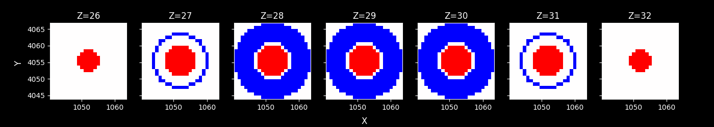{width="800"}

In *Step 4*, we first take the sign of the spot images and then compute the average of these using 
[`get_average_spot_image`](../code/utils/spot_images.md#iss.utils.spot_images.get_average_spot_image).
We set `av_type = 'mean'` and `symmetry = 'annulus_3d'`. We use this symmetry because we assume that the 
spot should be circular within a z-plane and symmetric in z. This procedure produces the *Average Sign* image
shown above. This is saved to the *Notebook* as `nb.omp.spot_shape_float`.

After we have this `av_sign_image`, we get our final spot_shape via:

``` python
import numpy as np
av_sign_image[np.abs(av_sign_image)] < config['omp']['shape_sign_thresh']] = 0
spot_shape = np.sign(av_sign_image)
```

This is just saying that if the absolute value of the mean sign across all these spots was less than 
`config['omp']['shape_sign_thresh']`, then we are not sure what sign these pixels 
should be, so we won't assign them a sign in our final `spot_shape`. Otherwise, 
we are fairly confident what sign they should be, so we do assign the sign to our final shape. The *Spot Shape*
image above shows what this looks like.

??? question "Why does the spot shape indicate the expected sign of the coefficient?"

    The `spot_shape` indicates the expected sign of a coefficient, not the expected value.
    This is because, through the [*OMP* algorithm](#omp-algorithm), for a pixel to have a non-zero coefficient 
    for any gene, it has already gone through a [thresholding](#finding-best-gene) procedure which has decided that 
    the gene `bled_code` is required to explain the pixel color.

    The idea behind [counting](#n_neighbours) the number of coefficients with the correct sign is 
    that if there are lots of pixels in the neighbourhood of the spot which required a certain gene, then that gives
    us confidence that the gene is actually present. 

    If we instead convolved the actual coefficent image (e.g. *Spot 1* image shown above) 
    with the expected coefficient kernel (e.g. mean of spot_images in *Step 4* of the pseudocode), it 
    would boost the score of intense pixels which we don't want to do.

The final `spot_shape` is saved to the *Notebook* as `nb.omp.spot_shape` and is also saved as a 
*npy* file in the output directory with the name indicated by `config['file_names']['omp_spot_shape']`.
The coordinates and corresponding gene of spots used to compute `nb.omp.spot_shape` are saved as
`nb.shape_spot_local_yxz` and `nb.shape_spot_gene_no` respectively.

### `n_neighbours`
Once we have found the `spot_shape`, we want to see how each spot resembles this. To do this, 
if spot $s$, was found on the gene $g$ coefficient image, we first 
[obtain](../code/utils/spot_images.md#iss.utils.spot_images.get_spot_images) `coef_im_s` which is the gene 
$g$ coefficient image centered on the coordinates of spot $s$, with the same size as `spot_shape`.

We then [count](../code/omp/spots.md#iss.omp.spots.count_spot_neighbours) the number of pixels for which 
`coef_im_s` and `spot_shape` both have positive coefficients. We also count the number of pixels for which 
`coef_im_s` and `spot_shape` both have negative coefficients. Once this has been done for all spots, these 
are saved as `nb.omp.n_neighbours_pos` and `nb.omp.n_neighbours_neg` respectively.

To reduce the memory of the *Notebook* file, we only save spots to the *Notebook* if `n_neighbours_pos`
exceeds `config['initial_pos_neighbour_thresh']`. If this is left blank, it will be set
to the fraction `config['initial_pos_neighbour_thresh_param']` of the maximum possible value (i.e.
`sum(spot_shape>0)`). It will also be clipped between `config['initial_pos_neighbour_thresh_min']` and 
`config['initial_pos_neighbour_thresh_max']`.


#### [`view_omp_score`](../code/plot/omp.md#view_omp_score)
The way `nb.omp.n_neighbours_pos` and `nb.omp.n_neighbours_neg` are obtained, can be visualised for a specific
spot with the function [`view_omp_score`](../code/plot/omp.md#view_omp_score):

=== "$\rho = 0.95$"
    {width="800"}
=== "$\rho = 0.1$"
    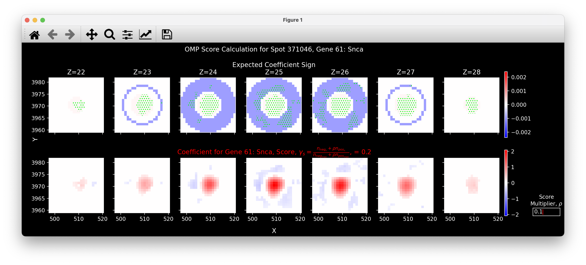{width="800"}
=== "$\rho = 20$"
    {width="800"}

Here, the top plot shows `nb.omp.spot_shape` and the bottom plot shows the coefficient image for *Snca* in the 
neighbourhood of spot $371046$ which has $yxz$ coordinates in the global coordinate system of 
$[3970, 509, 25]$. 

The green hatching in the top plot indicates where both plots have the same sign. So `nb.omp.n_neighbours_pos[371046]`
is the number of red pixels with green hatching (316) and `nb.omp.n_neighbours_neg[371046]` is the number of 
blue pixels with green hatching (192).

#### *OMP* Score
The final [score](../code/call_spots/qual_check.md#iss.call_spots.qual_check.omp_spot_score), $\gamma$, used for 
[thresholding](../code/call_spots/qual_check.md#iss.call_spots.qual_check.quality_threshold) 
*OMP* spots in the [final plot](../view_results.md) and when exporting to 
[*pciSeq*](../run_code.md#exporting-to-pciseq) is: 

$$
\gamma_s = \frac{n_{neg_s} + \rho n_{pos_s}}{n_{neg_{max}} + \rho n_{pos_{max}}}
$$

Where:

* $n_{neg_s}$ is `nb.omp.n_neighbours_neg[s]`
* $n_{neg_s}$ is `nb.omp.n_neighbours_pos[s]`
* $n_{neg_{max}}$ is `sum(nb.omp.spot_shape<0)`
* $n_{pos_{max}}$ is `sum(nb.omp.spot_shape>0)`
* $\rho$ is `config['thresholds']['score_omp_multiplier']`

So if $\rho = 1$, this would just be the fraction of pixels in the neighbourhood of spot $s$ with the correct
sign. The larger $\rho$, the greater the contribution of the positive pixels to $\gamma_s$.

With the [`view_omp_score`](#view_omp_score) function, the effect of varying $\rho$ on the score, can 
be seen by using the textbox. The top row of plots are also normalised so $\gamma_s$ is equal to the sum 
of the absolute value of the pixels with the green hatching. I.e. in the $\rho=0.1$ image, the negative pixels
are much larger than the positive and in the $\rho=20$ image, the positive pixels are much larger than the negative.

## Saving *OMP* results
Because the *OMP* section of the pipeline takes a long time, we want to save the results as we go along, so 
we don't have to restart the whole thing if it crashes for some reason e.g. a memory error.

Thus, after we have found the spots on a tile, we save the information for all of them to a npy file
in the output directory with a name indicated by `config['file_names']['omp_spot_info']`. For each spot, $s$, 
this file contains 7 integer values. The first 3 are the local $yxz$ coordinates (z-coordinate in units of z-pixels) on 
the tile it was found on. The fourth is the gene it was assigned to. The fifth is `n_neighbours_pos` and the sixth
is `n_neighbours_neg`. The seventh is the tile it was found on.

We also save the coefficients of each spot $s$ for each gene, $\pmb{\mu}_s$, 
found via the [*OMP* algorithm](#omp-algorithm). This $n_{spots}\times n_{genes}$ sparse array is saved as a 
npz file in the output directory with a name indicated by `config['file_names']['omp_spot_coef']`. This 
is not actually used anymore but may be useful for debugging purposes.

If these files already exist, the [`call_spots_omp`](../code/pipeline/omp.md) function will simply skip over all tiles 
for which spots have been saved and then load them all in after spots have been found on all the other tiles.

After spots have been found on all tiles, duplicate spots are removed in the same way as in the 
[*get reference spots*](get_reference_spots.md#duplicates) step of the pipeline.

We then save details of each spot to the *OMP* *NotebookPage* i.e. `local_yxz`, `tile`, 
[`colors`](get_reference_spots.md#reading-off-intensity), `gene_no`, 
[`intensity`](call_reference_spots.md#intensity), [`n_neighbours_neg`](#n_neighbours) and 
[`n_neighbours_pos`](#n_neighbours).

## Diagnostics
### `view_score`
### `view_weight`