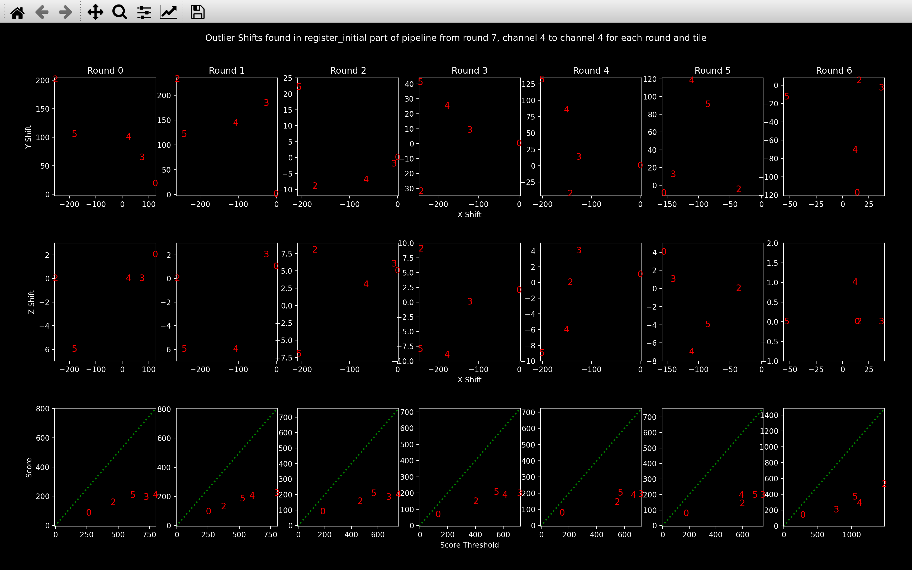
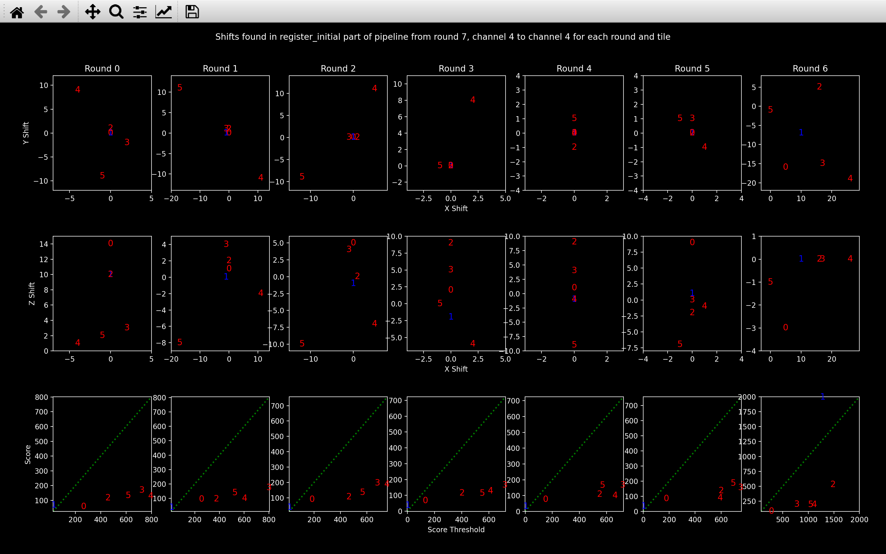

# Register Initial
The [*register initial* step of the pipeline](../code/pipeline/register_initial.md) uses the point clouds
added to the *Notebook* during the [`find_spots`](find_spots.md) step
to find the shift between the reference round and each imaging round for every tile.
The $yxz$ shift to tile $t$, round $r$ is saved as `nb.register_initial.shift[t, r]`. This shift
is then used as a starting point for finding the affine transforms in the 
[*register*](register.md) step of the pipeline 
to all channels of tile $t$, round $r$.

The [`register_initial`](../notebook_comments.md#register_initial) *NotebookPage* is added to the 
*Notebook* after this stage is finished.

## Shift
The channel used for finding the shifts is specified by $c_{shift}$ = `config['register_initial']['shift_channel']`.
If it is left blank, it will be set to $c_{ref}$ (`nb.basic_info.ref_channel`). This channel
should be one with lots of spots and if an [error](#error-too-many-bad-shifts) 
is hit, it may be worth re-running with a different value
of this parameter. 

So, for tile $t$, round $r$, we find the shift between $r_{ref}$/$c_{ref}$ and $r$/$c_{shift}$.

The [function](../code/stitch/shift.md#coppafish.stitch.shift.compute_shift) to compute these shifts is exactly the 
same as the one used in the [stitch](stitch.md#shift) section of the pipeline and the parameters in the 
[*register initial*](../config.md#register_initial) section of the config file do the same thing as the 
corresponding parameters in the [*stitch*](../config.md#stitch) section. A few details are different though,
as explained below.

### Initial range
The difference to the [*stitch*](stitch.md#initial-range) case is that `config['register_initial']['shift_min']` and 
`config['register_initial']['shift_max']` are always used. We expect the shift between rounds to be quite 
small hence the default values which perform an exhaustive search centered on 0 in each direction
with a range of 200 in $y$ and $x$ and a range of 6 in $z$.

### Updating initial range
We assume that the shifts to a given round will be approximately the same for all tiles. So, after we have found 
at least 3 shifts to a round which have `score > score_thresh`, we update our initial exhaustive search range
to save time for future tiles. See the [example](stitch.md#updating-initial-range) 
in the *stitch* section for how the update is performed.

### Amend low score shifts
This is very similar to the [*stitch*](stitch.md#amend-low-score-shifts) case, 
but the names of the variables saved to the *Notebook* are slightly different:

After the shifts to all rounds for all tiles have been found, the ones with `score < score_thresh` are 
amended.

If for round $r$, tile $t$, the best shift found had a `score < score_thresh`, 
the shift and score are saved in the notebook in `nb.register_initial.shift_outlier[t, r]` and 
`nb.register_initial.shift_score_outlier` respectively.

The shift is then re-computed using a new initial exhaustive search range 
(saved as `nb.register_initial.final_shift_search`). This range is computed using the 
[`update_shifts`](#updating-initial-range) function to centre 
it on all the shifts found to round $r$ for which `score > score_thresh`.
For this re-computation, no [widening](stitch.md#widening-range) is allowed either. The idea behind this 
is that it will force the shift to be within the range we expect based on the successful shifts. 
I.e. a shift with a slightly lower `score` but with a shift
more similar to the successful shifts is probably more reliable than a shift with 
a slightly higher `score` but with a shift significantly different from the successful ones.

The new shift and score will be saved in `nb.register_initial.shift[t, r]` and 
`nb.register_initial.shift_score[t, r]` respectively.

## Error - too many bad shifts
After the `register_initial` *NotebookPage* has been 
[added](../code/pipeline/run.md#coppafish.pipeline.run.run_register) to the *Notebook*, 
[`check_shifts_register`](../code/stitch/check_shifts.md#coppafish.stitch.check_shifts.check_shifts_register) 
will be run.

This will produce a warning for any shift found with `score < score_thresh`.

An error will be raised if the fraction of shifts with `score < score_thresh` exceeds 
`config['register_initial']['n_shifts_error_fraction']`.

If this error does occur, it is probably worth looking at the [debugging plots](#debugging) to see if the shifts found
looks good enough to use as a starting point for the [iterative closest point algorithm](register.md)
or if it should be re-run with different configuration
file parameters (e.g. different `config['register_initial']['shift_channel']` corresponding to a channel
with more spots, smaller `config['register_initial']['shift_step']` or larger 
`config['register_initial']['shift_max_range']`). 

## Debugging
There are a few functions using matplotlib which may help to debug this section of the pipeline.

To view how the shift matches up the point clouds, an analogous function to 
[`view_stitch_overlap`](stitch.md#view_stitch_overlap)
is [`view_icp`](../code/plot/register.md#view_icp) which is [explained](register.md#view_icp) 
in the next step of the pipeline. The *register* stage of the pipeline does 
not need to have been run to use this function though.

### [`view_register_shift_info`](../code/plot/register.md#view_register_shift_info)
The [`view_register_shift_info`](../code/plot/register.md#view_register_shift_info) function
plots the shifts to all tiles of a given round on the same plot
(there are 3 plots for each round).
This allows you to see if they are similar, as we expect or if there are some outliers.

It also includes a plot of `score` vs `score_thresh` for each round:

{width="800"}

In this case, all the shifts seem reasonable as the top two plots show quite a small range
and the bottom plot shows `score > score_thresh` for every shift (blue numbers are all above the green line).
If a shift had `score < score_thresh`, it would be shown in red in each of the three plots
for that direction.

The numbers refer to the tile.

??? note "Viewing outlier shifts"

    The shifts saved as [`nb.register_initial.shift_outlier`](#amend-low-score-shifts) can be viewed by calling
    `view_register_shift_info(nb, True)`.

    The example below shows the difference between the outlier shifts and the final shifts (`nb.register_initial.shift`)
    saved for a data set which did not work well.

    === "`shift_outlier`"
        {width="800"}

    === "`shift`"
        {width="800"}

    Clearly from the top plot, the range of `shift` is much smaller than the range of `shift_outlier` as we
    expect from the [reduced range](#updating-initial-range) of the exhaustive search to find these.

### [`view_register_search`](../code/plot/register.md#view_register_search)
The [`view_register_search`](../code/plot/register.md#view_register_search) function is exactly the same
as [`view_stitch_search`](stitch.md#view_stitch_search).

## Pseudocode
This is the pseudocode outlining the basics of this [step of the pipeline](../code/pipeline/register_initial.md).
For more detailed pseudocode about how the best shift is found, see the [shift](stitch.md#obtaining-best-shift) section.

```
r_ref = reference round
c_ref = reference round
c_shift = config['register_initial']['shift_channel']
spot_yxz[t, r, c] = yxz coordinates for spots detected on tile t,
                    round r, channel c.
for r in use_rounds:            
    for t in use_tiles:
        Find best_shift between spot_yxz[t, r_ref, c_ref] and 
                                spot_yxz[t, r, c_shift].
        If 3 or more shifts to round r with score > score_thresh:
            Update search range around these shifts.   
Amend shifts with score < score_thresh using new search range for each round.

Add shifts and debugging info to register_initial NotebookPage.
Add register_initial NotebookPage to Notebook.      
```
