# Stitch
The [stitch step of the pipeline](../code/pipeline/stitch.md) uses the reference point clouds
(all tiles of `ref_round`/`ref_channel`) added to the *Notebook* during the [`find_spots`](find_spots.md) step
to find the [overlap](#shift) between neighbouring tiles in the form of shifts. It then uses these shifts to get
the origin of each tile in a [global coordinate system](#global-coordinates). The tile origins are
saved to the *Notebook* as `nb.stitch.tile_origins` and this is the only variable computed in 
this section which is used later in the pipeline.

The [`stitch`](../notebook_comments.md#stitch) *NotebookPage* is added to the *Notebook* after this stage
is finished.

## Shift
We need to find the overlap between each pair of neighbouring tiles. To do this, for each tile, we
ask whether there is a tile to the north of it and if there is we 
[compute the shift](../code/stitch/shift.md#iss.stitch.shift.compute_shift) between the two.
We then ask if there is a tile to the east of it and if there is we compute the shift between the two.

??? example

    For a $2\times3$ ($n_y \times n_x$) grid of tiles, the indices are:

    | 2  | 1  | 0  |

    | 5  | 4  | 3  |

    We consider each tile in turn:
    
    * Tile 0 has no tiles to the north or east so we go to tile 1.
    * Tile 1 has a tile to the east (0) so we find the shift between tile 1 and tile 0.
    * Tile 2 has a tile to the east (1) so we find the shift between tile 2 and tile 1.
    * Tile 3 has a tile to the north (0) so we find the shift between tile 3 and tile 0.
    * Tile 4 has a tile to the north (1) so we find the shift between tile 4 and tile 1.
    Tile 4 also has a tile to the east (3) so we find the shift between tile 4 and tile 3.
    * Tile 5 has a tile to the north (2) so we find the shift between tile 5 and tile 2.
    Tile 5 also has a tile to the east (4) so we find the shift between tile 5 and tile 4.

    We will always be finding the offset of a tile relative to a tile with a [smaller index](#global-coordinates).

The tile indices for neighbours that we find the overlap in the north/south direction for
are saved as `nb.stitch.south_pairs`. The shift between tile `nb.stitch.south_pairs[i, 0]`
and tile `nb.stitch.south_pairs[i, 1]` is saved as `nb.stitch.south_shifts[i]`.

### Initial range
We compute the shift through an exhaustive search in a given range. The initial range used for a tile to the north 
can be specified through `config['stitch']['shift_south_min']` and `config['stitch']['shift_south_max']`.
The range used for a tile to the east
can be specified through `config['stitch']['shift_west_min']` and `config['stitch']['shift_west_max']`.

??? note "Confusion between north/south and east/west"

    For finding the shift to a tile in the north, the parameters used in the config file and saved to the 
    *NotebookPage* have the `south` prefix. This is because if tile B is to the north of tile A, the shift applied
    to tile A to get the correct overlap is to the south (i.e. negative in the y direction).

    Equally, for finding the shift to a tile in the east, the parameters used in the config file and saved to the 
    *NotebookPage* have the `west` prefix. This is because if tile B is to the east of tile A, the shift applied
    to tile A to get the correct overlap is to the west (i.e. negative in the x direction).

The range in the $i$ direction will then be between `shift_min[i]` and `shift_max[i]` with a spacing of 
`config['stitch']['shift_step'][i]`.

If these are left blank, the range will be computed automatically using `config['stitch']['expected_overlap']`
and `config['stitch']['auto_n_shifts']`.

??? example "Example automatic range calculation"

    For an experiment with 
    
    * `nb.basic_info.tile_sz = 2048`
    * `config['stitch']['expected_overlap'] = 0.1`
    * `config['stitch']['auto_n_shifts'] = 20, 20, 1`
    * `config['stitch']['shift_step'] = 5, 5, 3`

    the range used for a tile to the north is [computed](../code/stitch/starting_shifts.md) as follows:
    === "Code"
        ``` python
        import numpy as np
        expected_overlap = config['stitch']['expected_overlap']
        auto_n_shifts = config['stitch']['auto_n_shifts']
        shift_step = config['stitch']['shift_step']
        
        expected_shift = np.array([-(1 - expected_overlap]) * [tile_sz, 0, 0]).astype(int)
        print(f"Expected shift = {expected_shift}")
        range_extent = auto_n_shifts * shift_step
        print(f"YXZ range extent: {range_extent}")  
        range_min = expected_shift - range_extent
        range_max = expected_shift + range_extent
        print(f"YXZ range min: {range_min}")
        print(f"YXZ range max: {range_max}")
        shifts_y = np.arange(range_min[0], range_max[0] + shift_step[0]/2, shift_step[0])
        print(f"Y exhaustive search shifts:\n{shifts_y}")
        shifts_x = np.arange(range_min[1], range_max[1] + shift_step[1]/2, shift_step[1])
        print(f"X exhaustive search shifts:\n{shifts_x}")
        shifts_z = np.arange(range_min[2], range_max[2] + shift_step[2]/2, shift_step[2])
        print(f"Z exhaustive search shifts:\n{shifts_z}")
        ```
    === "Output"
        ```
        Expected shift = [-1843     0     0]
        YXZ range extent: [100 100   3]
        YXZ range min: [-1943  -100    -3]
        YXZ range max: [-1743   100     3]
        Y exhaustive search shifts:
        [-1943 -1938 -1933 -1928 -1923 -1918 -1913 -1908 -1903 -1898 -1893 -1888
         -1883 -1878 -1873 -1868 -1863 -1858 -1853 -1848 -1843 -1838 -1833 -1828
         -1823 -1818 -1813 -1808 -1803 -1798 -1793 -1788 -1783 -1778 -1773 -1768
         -1763 -1758 -1753 -1748 -1743]
        X exhaustive search shifts:
        [-100  -95  -90  -85  -80  -75  -70  -65  -60  -55  -50  -45  -40  -35
          -30  -25  -20  -15  -10   -5    0    5   10   15   20   25   30   35
           40   45   50   55   60   65   70   75   80   85   90   95  100]
        Z exhaustive search shifts:
        [-3  0  3]
        ```

    For a tile to the east, the calculation is exactly the same except
    `expected shift = [0     -1843     0]`.

The range used for north/south overlap is saved as `nb.stitch.south_start_shift_search`.

### Obtaining best shift
Here is some pseudocode for how we 
[obtain the best shift](../code/stitch/shift.md#iss.stitch.shift.get_best_shift_3d) between tile 5
and tile 4 from an exhaustive search. The comments (#) give the shape of the indicated array.

``` 
function find_neighbour_distances(yxz_0, yxz_1):
    # yxz_0: [n_spots_0 x 3]
    # yxz_1: [n_spots_1 x 3]
    For i in range(n_spots_0):
        find nearest spot in yxz_1 to yxz_0[i] to be the one at index j.
        distances[i] = distance between yxz_0[i] and yxz_1[j].
    return distances  # [n_spots_0]
    
function get_score(distances, dist_thresh):
    # distances: [n_spots]
    This is a function that basically counts the number of values in 
    distances which are below dist_thresh. 
    I.e. the more close neighbours, the better the shift and thus the 
    score should be larger.
    The function used in the pipeline returns the float given by: 
        score = sum(exp(-distances ** 2 / (2 * dist_thresh ** 2)))
        If all values in distances where 0 (perfect), score = n_spots.
        If all values in distances where infinity or much larger than 
        dist_thresh (bad), score = 0.
    
 
# tile_5_yxz: [n_spots_t5 x 3]
# tile_4_yxz: [n_spots_t4 x 3]
# exhaustive_search: [n_shifts x 3]

for shift in exhaustive_search:
    tile_5_yxz_shifted = tile_5_yxz + shift   # [n_spots_t5 x 3]
    distances = find_neighbour_distances(tile_5_yxz_shifted, 
                                         tile_4_yxz)  # [n_spots_t5]
    score = get_score(distances, dist_thresh)  # float
best_shift is the shift with the best score
```

#### `score`
In the [score function](../code/stitch/shift.md#iss.stitch.shift.shift_score), the `dist_thresh` parameter 
thus specifies the distance below which neighbours are a good match. It is specified through
`config['stitch']['neighb_dist_thresh']`. 

The `score` computed with this function is approximately the number of neighbouring points between
the two point clouds with a distance between them less than `config['stitch']['neighb_dist_thresh']`.


#### 3D
For speed, rather than considering an exhaustive search in three dimensions, we first ignore any shift in z and 
just find the [best yx shift](../code/stitch/shift.md#iss.stitch.shift.get_best_shift_2d).

To do this, we [split](../code/stitch/shift.md#iss.stitch.shift.get_2d_slices) 
each *3D* point cloud into a number of *2D* point clouds. 
The number is determined by `config['stitch']['nz_collapse']` to be:

`ceil(nb.basic_info.nz / config['stitch']['nz_collapse'])` 

We then consider the corresponding point clouds independently.

??? example

    Lets consider finding the best yx shift between tile 5 and tile 4 with:

    * `nb.basic_info.nz = 50`
    * `config['stitch']['nz_collapse'] = 30`
    * `config['stitch']['neighb_dist_thresh'] = 2`

    The pseudocode is:
    
    ```
    # tile_5_yxz: [n_spots_t5 x 3]
    # tile_4_yxz: [n_spots_t4 x 3]
    # exhaustive_search_yx: [n_shifts_yx x 2]

    n_2d_point_clouds = ceil(50 / 30) = 2 so we need 2 2D point clouds
    split tile_5_yxz into tile_5A_yx and tile_5B_yx:
        - tile_5A_yx are the yx coordinates of every spot in 
          tile_5_yxz with z coordinate between 0 and 24 inclusive.
          # [n_spots_t5A x 2]
        - tile_5B_yx are the yx coordinates of every spot in 
          tile_5_yxz with z coordinate between 25 and 49 inclusive.
          # [n_spots_t5B x 2]
    split tile_4_yxz into tile_4A_yx and tile_4B_yx:
        - tile_4A_yx are the yx coordinates of every spot in 
          tile_4_yxz with z coordinate between 0 and 24 inclusive.
          # [n_spots_t4A x 2]
        - tile_4B_yx are the yx coordinates of every spot in 
          tile_4_yxz with z coordinate between 25 and 49 inclusive.
          # [n_spots_t4B x 2]

    for shift_yx in exhaustive_search_yx:
        tile_5A_yx_shifted = tile_5A_yx + shift_yx   # [n_spots_t5A x 2]
        distancesA = find_neighbour_distances(tile_5A_yx_shifted, 
                                              tile_4A_yx)  # [n_spots_t5A]
        scoreA = get_score(distancesA, 2)  # float

        tile_5B_yx_shifted = tile_5B_yx + shift_yx   # [n_spots_t5B x 2]
        distances = find_neighbour_distances(tile_5B_yx_shifted, 
                                             tile_4B_yx)  # [n_spots_t5B]
        scoreB = get_score(distancesB, 2)  # float
        score = scoreA + scoreB
    best_shift_yx is the shift_yx with the best score
    ```
    
Once the best $yx$ shift is found (and after any necessary [widening](#widening-range) of the range),
the shift in $z$ is found by using the full *3D* point clouds again
but doing just an exhaustive search in $z$. 

Before this is done, it is important that the $z$ coordinate of the point clouds is in the same unit 
as the $yx$ coordinate so distances are computed correctly.
The conversion from $z$ pixel units to $yx$ pixel units is achieved by multiplying 
the $z$ coordinate by `nbp_basic.pixel_size_z / nbp_basic.pixel_size_xy`. The $z$ shifts in the 
exhaustive search must also be put into $yx$ pixel units.

??? example

    If the previous example found the best $yx$ shift to be `best_shift_yx`, 
    the pseudocode below is what [follows](../code/stitch/shift.md#iss.stitch.shift.get_best_shift_3d) 
    this to find the best $yxz$ shift.

    ```
    # tile_5_yxz: [n_spots_t5 x 3]
    # tile_4_yxz: [n_spots_t4 x 3]
    # exhaustive_search_z: [n_shifts_z]
    # best_shift_yx: [2]

    shift_yxz = [0, 0, 0]
    The yx shift is constant in this search, always set to the best 
    yx shift we found in the 2D search.
    shift_yxz[0] = best_shift_yx[0]
    shift_yxz[1] = best_shift_yx[1]
    for shift_z in exhaustive_search_z:
        shift_yxz[2] = shift_z
        tile_5_yxz_shifted = tile_5_yxz + shift_yxz   # [n_spots_t5 x 3]
        distances = find_neighbour_distances(tile_5_yxz_shifted, 
                                             tile_4_yxz)  # [n_spots_t5]
        score = get_score(distances, 2)  # float
    best_shift is the shift with the best score
    ```

### Score Threshold
Once we have found the best shift in the exhaustive search and its score, we need to determine if the score
is large enough for us to accept the shift or if we should [widen](#widening-range) the range. 

We accept the shift if the score is above a `score_thresh`. This can either be specified through 
`config['stitch']['shift_score_thresh']` or if this is left empty, it is 
[computed](../code/stitch/shift.md#iss.stitch.shift.get_score_thresh) for each shift.
This computation is done after we have [found](#obtaining-best-shift) 
the best $yx$ shift to be `best_shift_yx`, as explained by the following pseudocode (also shown
with [`view_stitch_search`](#view_stitch_search)):

```
# exhaustive_search_yx: [n_shifts_yx x 2]
# best_shift_yx: [2]

shifts_yx_use = all shifts between min_dist and max_dist from 
                best_shift_yx in exhaustive_search_yx  # [n_shifts_use x 2]
shift_yx_thresh = shift in shifts_yx_use with the max score.
score_thresh = the score corresponding to shift_yx_thresh 
               multiplied by thresh_multiplier.
```

Where various parameters are specified through the configuration file:

* `min_dist`: `config['stitch']['shift_score_thresh_min_dist']`
* `max_dist`: `config['stitch']['shift_score_thresh_max_dist']`
* `thresh_multiplier`: `config['stitch']['shift_score_thresh_multiplier']`

#### [`view_stitch_search`](../code/plot/stitch.md#iss.plot.stitch.view_stitch_search)
A good debugging tool to visualise how the best shift was computed is 
[`view_stitch_search`](../code/plot/stitch.md#iss.plot.stitch.view_stitch_search). 

In *2D*, it shows the [`score`](#score) for all $yx$ shifts in the exhaustive search:

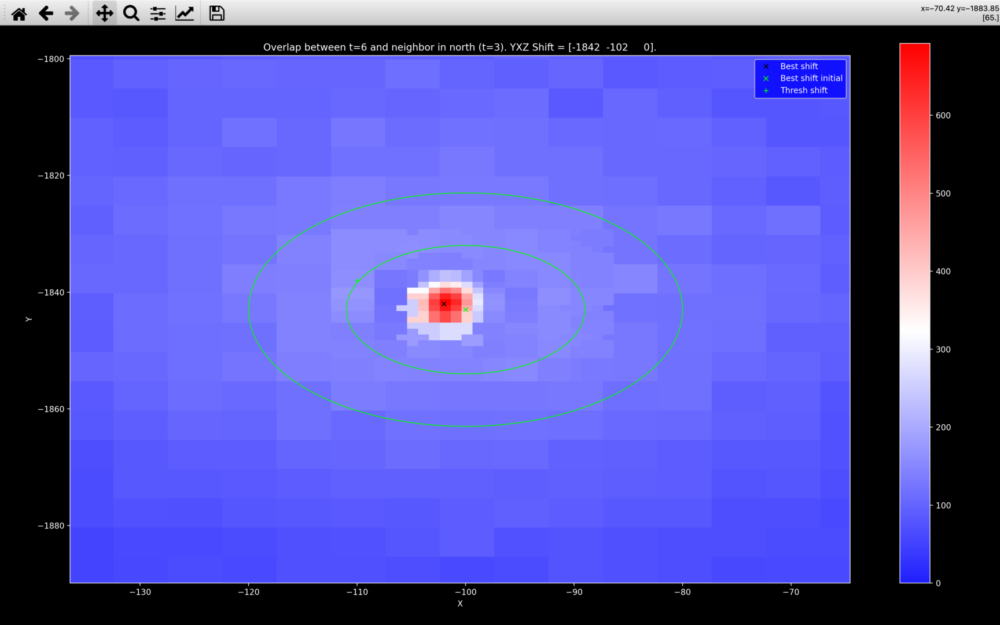{width="800"}

White in the colorbar refers to the value of `score_thresh`. The green **x** indicates 
the shift that was found after the initial exhaustive search. The black **x** indicates 
the final shift found after the [refined search](#refined-search). 

This plot is also useful for understanding the [`score_thresh` computation](#score-threshold).
The green **+** indicates the `shift_yx_thresh`, 
the shift with the largest `score` between the two green circles. 
The inner circle has a radius of `config['stitch']['shift_score_thresh_min_dist']` and 
is centered on the green **x**. The outer circle has a radius of 
`config['stitch']['shift_score_thresh_max_dist']` and is centered on the green **x**. 

`score_thresh` is then set to `config['stitch']['shift_score_thresh_multiplier']` 
multiplied by the score at the green **+**. In this case, this multiplier is 2 and thus the 
`score` at the green **+** appears blue (`score` at the green **+** is approximately 150
and so `score_thresh` and the white in the image is about 300).

We use this method of determining `score_thresh` because the most striking feature of the plot
is the sharp gradient near the global maxima in `score`. Requiring 
the `score` for an acceptable shift to be much larger than the max nearby `score` is
just saying we require a large gradient.

??? note "`score_thresh` in *3D*"
    
    For the *3D* pipeline, the `score_thresh` is computed in exactly the same way 
    to determine if the initial $yx$ shift found is acceptable or the $yx$ range needs 
    [widening](#widening-range):

    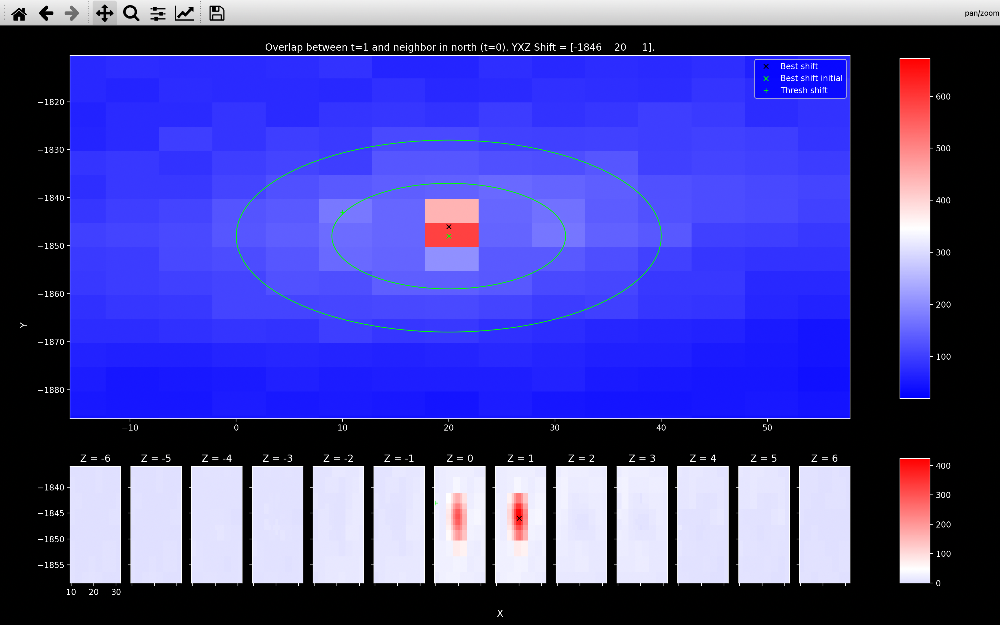{width="800"}

    Once an acceptable $yx$ shift has been found, we divide `score_thresh` by 
    `config['stitch']['shift_score_thresh_multiplier']` i.e. we set it to the 
    value of the `score` at `shift_yx_thresh`. Hence the `score` at the green **+**
    in the above image appears white (it is equal to `score_thresh`). This new threshold
    is then used to determine whether the final $yxz$ shift is acceptable.

    We decrease `score_thresh` when looking for the $yxz$ shift because
    we expect in *3D*, if neighbouring points are on slightly different z-planes but 
    very close in $yx$ they would have a small contribution to the `score`. 
    This is because the $z$ pixels are larger than the $yx$ pixels. 
    In *2D*, a pair such as this would give a large contribution to the `score`
    because only the $yx$ distance would matter.

    See the example in the [refined search](#refined-search) section to see how a shift of 1 in 
    $z$ can almost double the score.


### Widening range
If the best shift found has `score < score_thresh`, then exhaustive search will continue 
until either a shift with `score > score_thresh` is found or the search range exceeds a `max_range`:

```
while best_score < score_thresh:
    extend exhaustive search
    if range of exhaustive search > max_range in all dimensions:
        Return current best_shift and best_score.
    else:
        Find best_shift and corresponding best_score in new larger 
        exhaustive_search.
```

The `max_range` in the $y$, $x$, $z$ direction is set to be `config['stitch']['shift_max_range']`.

The exhaustive search is [extended](../code/stitch/shift.md#iss.stitch.shift.extend_array) 
using `config['stitch']['shift_widen']`. The possible shifts in dimension $i$ are extended
by `config['stitch']['shift_widen'][i]` values either side of the current min/max values of the 
shifts while maintaining the same spacing.

??? example "Example exhaustive search extension"

    Lets consider a single dimension with initial an initial exhaustive search
    containing the following shifts:
    ``` python
    array([-10,  -5,   0,   5,  10])
    ```

    With `shift_widen = 10` in this dimension, the updated exhaustive search would
    contain the following shifts:
    ``` python
    array([-60, -55, -50, -45, -40, -35, -30, -25, -20, -15, -10,  -5,   0,
             5,  10,  15,  20,  25,  30,  35,  40,  45,  50,  55,  60])
    ```
    
    This new search has a range of 120 so if `max_range` in this dimension was 100, 
    the updated exhaustive search would not take place.

An example in *2D* where the widening worked successfully is shown below using `view_stitch_search`:

=== "Pre-widen"
    {width="800"}

=== "Post-widen"
    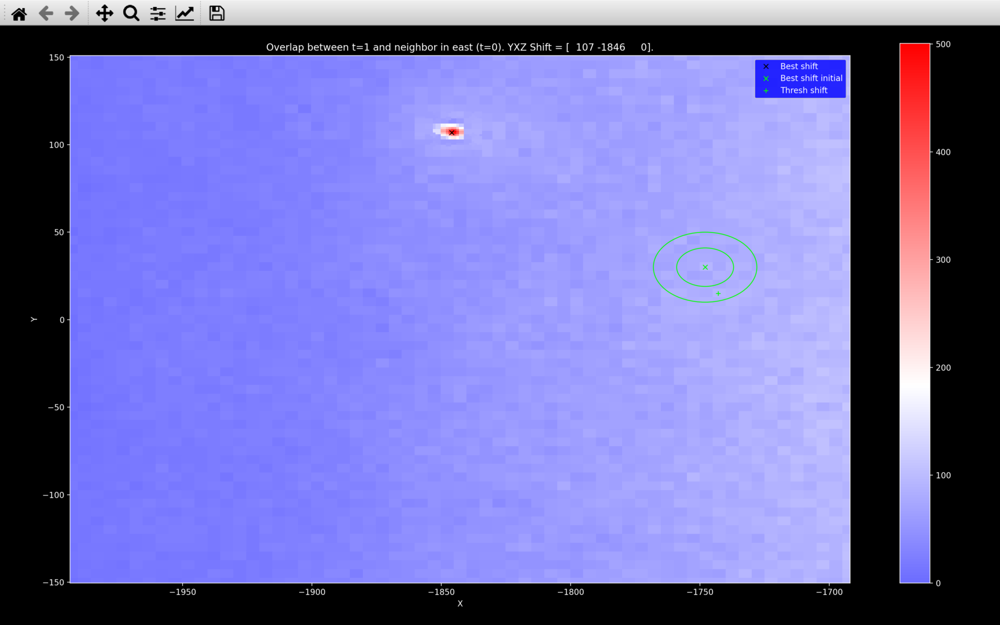{width="800"}

Here we see that before widening the search range, the maximum score is barely distinguishable from 
the rest and thus falls below `score_thresh`.
After widening though, we uncover a shift with a score far exceeding `score_thresh`.

??? note "3D"

    In *3D*, we do the $yx$ search first and then widen according to 
    `config['stitch']['shift_widen'][:2]` and `config['stitch']['shift_max_range'][:2]`
    to find the best $yx$ shift.

    Then we do the $z$ search keeping the $yx$ shift equal to the best $yx$ shift and 
    widen according to `config['stitch']['shift_widen'][2]` and `config['stitch']['shift_max_range'][2]`.
    This gives us the best $yxz$ shift.

    The example below shows a case where widening was required in $z$ but not in $yx$:

    === "Pre-widen"
        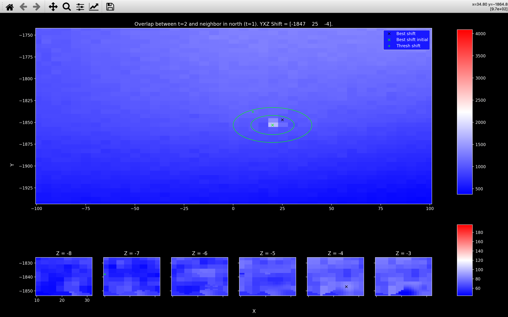{width="800"}

    === "Post-widen"
        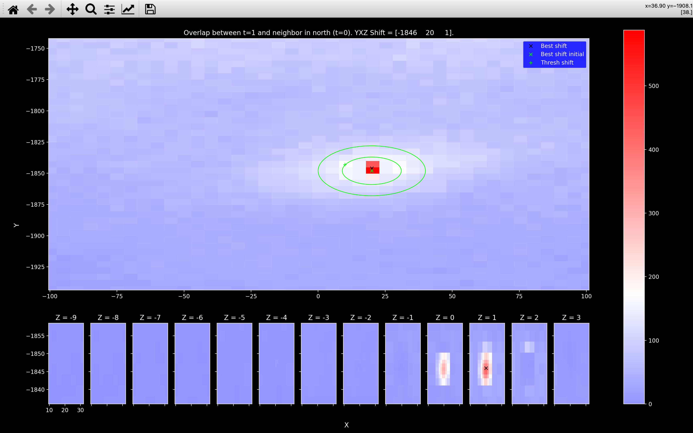{width="800"}

### Refined search
After we have found the best $yxz$ shift from the exhaustive search, we find the 
final shift by looking in the neighbourhood of this shift with a 
[smaller spacing](../code/stitch/shift.md#iss.stitch.shift.refined_shifts).
Initially, we halve the spacing, then we reduce the spacing to 1.

??? example

    Lets consider a *3D* example where an exhaustive search with $yxz$ spacing `[5, 5, 3]`
    found the best $yxz$ shift to be `[-1848, 20, 0]` with a `score` of 247.7.
    
    The refined search range in this neighbourhood with half the step size is set to:
    ``` python
    Y shifts: [-1858 -1855 -1852 -1849 -1846 -1843 -1840 -1837]
    X shifts: [10 13 16 19 22 25 28 31]
    Z shifts: [-6 -4 -2  0  2  4  6]
    ```

    This search finds the best $yxz$ shift to be `[-1846, 19, 0]` with a `score` of 298.3.
    
    The final search with a spacing of 1 is set to:
    ``` python
    Y shifts: [-1849 -1848 -1847 -1846 -1845 -1844 -1843]
    X shifts: [16 17 18 19 20 21 22]
    Z shifts: [-2 -1  0  1  2]
    ```

    This search finds the best $yxz$ shift to be `[-1846, 20, 1]` with a `score` of 423.8.
    

This is why the [`view_stitch_search`](../code/plot/stitch.md#iss.plot.stitch.view_stitch_search)
plot shows [more detail](#view_stitch_search) near the black **x** and why the black **x** is in a 
different location from the green **x** even when no widening is required.

### Updating initial range
We assume that all tiles overlapping in the same direction should have approximately the same
shift between them. So, after we have found at least 3 shifts in a given direction 
which have `score > score_thresh`, we [update](../code/stitch/shift.md#iss.stitch.shift.update_shifts) 
our initial exhaustive search range to save time for future tiles.

??? example

    The code below shows how the `update_shifts` works to refine the initial search 
    range given the following $yxz$ shifts have been found for north/south overlapping tiles
    (all with `score > score_thresh`):
    
    * `[-1846, 20, 1]`
    * `[-1853, 22, 0]`
    * `[-1854, 20, 0]`
    
    === "Code"
        ``` python
        import numpy as np
        from iss.stitch.shift import update_shifts
        y_shifts_found = [-1846, -1853, -1854]
        x_shifts_found = [20, 22, 0]
        z_shifts_found = [1, 0, 0]

        step = [5, 5, 3]
        y_search = np.arange(-1943, -1743+step[0], step[0])
        x_search = np.arange(-100, 100+step[1], step[1])
        z_search = np.arange(-3, 3 + step[2], step[2])

        # y
        print(f"Initial y search:\n{y_search}")
        y_search_new = update_shifts(y_search, y_shifts_found)
        print(f"Updated y search:\n{y_search_new}")

        # x
        print(f"Initial x search:\n{x_search}")
        x_search_new = update_shifts(x_search, x_shifts_found)
        print(f"Updated x search:\n{x_search_new}")

        # z
        print(f"Initial z search:\n{z_search}")
        z_search_new = update_shifts(z_search, z_shifts_found)
        print(f"Updated z search:\n{z_search_new}")

        # Number of shifts to search
        print(f"Initial number of shifts in search: "
              f"{y_search.size * x_search.size * z_search.size}")
        print(f"Updated number of shifts in search: "
              f"{y_search_new.size * x_search_new.size * z_search_new.size}") 
        ```
    === "Output"
        ``` 
        Initial y search:
        [-1943 -1938 -1933 -1928 -1923 -1918 -1913 -1908 -1903 -1898 -1893 -1888
         -1883 -1878 -1873 -1868 -1863 -1858 -1853 -1848 -1843 -1838 -1833 -1828
         -1823 -1818 -1813 -1808 -1803 -1798 -1793 -1788 -1783 -1778 -1773 -1768
         -1763 -1758 -1753 -1748 -1743]
        Updated y search:
        [-1861 -1856 -1851 -1846 -1841]
        Initial x search:
        [-100  -95  -90  -85  -80  -75  -70  -65  -60  -55  -50  -45  -40  -35
          -30  -25  -20  -15  -10   -5    0    5   10   15   20   25   30   35
           40   45   50   55   60   65   70   75   80   85   90   95  100]
        Updated x search:
        [-1  4  9 14 19 24 29]
        Initial z search:
        [-3  0  3]
        Updated z search:
        [-3  0  3]
        Initial number of shifts in search: 5043
        Updated number of shifts in search: 105
        ```

### Amend low score shifts
After all the shifts between neighbouring tiles have been found, the ones with `score < score_thresh` are 
amended.

If for a particular pair of overlapping tiles in the north/south direction,
the best shift found had a `score < score_thresh`, 
the shift and score are saved in the notebook in `nb.stitch.south_outlier_shifts` and 
`nb.stitch.south_outlier_score` respectively.

The shift is then re-computed using a new initial exhaustive search range 
(saved as `nb.stitch.south_final_shift_search`). This range is computed using the 
[`update_shifts`](#updating-initial-range) function to centre 
it on all the shifts found in the `south` direction for which `score > score_thresh`.
For this re-computation, no [widening](#widening-range) is allowed either. The idea behind this 
is that it will force the shift to be within the range we expect based on the successful shifts. 
I.e. a shift with a slightly lower `score` but with a shift
more similar to the successful shifts is probably more reliable than a shift with 
a slightly higher `score` but with a shift significantly different from the successful ones.

The new shift and score will be saved in `nb.stitch.south_shifts` and 
`nb.stitch.south_score` respectively.
 
## Global coordinates
After finding the overlap for the set of neighbouring tile pairs ($\mathcal{R}$), we are left with a shift vector
$\pmb{\Delta}_{T_1, T_2}$ for every pair of neighbouring tiles $T_1$ and $T_2$, that specifies the $yxz$ offsets
of tile $T_2$ relative to tile $T_1$. 

We define a single global coordinate system by finding the coordinate origin $\pmb{\mathrm{X}}_T$ (bottom left corner) 
for each tile $T$. Note however that this problem is overdetermined as there are more neighbor pairs than there 
are tiles. We therefore compute the offsets by minimizing the loss function:

$$
L = \sum_{(T_1, T_2) \in \mathcal{R}} \pmb{|} \pmb{\mathrm{X}}_{T_1} - \pmb{\mathrm{X}}_{T_2} - \pmb{\Delta}_{T_1, T_2}
\pmb{|}^2
$$

Differentiating this loss function with respect to $\pmb{\mathrm{X}}_T$ 
yields a set of simultaneous linear equations, whose solution yields the origins of each 
tile on the reference round/channel.

This procedure is done with the [`get_tile_origin`](../code/stitch/tile_origin.md) function, with 
the tile origins saved to the *Notebook* as `nb.stitch.tile_origin`.

## Saving stitched images
[After](../code/pipeline/run.md#iss.pipeline.run.run_stitch) 
the `tile_origin` has been computed and the `stitch` *NotebookPage* has been added to the *Notebook*, 
a stitched image of the `ref_round`/`ref_channel` will be [saved](../code/utils/npy.md#iss.utils.npy.save_stitched) 
to the `output_dir` as a npz file with the file name `nb.file_names.big_anchor_image`. 

To save memory, the stitched reference image will be saved as *int16* after rescaling to fill the range.
We do this because the image is useful for plotting, but we do not care much about the actual pixel values.

??? note "DAPI"

    If `dapi_channel` is specified, a stitched image of the 
    `anchor_round`/`dapi_channel` will be [saved](../code/utils/npy.md#iss.utils.npy.save_stitched) 
    to the `output_dir` as a npz file with the file name `nb.file_names.big_dapi_image`.

    If DAPI [tophat filtering was specified](../config_setup.md#extractr_dapi), the filtered images
    save to `tile_dir` will be loaded in and stitched together. Otherwise, the raw data will be 
    loading in from the `input_dir` and stitched together with no filtering. 
    I.e. `from_raw == True` in[`save_stitched`](../code/utils/npy.md#iss.utils.npy.save_stitched).

    The stitched DAPI image will be saved as *uint16* with no rescaling.

Also to save memory, all pixels with absolute value less than `config['stitch']['save_image_zero_thresh']`
will have their pixel value set to $0$ before saving.
    
## View stitched point clouds
### [`view_stitch_overlap`](../code/plot/stitch.md#view_stitch_overlap)
To debug this section of the pipeline, the function 
[`view_stitch_overlap`](../code/plot/stitch.md#view_stitch_overlap) is useful.

For an experiment with tile $0$ to the north of tile $1$, `view_stitch_overlap(nb, 1, 'north')`
will always show the global coordinates of the point cloud for tile $0$ in red 
(`global_yxz = local_yxz + nb.stitch.tile_origin[0]`).
There are then buttons to select which point cloud for tile $1$ is plotted in blue:

* No overlap: This is assuming there is $0\%$ overlap between the two tiles.
* $x\%$ overlap: $x$ here will be `config['stitch']['expected_overlap']`.
This is our starting guess, i.e. the expected overlap in the $y$ and a shift of 0 in $x$ and $z$.
* Shift: This is the best shift found, saved in `nb.stitch.south_shifts`.
* Final: This is the coordinates of tile $1$ spots in the global coordinate system 
(`local_yxz + nb.stitch.tile_origin[1]`).

An example is shown below:

=== "No overlap"
    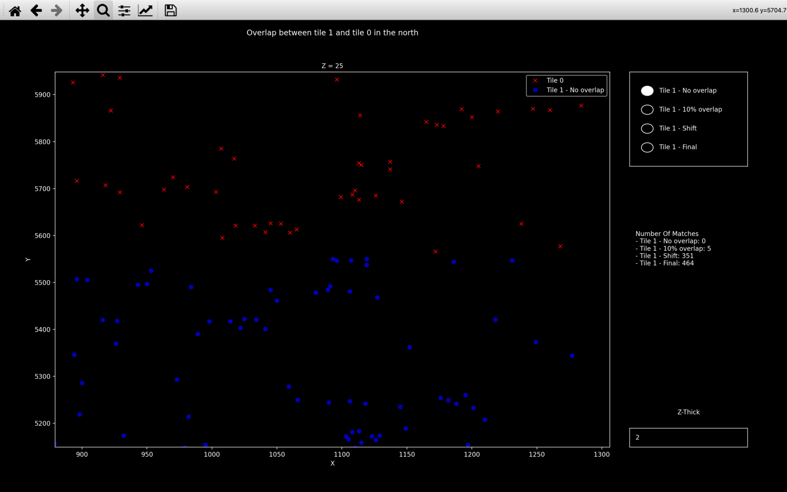{width="800"}

=== "10% overlap"
    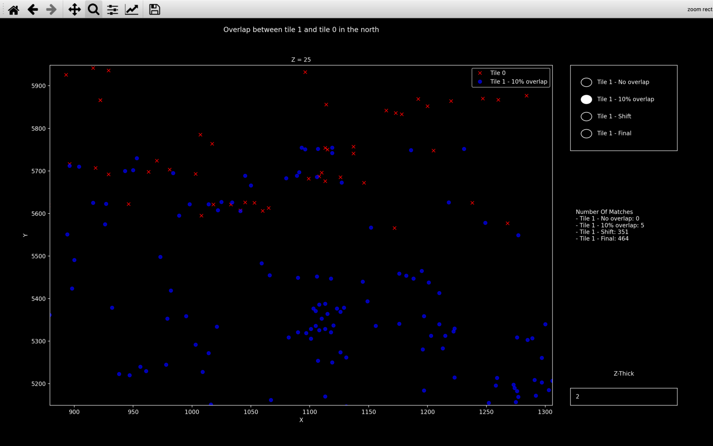{width="800"}

=== "Shift"
    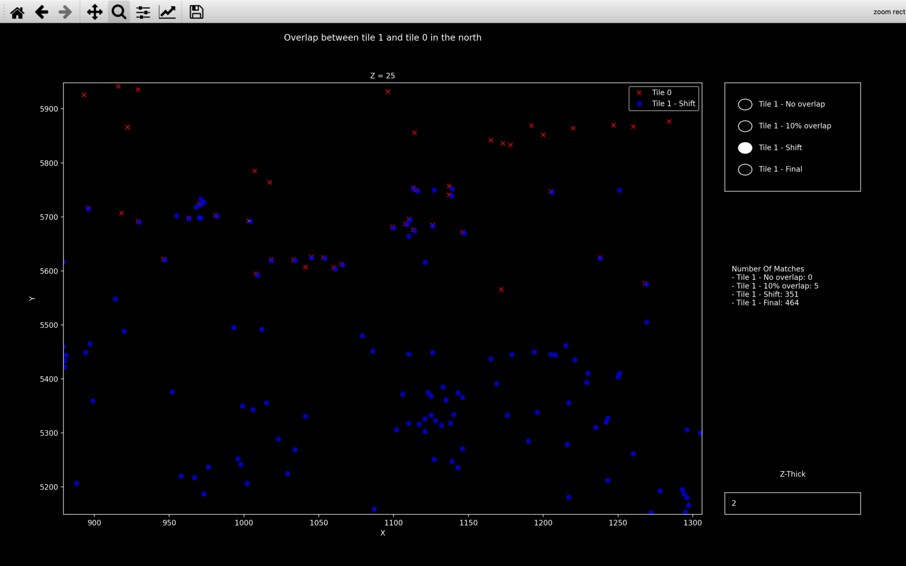{width="800"}

=== "Final"
    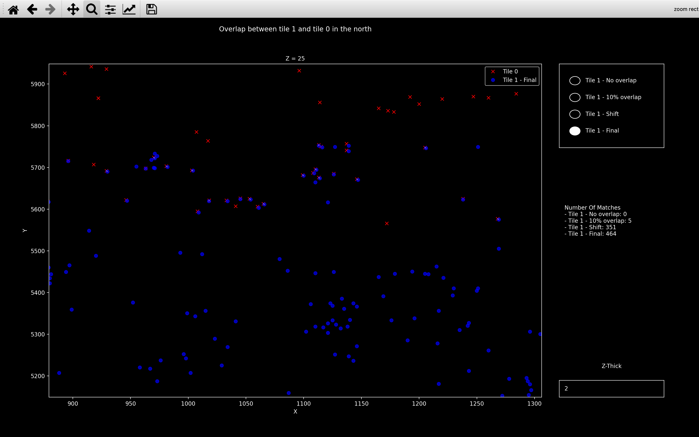{width="800"}

The z-plane is changed by scrolling with the mouse. You can change the value of z-thick in the bottom right.
Spots detected on the current z-plane and this many z-planes either side of it will be shown.

The white lines (only really visible in the *Final* plot) indicate neighbouring points with 
a distance between them of less than or equal to `config['stitch']['neighb_dist_thresh']`.
The number of matches listed on the right is then the number of these white lines (across all z-planes), 
this will be similar to the [`score`](#score).

### [`view_stitch`](../code/plot/stitch.md#view_stitch)
Another useful function is [`view_stitch`](../code/plot/stitch.md#view_stitch). 
This plots the all spots found in the `ref_round`/`ref_channel` in the global coordinate system specified
by `nb.stitch.tile_origin`.

The example below is for a $4\times3$ grid of tiles in *2D*.

=== "Full"
    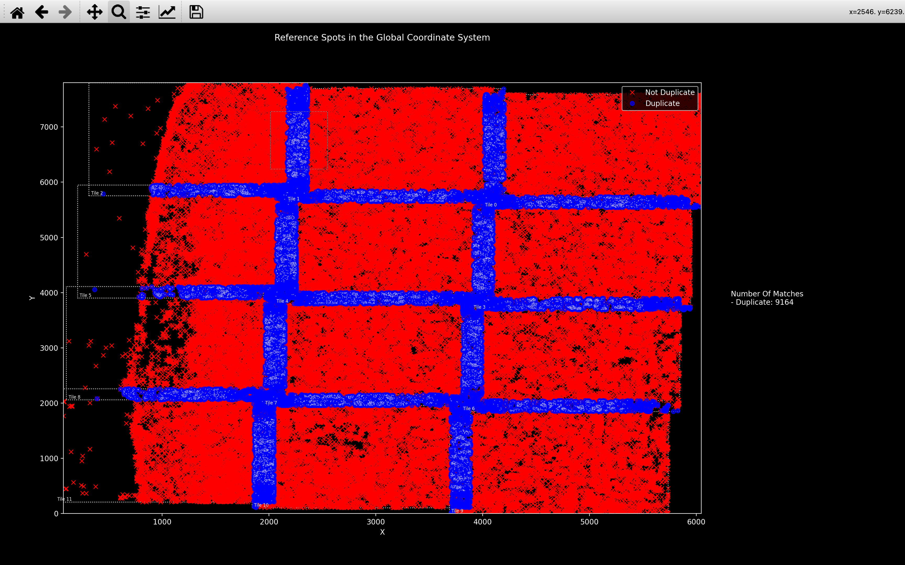{width="800"}

=== "Zoom"
    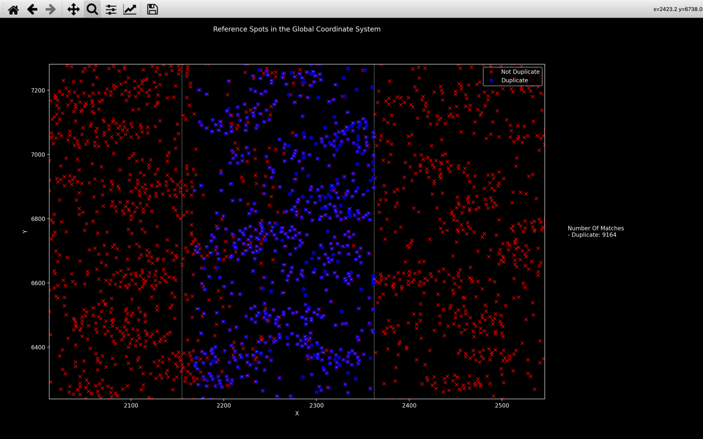{width="800"}

The blue spots are duplicate spots (detected on a tile which is not the tile whose centre they are closest to).
For each duplicate spot, we expect there is a non-duplicate spot in red, detected on a different tile
but with the same global coordinate. We can see this in the *Zoom* plot showing the intersection between tile 1 and 
tile 2 (indicated by a green box in the *Full* image).

These duplicate spots will be removed in the `get_reference_spots` step of the pipeline, so we don't double count
the same spot.

The white lines and number of matches are the same as for [`view_stitch_overlap`](#view_stitch_overlap).
Also in *3D*, you can scroll between z-planes with the mouse and specify z-thick in the same way.


## Pseudocode
This is the pseudocode outlining the basics of this [step of the pipeline](../code/pipeline/stitch.md).
For more detailed pseudocode about how the best shift is found, see the [shift](#obtaining-best-shift) section.

```
spot_yxz[t] = yxz coordinates for spots detected on tile t of 
              ref_round and ref_channel
for t in use_tiles:
    if tile to north of t:
        Find best_shift between tile spot_yxz[t] and spot_yxz[t_north].
    if tile to east of t:
        Find best_shift between tile spot_yxz[t] and spot_yxz[t_east].

Amend shifts with score < score_thresh using new search range.
Find tile_origin specifying global coordinate system.

Add tile_origin and debugging info to stitch NotebookPage.
Add stitch NotebookPage to Notebook.         
Use tile_origin to save stitched ref_channel (and DAPI) image to 
output directory.
```