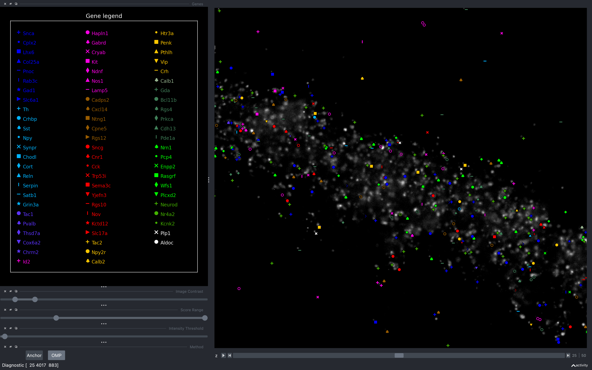
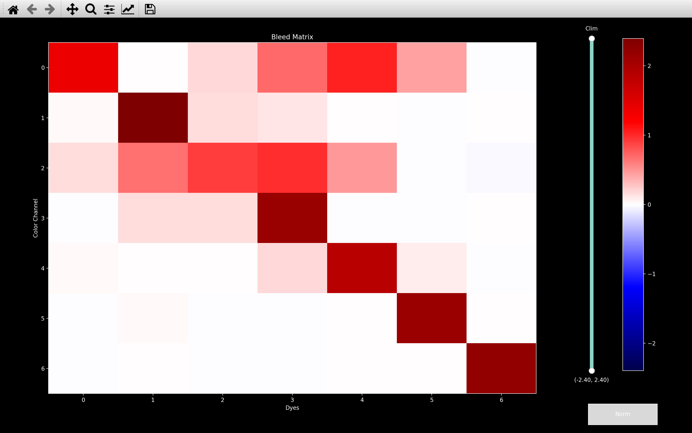
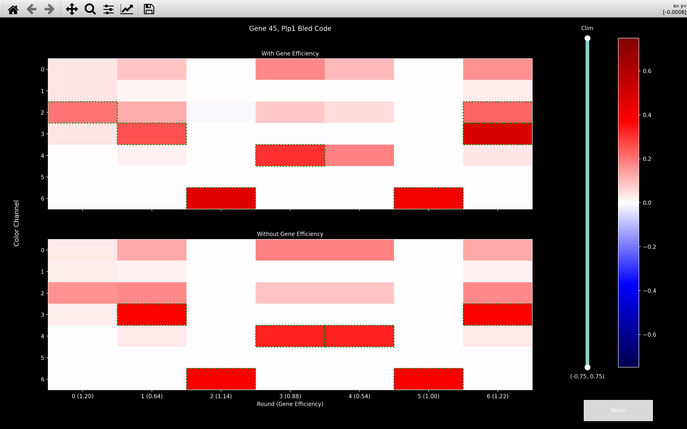
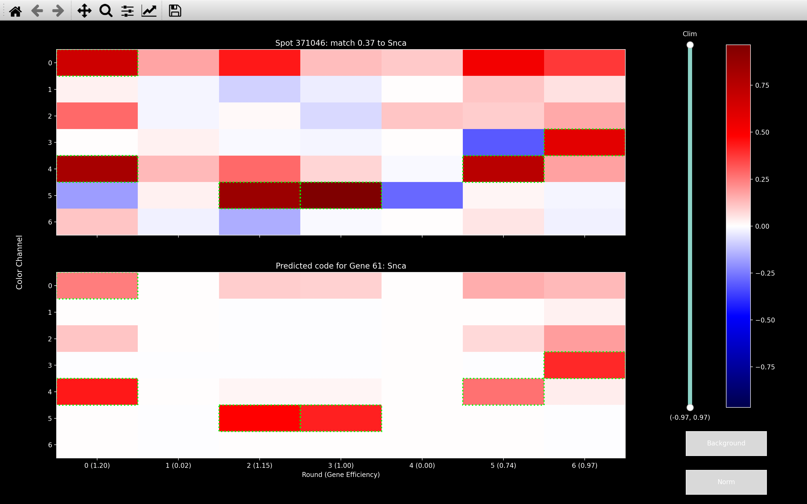
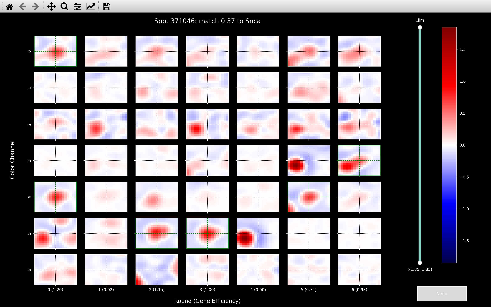
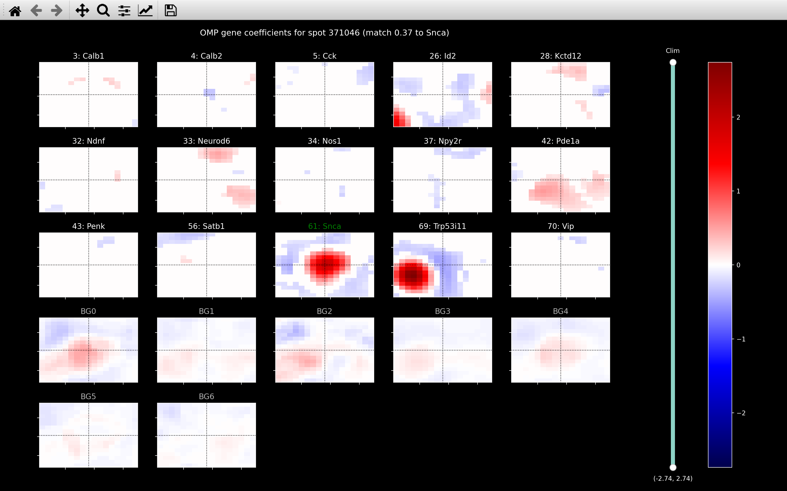
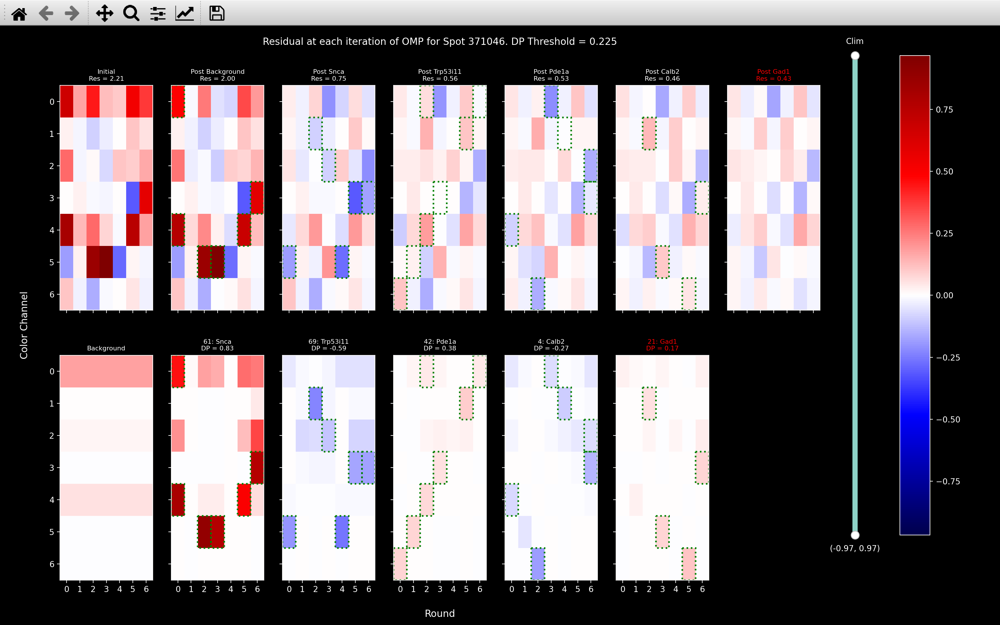

# Viewing the results

Once the pipeline has completed the [`reference_spots`](code/pipeline/run.md#iss.pipeline.run.run_reference_spots) step 
such that the [*Notebook*](notebook.md) contains the [*call_spots*](notebook_comments.md#call_spots) and 
[*ref_spots*](notebook_comments.md#ref_spots) pages, the gene assignments of the spots found can be visualised
by using [`iss_plot`](code/plot/viewer.md).

This can be opened via the command line or using a python script. It requires either the path to the config file
(*/Users/user/iss/experiment/settings.ini*) or the path to the notebook file 
(*/Users/user/iss/experiment/notebook.npz*):

=== "Command Line"

    ``` bash
    python -m iss /Users/user/iss/experiment/settings.ini -view
    ```

=== "Python Script Using Config Path"
    ``` python
    from iss import Notebook, iss_plot
    ini_file = '/Users/user/iss/experiment/settings.ini'
    nb = Notebook(config_file=ini_file)
    iss_plot(nb)
    ```

=== "Python Script Using Notebook Path"
    ``` python
    from iss import Notebook, iss_plot
    nb_file = '/Users/user/iss/experiment/notebook.npz'
    nb = Notebook(nb_file)
    iss_plot(nb)
    ```

This will then open the napari viewer which will show the spots with a marker indicating which gene they 
were assigned to. If the notebook contains the [*omp*](notebook_comments.md#omp) page, the spots plotted
will be those found with the [omp algorithm](code/pipeline/omp.md), otherwise it will show the 
reference spots (those found on `nb.basic_info.ref_round`/`nb.basic_info.ref_channel`) 
and their gene assignments found using [call_reference_spots](code/pipeline/call_reference_spots.md). 
An example is shown below:

{width="800"}

???+ info "Markers not visible"
    When the napari viewer first opens, the markers are often not visible because it is so far zoomed out.
    After zooming in by scrolling with the mouse, they should show up.

## Background Image
By default, the spots will be plotted on top of the stitched DAPI image (`config['file_names']['big_dapi_image']`) 
if it exists, otherwise there will not be a background image.

To use a particular background image, when calling `iss_plot` a second argument needs to be given 
(`iss_plot(nb, background_image)`. There are several options:

- `'dapi'`: Will use `config['file_names']['big_dapi_image']` if it exists, otherwise will be no background (default).
- `'anchor'`: Will use `config['file_names']['big_anchor_image']` if it exists, otherwise will be no background.
- Path to .npy or .npz file: An example would be `'/Users/user/iss/experiment/background_image.npz'`. 
    This file must contain an image with axis in the order z-y-x (y-x if 2D).
- Numpy array: Can explicitly given the `[n_z x n_y x n_x]` (`[n_y x n_x]` in 2D) image desired.

## Sidebar

The sidebar on the left of the viewer includes various widgets which can change which spots are plotted.

### Select Genes
- To remove a gene from the plot, click on it in the gene legend. 
- To add a gene that has been removed, click on it again.
- To view only one gene, right-click on it.
- To go back to viewing all genes, right-click on a gene which is the only gene selected.

### Image contrast
The image contrast slider controls the brightness of the background image.

### Method
If the notebook contains the *omp* page, a pair of buttons labelled *OMP* and *Anchor* will appear at the bottom of the 
sidebar. Initially the *OMP* button is selected meaning the spots shown are those saved in the 
[*omp*](notebook_comments.md#omp) page. 
Pressing the *Anchor* button will change the spots shown to be those saved in the 
[*ref_spots*](notebook_comments.md#ref_spots) page.

If the notebook does not have the *omp* page, these buttons will not be present and the spots shown will be those 
saved in the [*ref_spots*](notebook_comments.md#ref_spots) page.


### Score Range
Only spots which pass a
[quality thresholding](code/call_spots/qual_check.md#iss.call_spots.qual_check.quality_threshold) 
are shown in the viewer.

Spots are assigned a `score` between 0 and 1 which indicates the likelihood that the gene assignment is legitimate. 
When the viewer is first opened, only spots with `score > config['thresholds']['score_omp]` 
(`score > config['thresholds']['score_ref]` if no *omp* page in notebook) are shown
and lower value of the score slider is set to `config['thresholds']['score_omp]`.

The slider can then be used to view only spots which satisfy:

`slider_low_value < score < slider_high_value`

!!! note "Effect of changing Method on Score Range slider"
    
    The `score` computed for spots using the omp method **[ADD LINK TO DESCRION OF SCORE]** differs from that used 
    with the ref_spots method **[ADD LINK TO DESCRION OF SCORE]**.
    Thus, we keep a unique score range slider for each method so that when the method is changed using the buttons, 
    the score range slider values will also change to the last values used with that method.

### Intensity Threshold
As well as a score, each spot has an [`intensity`](code/call_spots/qual_check.md#iss.call_spots.get_spot_intensity) 
value.

The [quality thresholding](code/call_spots/qual_check.md#iss.call_spots.qual_check.quality_threshold) also means 
that only spots with `intensity > intensity_thresh` are shown in the viewer.

Initially, `intensity_thresh` will be set to `config['thresholds']['intensity]` and the slider can be used to change it.

!!! note "Effect of changing Method on Intensity Threshold slider"
    
    The `intensity` is computed in the same way for omp method spots and ref_spots method spots.
    Thus the value of `intensity_thresh` will not change when the method is changed using the buttons.


## Diagnostics
There are a few diagnostic plots which can be called with keyboard shortcuts with the viewer open.


### *i*: Remove background image
The background image can be removed from the viewer by pressing the *i*  key. Once it has been removed, it can be 
put back by pressing *i* again.


### *b*: [`view_bleed_matrix`](code/plot/call_spots.md#view_bleed_matrix)
The bleed matrix computed for the experiment can be shown by pressing *b*. 
This will then show the expected intensity of each dye in each channel. An example is shown below.

=== "Normalised Bleed Matrix"
    {width="600"}

=== "Un-normalised Bleed Matrix"
    {width="600"}

??? note "Norm Button"

    This plot as well as the `view_bled_codes`, `view_codes` and `view_spot` plots below have a *Norm* button. 

    When these plots open the colorbar gives the intensity after 
    [normalisation](code/call_spots/base.md#iss.call_spots.base.color_normalisation) 
    has been applied to equalise the intensity between color channels i.e. weaker channels are boosted.
    
    To remove this normalisation, press the *Norm* button. 
    The range of the colorbar will then change from approximately *-1 to 1* to approximately *-1000 to 1000*. 
    This is then then the intensity that is read off from the filtered images saved as .npy files 
    in the *file_names[tile_dir]*.

    You can see above that in the un-normalised bleed matrix, channel 2 appears much weaker than it does in 
    the normalised version.

    In both the *call_reference_spots* and *omp* sections of the pipeline, spots are assigned to genes by comparing the 
    `spot_color` to the `bled_code` of each gene. This is done using the normalised `spot_color` and normalised
    `bled_codes`.

This plot is useful to check that the dyes can be distinguished. 
I.e. that each column above (in the normalised version) is relatively unique. This is required so that 
genes can be distinguished based on their barcodes which indicate which dye each gene should appear with in each round.


### *g*: [`view_bled_codes`](code/plot/call_spots.md#view_bled_codes)
The `bled_code` for each gene can be shown by pressing *g*. This shows two plots for each gene as shown below
for *Plp1*:

{width="600"}

The bottom plot shows the predicted code for the gene based on its [barcode](config_setup.md#code_book) 
and the [`bleed_matrix`](#b-view_bleed_matrix). 
For this experiment, *Plp1* has the barcode *2364463* meaning the column for round 0 in the `bled_code` 
is the column for dye 2 in the `bleed_matrix`, the column for round 1 above is the column for dye 3 in 
the `bleed_matrix` etc. These bled_codes are saved as 
[`nb.call_spots.bled_codes`](notebook_comments.md#call_spots) in the 
[`call_reference_spots`](code/pipeline/call_reference_spots.md) section of the pipeline.

The top plot shows the bled_code incorporating the calculated 
[`gene_efficiency`](code/call_spots/base.md#iss.call_spots.base.get_gene_efficiency). 
The `gene_efficiency` is the expected strength of a gene in each round and is given in 
brackets in the x-tick labels. These bled_codes are saved as 
[`nb.call_spots.bled_codes_ge`](notebook_comments.md#call_spots) in the 
[`call_reference_spots`](code/pipeline/call_reference_spots.md) section of the pipeline. It is these `bled_codes`
which are compared to `spot_colors` when assigning each spot to a particular gene.

You can view other gene codes by scrolling up and down with the mouse when this plot is open.

A green rectangle is added to each round/channel where the `bled_code` value is greater than 0.2. This indicates
rounds/channels where the gene is particularly strong. It is also done in [`view_codes`](#c-view_codes) and
[`view_omp_fit`](#shift-o-view_omp_fit).

### *space*: Change to *select* mode
To run the below diagnostics, you need to change to *select* mode. This is done by pressing *space-bar*.
In *select* mode, you won't be able to pan or zoom. To change back to *pan/zoom* mode, press *space-bar* again.
On pressing *space-bar*, it should tell you in the bottom right corner of the viewer which mode you are in.

When clicking on a spot in *select* mode, it should tell you in the bottom left corner, the *spot_no* of that spot
and to which *gene* it was assigned. 

### *c*: [`view_codes`](code/plot/call_spots.md#view_codes)
The `spot_color` for a particular spot can be compared to the `bled_code` (including `gene_efficiency`)
of the gene it was assigned to by pressing *c* after clicking on the
spot in [*select* mode](#space-change-to-select-mode):

{width="600"}

The subsequent plots all show the same spot as used here.

### *s*: [`view_spot`](code/plot/call_spots.md#view_spot)
The intensity in the neighbourhood of a particular spot in each round/channel can be viewed by pressing *s* 
after clicking on the spot in [*select* mode](#space-change-to-select-mode):

{width="600"}

For a *3D* experiment, this will only show the neighbourhood on the z-plane where the spot was found. This is also
the case for [`view_omp`](#o-view_omp).

The cross-hair is in green in each round/channel where the bled_code (with `gene_efficiency`) 
of the predicted gene (*Snca* here) is greater than 0.2.

### *o*: [`view_omp`](code/plot/omp.md#view_omp)
The omp coefficients of all genes in neighbourhood of a particular spot can be viewed by pressing *o*
after clicking on the spot in [*select* mode](#space-change-to-select-mode):

{width="600"}

If a gene is not plotted, it means hardly any pixels had a non-zero coefficient for that gene.

The gene indicated by *BG2* is the background code for channel 2 which is equal to 1 in all rounds of channel 
2 and 0 otherwise. It is then normalised to have an L2 norm of 1. E.g. for an experiment with 7 rounds and 7 channels, 
the n_rounds x n_channels code would be:

``` python
array([[0.   , 0.   , 0.378, 0.   , 0.   , 0.   , 0.   ],
       [0.   , 0.   , 0.378, 0.   , 0.   , 0.   , 0.   ],
       [0.   , 0.   , 0.378, 0.   , 0.   , 0.   , 0.   ],
       [0.   , 0.   , 0.378, 0.   , 0.   , 0.   , 0.   ],
       [0.   , 0.   , 0.378, 0.   , 0.   , 0.   , 0.   ],
       [0.   , 0.   , 0.378, 0.   , 0.   , 0.   , 0.   ],
       [0.   , 0.   , 0.378, 0.   , 0.   , 0.   , 0.   ]])
```

The background codes are saved as 
[`nb.call_spots.background_codes`](notebook_comments.md#call_spots) in the 
[`call_reference_spots`](code/pipeline/call_reference_spots.md) section of the pipeline. Each background vector
is always [fitted](code/call_spots/background.md) to each pixel by the omp algorithm, so they will always be shown.


### *shift-o*: [`view_omp_fit`](code/plot/omp.md#view_omp_fit)
The genes fitted to a particular spot at each stage of the omp algorithm can be viewed by pressing *shift-o*
after clicking on the spot in [*select* mode](#space-change-to-select-mode):

{width="600"}

The image shown at column $i$ of the first row is the residual `spot_color` before the gene shown 
at the column $i$ of the second row has been fitted. 

The image shown at column $i+1$ of the first row is the residual `spot_color`
after the gene at column $i$ of the second row has been removed.

The image shown at column $i$ of the second row is the gene that best explains the residual `spot_color` 
shown at column $i$ of the first row. 

The second row shows the `bled_code` (with `gene_efficiency`) for the gene multiplied by the coefficient found by
the omp algorithm for that gene at that iteration.

The first plot of the second row shows the sum of the contribution of all background vectors. They are
combined because there is no overlap between the different `background_codes`.

The omp algorithm stops when the absolute value of the [`dot_product_score`](code/call_spots/dot_product.md) 
(*DP* in the title of images in the second row) to the best gene drops below the *DP Threshold* indicated in 
the title (0.225 here, this value is [`config['omp']['dp_thresh']`](config.md#omp)). 
The gene shown in red is the first gene with a `dot_product_score` less than this and won't be fitted.

*Res* in the title of images in the first row gives the L2 norm of the residual `spot_color` at that iteration 
of the omp algorithm. I.e. we expect this to decrease as the omp algorithm proceeds.
